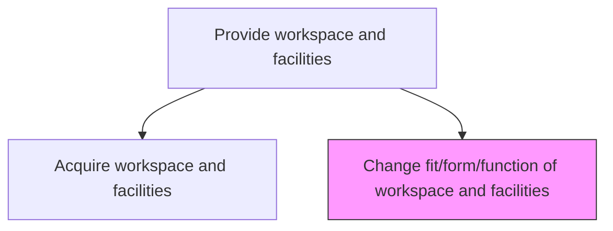
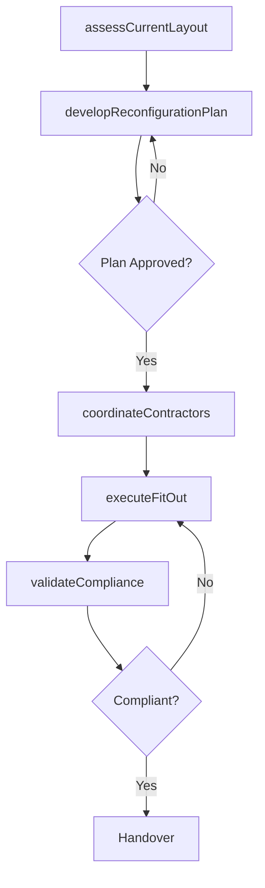

# Change fit/form/function of workspace and facilities

> Business-as-Code definition for workspace and facility reconfiguration. Models the complete process of assessing, planning, and executing changes to workspace layout, form, and function.

## Overview

Modifying the formation of the workspace and its assets. Make necessary changes in an office space with all assets (tables, chairs, computers, admin staff, interior designing, etc.) according to requirements.

## Process Hierarchy



## GraphDL

```yaml
change:
  object: Fit/form/function Of Workspace And Facilities
  actor: FacilitiesManager
  result: ReconfiguredWorkspace
```

## Actions

| Action | Description |
|--------|-------------|
| assessCurrentLayout | Evaluate the existing workspace configuration against new requirements |
| developReconfigurationPlan | Create a detailed plan for workspace modifications including timelines and costs |
| coordinateContractors | Engage and manage interior designers, construction teams, and IT installers |
| executeFitOut | Perform physical modifications to workspace layout, furniture, and infrastructure |
| validateCompliance | Confirm that reconfigured space meets building codes, safety, and accessibility standards |

## Events

| Event | Description |
|-------|-------------|
| layoutAssessed | Current workspace assessment completed with gap analysis |
| reconfigurationPlanApproved | Modification plan reviewed and approved by stakeholders |
| contractorsEngaged | External vendors and contractors confirmed and scheduled |
| fitOutCompleted | Physical workspace modifications finished |
| complianceValidated | Reconfigured space passed all regulatory and safety inspections |

## Searches

| Search | Description |
|--------|-------------|
| findWorkspacesByStatus | List workspaces filtered by reconfiguration status or phase |
| getReconfigurationPlan | Retrieve the detailed modification plan for a specific workspace |
| getComplianceChecklist | Retrieve outstanding compliance items for a workspace change |
| findContractorAssignments | List contractor engagements by workspace or project |

## Process Flow



## RACI Matrix

| Activity | Responsible | Accountable | Consulted | Informed |
|----------|-------------|-------------|-----------|----------|
| assessCurrentLayout | FacilitiesManager | VP Operations | DepartmentHeads | Employees |
| developReconfigurationPlan | SpacePlanner | FacilitiesManager | Finance | HR |
| coordinateContractors | ProjectCoordinator | FacilitiesManager | Procurement | Legal |
| executeFitOut | ContractorTeam | FacilitiesManager | IT | SafetyOfficer |
| validateCompliance | SafetyOfficer | FacilitiesManager | Legal | Executive |

## Related Processes

| Process | Relationship |
|---------|-------------|
| 10.1.3.1 Acquire workspace and facilities | Upstream - provides the base workspace to modify |
| 10.1.2.1 Design facility | Parallel - design standards inform reconfiguration |
| 10.1.4.1 Relocate people | Downstream - staff may need relocation during changes |

## Related Departments

| Department | Role |
|-----------|------|
| Facilities Management | Primary owner of workspace reconfiguration |
| IT | Ensures technology infrastructure supports new layout |
| HR | Communicates changes and manages employee transitions |
| Finance | Approves budget and tracks expenditure |

## Related Occupations

| Occupation | Involvement |
|-----------|-------------|
| Facilities Manager | Primary executor and coordinator |
| Interior Designer | Designs layout and aesthetic changes |
| Project Manager | Manages timelines and contractor coordination |
| Safety Inspector | Validates compliance with regulations |

## KPIs

| KPI | Description | Unit |
|-----|-------------|------|
| Reconfiguration Cycle Time | Average time from assessment to completion | Days |
| Budget Variance | Percentage deviation from approved reconfiguration budget | % |
| Space Utilization Rate | Percentage of usable workspace occupied post-reconfiguration | % |
| Employee Satisfaction Score | Post-change survey score on workspace quality | Score (1-10) |

## Usage

```typescript
import { changeFitFormFunction } from '@headlessly/change-fit-form-function-of-workspace-and-facilities'

const workspace = changeFitFormFunction()

// Assess current workspace layout
const assessment = await workspace.assessCurrentLayout({
  workspaceId: 'floor-3-east',
  requirements: ['open-plan', 'collaboration-zones', 'quiet-rooms']
})

// Develop reconfiguration plan
const plan = await workspace.developReconfigurationPlan({
  assessmentId: assessment.id,
  budget: 250000,
  targetCompletionDate: '2026-06-01'
})
```
