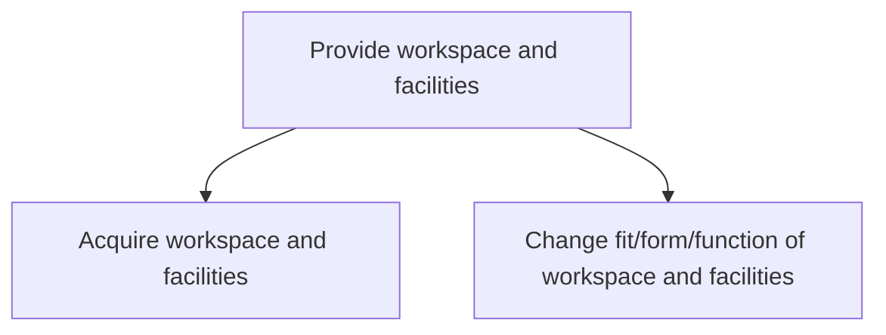
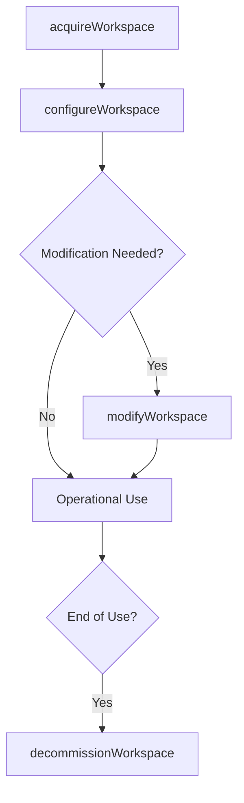

# Provide workspace and facilities

> Business-as-Code definition for acquiring, configuring, and adapting workspaces and facility assets including furniture, equipment, and technology to meet organizational requirements and employee needs.

## Overview

Managing the provision of the workspace and its assets. Arrange an office space with all assets (tables, chairs, computers, admin staff, etc.) according to requirements.

## Process Hierarchy



## GraphDL

```yaml
provide:
  object: Workspace And Facilities
  actor: WorkspaceManager
  result: ReadyWorkspace
```

## Actions

| Action | Description |
|--------|-------------|
| acquireWorkspace | Procure office space with required furniture, equipment, and technology |
| configureWorkspace | Set up workspace layouts, seating assignments, and amenities |
| modifyWorkspace | Change the fit, form, or function of existing workspaces to meet new requirements |
| decommissionWorkspace | Remove and return workspace assets when space is vacated |

## Events

| Event | Description |
|-------|-------------|
| workspaceAcquired | Office space and assets procured and delivered |
| workspaceConfigured | Workspace set up and ready for occupancy |
| workspaceModified | Workspace reconfigured to meet updated requirements |
| workspaceDecommissioned | Workspace vacated and assets recovered |

## Searches

| Search | Description |
|--------|-------------|
| findAvailableWorkspaces | List unassigned workspaces by building, floor, or type |
| getWorkspaceAssignments | Retrieve current workspace assignments by department or employee |
| getWorkspaceUtilization | Query occupancy and utilization data for workspaces |

## Process Flow



## RACI Matrix

| Activity | Responsible | Accountable | Consulted | Informed |
|----------|-------------|-------------|-----------|----------|
| acquireWorkspace | WorkspaceManager | VP Facilities | Procurement | IT |
| configureWorkspace | FacilitiesCoordinator | WorkspaceManager | IT | HR |
| modifyWorkspace | FacilitiesCoordinator | WorkspaceManager | Engineering | Department |

## Sub-Processes

| ID | Name | Description |
|----|------|-------------|
| 10.1.3.1 | Acquire workspace and facilities | Attaining the office space with all assets (tables, chairs, computers, admin staff, etc.) according  |
| 10.1.3.2 | Change fit/form/function of workspace and facilities | Modifying the formation of the workspace and its assets. Make necessary changes in an office space w |

## Related Processes

| Process | Relationship |
|---------|-------------|
| 10.1.2 Plan facility | Upstream - facility plans drive workspace provisioning |
| 10.1.4 Manage facilities operations | Downstream - provisioned workspaces enter operations |
| 9.0 Acquire and Manage Human Capital | Parallel - onboarding drives workspace assignment |

## Related Departments

| Department | Role |
|-----------|------|
| Facilities Management | Configures and maintains workspace environments |
| IT | Provides technology infrastructure for workspaces |
| Procurement | Sources furniture, equipment, and supplies |

## Related Occupations

| Occupation | Involvement |
|-----------|-------------|
| Workspace Manager | Coordinates workspace provisioning and reconfiguration |
| Facilities Coordinator | Executes workspace setup and asset installation |

## KPIs

| KPI | Description | Unit |
|-----|-------------|------|
| Workspace Provisioning Time | Average time from request to workspace ready for occupancy | Days |
| Space Utilization Rate | Percentage of provisioned workspace actively occupied | % |
| Employee Workspace Satisfaction | Survey-based satisfaction with workspace environment | Score (1-5) |

## Usage

```typescript
import { provideWorkspaceAndFacilities } from '@headlessly/provide-workspace-and-facilities'

const workspace = provideWorkspaceAndFacilities()

// Acquire workspace for new team
const ws = await workspace.acquireWorkspace({
  building: 'HQ-West',
  floor: 4,
  seats: 25,
  equipment: ['standing-desks', 'monitors', 'phones']
})

// Check available workspaces
const available = await workspace.findAvailableWorkspaces({
  building: 'HQ-West',
  type: 'open-plan',
  minSeats: 10
})
```
