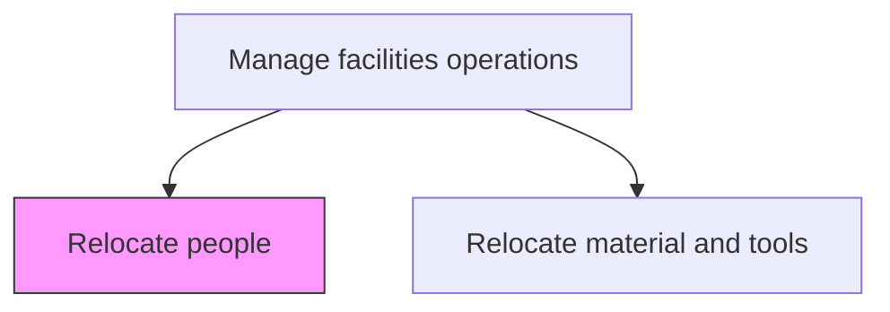
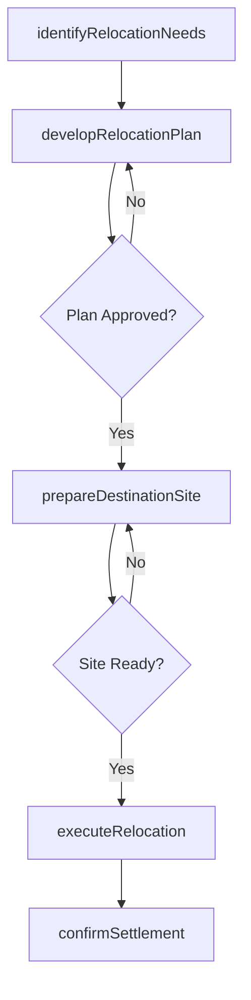

# Relocate people

> Business-as-Code definition for employee and staff relocation. Models the complete process of planning, coordinating, and executing the physical relocation of personnel across facilities.

## Overview

Shifting staff or employees from one place to another place according to changes in business requirements.

## Process Hierarchy



## GraphDL

```yaml
relocate:
  object: People
  actor: RelocationCoordinator
  result: CompletedRelocation
```

## Actions

| Action | Description |
|--------|-------------|
| identifyRelocationNeeds | Determine which employees or teams need to move and to which locations |
| developRelocationPlan | Create a timeline, logistics plan, and communication strategy for the move |
| prepareDestinationSite | Ensure the target workspace is ready with furniture, IT, and access credentials |
| executeRelocation | Carry out the physical move of personnel to their new workspaces |
| confirmSettlement | Verify all relocated employees are operational in their new locations |

## Events

| Event | Description |
|-------|-------------|
| relocationNeedsIdentified | Personnel relocation requirements documented and approved |
| relocationPlanApproved | Move plan reviewed and signed off by all stakeholders |
| destinationSitePrepared | Target workspace fully outfitted and ready for occupancy |
| relocationExecuted | Physical move of personnel completed |
| settlementConfirmed | All relocated staff confirmed operational at new site |

## Searches

| Search | Description |
|--------|-------------|
| findPendingRelocations | List all scheduled or in-progress personnel relocations |
| getRelocationPlan | Retrieve the detailed plan for a specific relocation event |
| findAffectedEmployees | List employees impacted by a given relocation initiative |
| getDestinationReadiness | Check preparation status of a target workspace |

## Process Flow



## RACI Matrix

| Activity | Responsible | Accountable | Consulted | Informed |
|----------|-------------|-------------|-----------|----------|
| identifyRelocationNeeds | FacilitiesManager | VP Operations | HR | DepartmentHeads |
| developRelocationPlan | RelocationCoordinator | FacilitiesManager | IT | Finance |
| prepareDestinationSite | FacilitiesTechnician | FacilitiesManager | IT | Security |
| executeRelocation | MovingTeam | RelocationCoordinator | HR | Employees |
| confirmSettlement | RelocationCoordinator | FacilitiesManager | DepartmentHeads | HR |

## Related Processes

| Process | Relationship |
|---------|-------------|
| 10.1.4.2 Relocate material and tools | Parallel - often executed alongside personnel moves |
| 10.1.3.2 Change fit/form/function of workspace and facilities | Upstream - workspace changes may trigger relocations |
| 10.1.3.1 Acquire workspace and facilities | Upstream - new workspace acquisitions enable relocations |

## Related Departments

| Department | Role |
|-----------|------|
| Facilities Management | Plans and executes physical relocations |
| Human Resources | Communicates with employees and manages change impact |
| IT | Ensures connectivity and equipment at new locations |
| Security | Updates access credentials and badges for new locations |

## Related Occupations

| Occupation | Involvement |
|-----------|-------------|
| Relocation Coordinator | Primary planner and executor |
| Facilities Manager | Oversees the relocation program |
| HR Business Partner | Manages employee communication and support |
| IT Support Specialist | Sets up technology at destination sites |

## KPIs

| KPI | Description | Unit |
|-----|-------------|------|
| Relocation Completion Rate | Percentage of relocations completed on schedule | % |
| Employee Downtime | Average time employees are non-productive during relocation | Hours |
| Relocation Cost Per Person | Average cost to relocate a single employee | Currency |
| Post-Move Satisfaction | Employee satisfaction score after relocation | Score (1-10) |

## Usage

```typescript
import { relocatePeople } from '@headlessly/relocate-people'

const relocation = relocatePeople()

// Identify which teams need to move
const needs = await relocation.identifyRelocationNeeds({
  trigger: 'office-consolidation',
  departments: ['Engineering', 'Product'],
  targetFacility: 'building-b-floor-2'
})

// Execute the relocation
const result = await relocation.executeRelocation({
  planId: needs.planId,
  moveDate: '2026-04-15'
})
```
