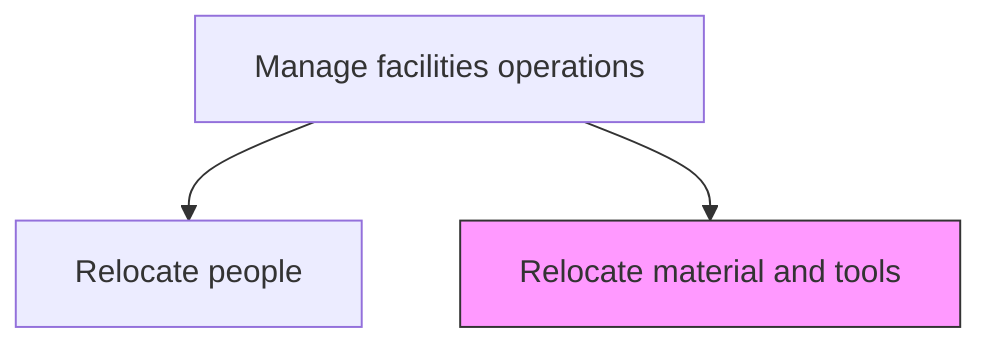
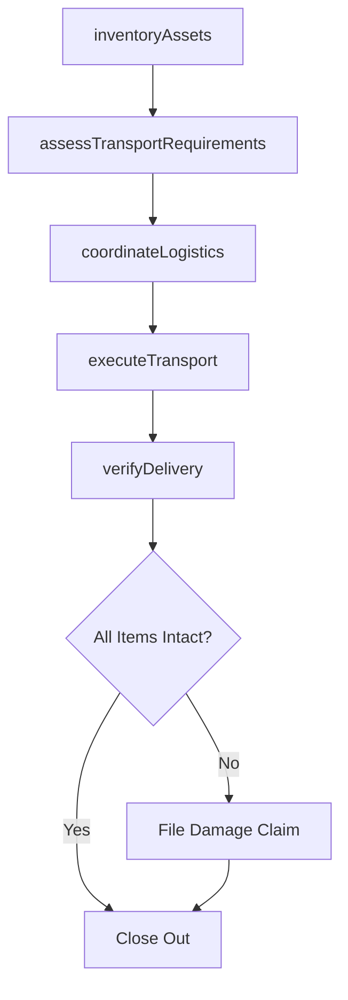

# Relocate material and tools

> Business-as-Code definition for material and tool relocation. Models the complete process of inventorying, transporting, and reinstalling equipment, materials, and tools across facilities.

## Overview

Relocating the tools and raw materials. Shift raw or finished material and machines of company from one place to another place according to changes in business requirements.

## Process Hierarchy



## GraphDL

```yaml
relocate:
  object: Material And Tools
  actor: LogisticsCoordinator
  result: RelocatedInventory
```

## Actions

| Action | Description |
|--------|-------------|
| inventoryAssets | Catalog all materials, tools, and equipment to be relocated |
| assessTransportRequirements | Determine packaging, handling, and transportation needs for each item |
| coordinateLogistics | Arrange transportation vendors, routes, and delivery schedules |
| executeTransport | Physically move materials and tools to the destination facility |
| verifyDelivery | Confirm all items arrived intact and are properly installed at the new location |

## Events

| Event | Description |
|-------|-------------|
| assetsInventoried | Complete inventory of materials and tools documented |
| transportRequirementsAssessed | Packaging and logistics requirements finalized |
| logisticsCoordinated | Transportation vendors and schedules confirmed |
| transportExecuted | Physical movement of materials and tools completed |
| deliveryVerified | All items confirmed received and installed at destination |

## Searches

| Search | Description |
|--------|-------------|
| findPendingMaterialMoves | List all scheduled material and tool relocations |
| getInventoryManifest | Retrieve the itemized list for a specific relocation |
| trackShipmentStatus | Check the real-time status of an in-transit shipment |
| findDamagedItems | List items reported damaged during transport |

## Process Flow



## RACI Matrix

| Activity | Responsible | Accountable | Consulted | Informed |
|----------|-------------|-------------|-----------|----------|
| inventoryAssets | AssetCoordinator | FacilitiesManager | Operations | Finance |
| assessTransportRequirements | LogisticsCoordinator | FacilitiesManager | SafetyOfficer | Procurement |
| coordinateLogistics | LogisticsCoordinator | FacilitiesManager | Vendors | Operations |
| executeTransport | MovingTeam | LogisticsCoordinator | Security | Insurance |
| verifyDelivery | AssetCoordinator | FacilitiesManager | Operations | Finance |

## Related Processes

| Process | Relationship |
|---------|-------------|
| 10.1.4.1 Relocate people | Parallel - often coordinated with personnel relocations |
| 10.1.3.2 Change fit/form/function of workspace and facilities | Upstream - workspace changes trigger material moves |
| 10.3.1.2 Analyze assets and predict maintenance requirements | Downstream - relocated assets may need maintenance assessment |

## Related Departments

| Department | Role |
|-----------|------|
| Facilities Management | Owns and coordinates the relocation process |
| Operations | Ensures minimal disruption to production during moves |
| Logistics | Manages transportation and delivery scheduling |
| Finance | Tracks relocation costs and insurance claims |

## Related Occupations

| Occupation | Involvement |
|-----------|-------------|
| Logistics Coordinator | Plans and manages transportation logistics |
| Asset Manager | Maintains inventory and tracks asset locations |
| Facilities Technician | Handles equipment disconnection and reinstallation |
| Safety Officer | Ensures safe handling and transport of materials |

## KPIs

| KPI | Description | Unit |
|-----|-------------|------|
| On-Time Delivery Rate | Percentage of relocations completed within scheduled timeframe | % |
| Damage Rate | Percentage of items damaged during transport | % |
| Relocation Cost Per Item | Average cost to move a single asset | Currency |
| Inventory Accuracy | Match rate between manifest and received items | % |

## Usage

```typescript
import { relocateMaterialAndTools } from '@headlessly/relocate-material-and-tools'

const relocation = relocateMaterialAndTools()

// Inventory all assets to be moved
const manifest = await relocation.inventoryAssets({
  sourceLocation: 'warehouse-a',
  assetCategories: ['machinery', 'raw-materials', 'hand-tools']
})

// Execute the transport
const shipment = await relocation.executeTransport({
  manifestId: manifest.id,
  destination: 'warehouse-b',
  carrier: 'industrial-movers-inc'
})
```
