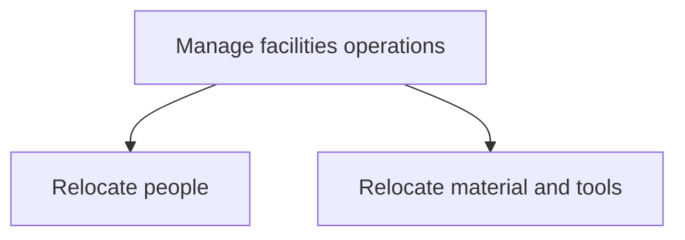
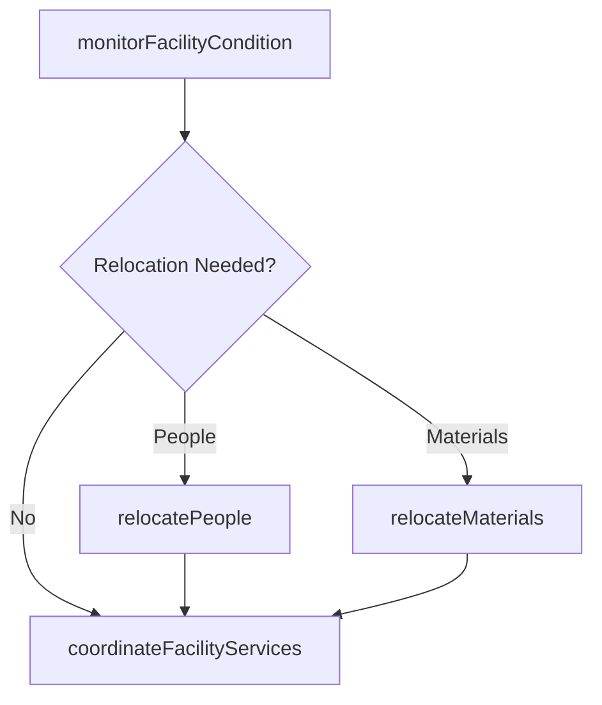

# Manage facilities operations

> Business-as-Code definition for managing day-to-day facility operations including personnel relocations, material transfers, and coordination of business unit activities within the facility to support organizational goals.

## Overview

Managing all operational activities of the facility. Manage how each function/business unit works. Support the manufacturing facility to attain organizational goals.

## Process Hierarchy



## GraphDL

```yaml
manage:
  object: Facilities Operations
  actor: FacilitiesOperationsManager
  result: OperationalStatusReport
```

## Actions

| Action | Description |
|--------|-------------|
| relocatePeople | Coordinate employee moves between locations, floors, or buildings |
| relocateMaterials | Transfer equipment, tools, and materials between facility locations |
| coordinateFacilityServices | Manage janitorial, security, and utility services across facilities |
| monitorFacilityCondition | Track building systems, environment controls, and operational health |

## Events

| Event | Description |
|-------|-------------|
| peopleRelocated | Employee relocation between workspaces completed |
| materialsRelocated | Equipment and materials transferred to new location |
| facilityServicesCoordinated | Facility service contracts reviewed and adjusted |
| facilityConditionMonitored | Building systems and environmental health check completed |

## Searches

| Search | Description |
|--------|-------------|
| findRelocationRequests | List pending relocation requests by type, department, or priority |
| getFacilityServiceStatus | Query status of facility services by building or vendor |
| getFacilityConditionReport | Retrieve building condition and environmental monitoring data |

## Process Flow



## RACI Matrix

| Activity | Responsible | Accountable | Consulted | Informed |
|----------|-------------|-------------|-----------|----------|
| relocatePeople | FacilitiesCoordinator | FacilitiesManager | HR | DepartmentHead |
| relocateMaterials | LogisticsCoordinator | FacilitiesManager | Operations | Safety |
| coordinateFacilityServices | FacilitiesManager | VP Facilities | Procurement | Finance |

## Sub-Processes

| ID | Name | Description |
|----|------|-------------|
| 10.1.4.1 | Relocate people | Shifting staff or employees from one place to another place according to changes in business require |
| 10.1.4.2 | Relocate material and tools | Relocating the tools and raw materials. Shift raw or finished material and machines of company from  |

## Related Processes

| Process | Relationship |
|---------|-------------|
| 10.1.3 Provide workspace and facilities | Upstream - provisioned workspaces enter daily operations |
| 10.3 Maintain productive assets | Parallel - facility maintenance supports operations |
| 9.0 Acquire and Manage Human Capital | Parallel - employee moves coordinate with HR actions |

## Related Departments

| Department | Role |
|-----------|------|
| Facilities Management | Oversees daily facility operations and service coordination |
| Human Resources | Coordinates employee relocations and workspace needs |
| Logistics | Manages material and equipment transfers |

## Related Occupations

| Occupation | Involvement |
|-----------|-------------|
| Facilities Operations Manager | Oversees daily facility operations and vendor management |
| Relocation Coordinator | Plans and executes employee and material moves |

## KPIs

| KPI | Description | Unit |
|-----|-------------|------|
| Relocation Completion Time | Average time to complete an employee or material relocation | Days |
| Facility Service Satisfaction | Employee satisfaction with facility services | Score (1-5) |
| Facility Operating Cost per Sqft | Total facility operations cost per square foot | $/sq ft |

## Usage

```typescript
import { manageFacilitiesOperations } from '@headlessly/manage-facilities-operations'

const ops = manageFacilitiesOperations()

// Relocate team to new floor
const move = await ops.relocatePeople({
  department: 'Marketing',
  fromLocation: { building: 'HQ', floor: 2 },
  toLocation: { building: 'HQ', floor: 5 },
  headcount: 30,
  targetDate: '2025-04-01'
})

// Check facility condition
const condition = await ops.getFacilityConditionReport({
  building: 'HQ',
  systems: ['HVAC', 'electrical', 'plumbing']
})
```
