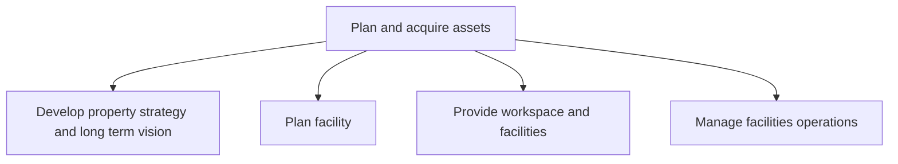
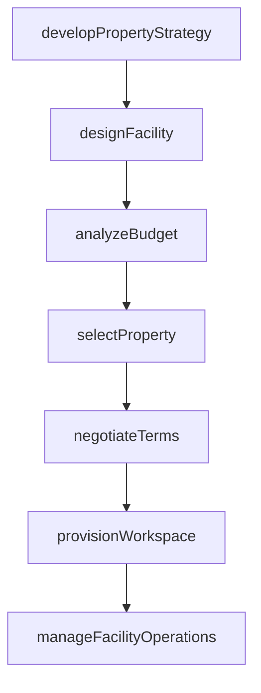

# Plan and acquire assets

> Business-as-Code definition for strategically planning, procuring, and provisioning facilities, workspaces, and supporting physical assets aligned with organizational requirements.

## Overview

Planning, acquiring, and managing facilities, workspaces, and supporting assets. Acquire, configure, and manage facilities and workspaces, to include supporting equipment and materials.

## Process Hierarchy



## GraphDL

```yaml
plan:
  object: And Acquire Assets
  actor: RealEstateManager
  result: FacilityAcquisitionPlan
```

## Actions

| Action | Description |
|--------|-------------|
| developPropertyStrategy | Define long-term property requirements and acquisition approach |
| designFacility | Create floor plans, space allocations, and infrastructure specifications |
| analyzeBudget | Evaluate capital and operating budgets for facility acquisition |
| selectProperty | Identify and evaluate candidate properties against requirements |
| negotiateTerms | Negotiate lease or purchase agreements for selected properties |
| provisionWorkspace | Configure and equip workspaces with required furniture and technology |
| manageFacilityOperations | Oversee day-to-day operations including relocations and space management |

## Events

| Event | Description |
|-------|-------------|
| propertyStrategyDeveloped | Long-term property strategy approved by leadership |
| facilityDesigned | Facility design specifications finalized |
| budgetAnalyzed | Capital budget analysis completed for facility project |
| propertySelected | Candidate property evaluated and selected |
| termsNegotiated | Lease or purchase agreement terms finalized |
| workspaceProvisioned | Workspace configured and ready for occupancy |
| facilityOperationsManaged | Facility operations review cycle completed |

## Searches

| Search | Description |
|--------|-------------|
| findProperties | List available properties filtered by location, size, and budget |
| getFacilityDesign | Retrieve design specifications for a planned or existing facility |
| getLeaseAgreements | Query active lease agreements by property, expiration, or terms |
| findWorkspaceAllocations | List workspace assignments by department, floor, or building |

## Process Flow



## RACI Matrix

| Activity | Responsible | Accountable | Consulted | Informed |
|----------|-------------|-------------|-----------|----------|
| developPropertyStrategy | RealEstateManager | VP Facilities | CFO | BusinessUnitLeads |
| designFacility | FacilityArchitect | VP Facilities | Engineering | Safety |
| selectProperty | RealEstateManager | CFO | Legal | Operations |
| negotiateTerms | RealEstateManager | GeneralCounsel | Finance | Procurement |
| manageFacilityOperations | FacilitiesManager | VP Facilities | HR | IT |

## Sub-Processes

| ID | Name | Description |
|----|------|-------------|
| 10.1.1 | Develop property strategy and long term vision | Strategizing a long-term vision for managing properties. Prepare strategies and a long-term vision f |
| 10.1.2 | Plan facility | Recognizing the needs of facility users in order to construct a project proposal that meets those ne |
| 10.1.3 | Provide workspace and facilities | Managing the provision of the workspace and its assets. Arrange an office space with all assets (tab |
| 10.1.4 | Manage facilities operations | Managing all operational activities of the facility. Manage how each function/business unit works. S |

## Related Processes

| Process | Relationship |
|---------|-------------|
| 10.2 Design and construct productive assets | Downstream - acquired properties may require construction |
| 10.3 Maintain productive assets | Downstream - acquired facilities enter maintenance lifecycle |
| 10.4 Dispose of assets | Downstream - facilities eventually reach end of useful life |
| 8.0 Manage Financial Resources | Upstream - capital budgets fund property acquisitions |

## Related Departments

| Department | Role |
|-----------|------|
| Real Estate | Identifies, evaluates, and acquires properties |
| Facilities Management | Operates and maintains acquired workspaces |
| Finance | Approves capital budgets and manages lease obligations |
| Legal | Reviews property contracts and regulatory compliance |
| Human Resources | Provides headcount forecasts for space planning |

## Related Occupations

| Occupation | Involvement |
|-----------|-------------|
| Real Estate Manager | Leads property sourcing, selection, and negotiations |
| Facilities Planner | Designs space layouts and workspace configurations |
| Property Accountant | Tracks lease obligations, depreciation, and occupancy costs |

## KPIs

| KPI | Description | Unit |
|-----|-------------|------|
| Occupancy Rate | Percentage of available workspace occupied | % |
| Cost per Square Foot | Total facility cost per square foot of occupied space | $/sq ft |
| Lease Renewal Rate | Percentage of expiring leases successfully renewed | % |
| Space Utilization | Average utilization of allocated workspace | % |

## Usage

```typescript
import { planAndAcquireAssets } from '@headlessly/plan-and-acquire-assets'

const assets = planAndAcquireAssets()

// Develop property strategy for expansion
const strategy = await assets.developPropertyStrategy({
  region: 'Northeast',
  headcountForecast: 500,
  horizon: '3-year'
})

// Search available properties
const properties = await assets.findProperties({
  city: 'Boston',
  minSqFt: 25000,
  maxLease: 50
})

// Provision workspace for new team
const workspace = await assets.provisionWorkspace({
  building: 'HQ-East',
  floor: 3,
  department: 'Engineering',
  desks: 40
})
```
