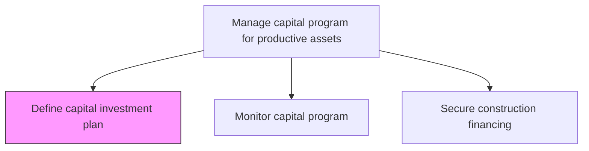
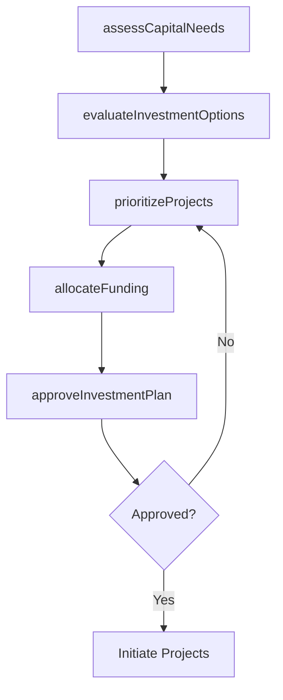

# Define capital investment plan

> Business-as-Code definition for capital investment planning. Models the complete process of identifying, evaluating, and allocating funds for productive asset construction aligned with business strategy.

## Overview

Establishing what funds will be invested in the construction of productive assets for the advancement of established business objectives.

## Process Hierarchy



## GraphDL

```yaml
define:
  object: Capital Investment Plan
  actor: CapitalPlanner
  result: ApprovedInvestmentPlan
```

## Actions

| Action | Description |
|--------|-------------|
| assessCapitalNeeds | Identify productive asset requirements aligned with strategic objectives |
| evaluateInvestmentOptions | Analyze potential capital projects using NPV, IRR, and payback period |
| allocateFunding | Distribute capital budget across approved investment projects |
| prioritizeProjects | Rank capital projects by strategic value, risk, and return |
| approveInvestmentPlan | Submit the consolidated capital plan for executive approval |

## Events

| Event | Description |
|-------|-------------|
| capitalNeedsAssessed | Asset investment requirements documented and validated |
| investmentOptionsEvaluated | Financial analysis of capital project alternatives completed |
| fundingAllocated | Budget distributed across approved capital projects |
| projectsPrioritized | Capital projects ranked and sequenced |
| investmentPlanApproved | Capital investment plan formally approved by leadership |

## Searches

| Search | Description |
|--------|-------------|
| findCapitalProjects | List capital projects filtered by status, priority, or budget range |
| getInvestmentPlan | Retrieve the detailed capital investment plan for a given fiscal period |
| getProjectFinancials | Retrieve NPV, IRR, and payback analysis for a specific project |
| findBudgetAllocations | List funding allocations by department or project category |

## Process Flow



## RACI Matrix

| Activity | Responsible | Accountable | Consulted | Informed |
|----------|-------------|-------------|-----------|----------|
| assessCapitalNeeds | CapitalPlanner | CFO | Operations | Executive |
| evaluateInvestmentOptions | FinancialAnalyst | CFO | Engineering | Legal |
| allocateFunding | CapitalPlanner | CFO | Treasury | Board |
| prioritizeProjects | CapitalPlanner | CFO | StrategyTeam | Operations |
| approveInvestmentPlan | CFO | CEO | Board | Finance |

## Related Processes

| Process | Relationship |
|---------|-------------|
| 10.2.1.2 Monitor capital program | Downstream - tracks execution of approved plan |
| 10.2.1.3 Secure construction financing | Downstream - obtains funding for approved projects |
| 10.2.2.1 Develop construction strategy | Downstream - translates investment plan into construction approach |

## Related Departments

| Department | Role |
|-----------|------|
| Finance | Develops financial models and manages capital budgets |
| Strategy | Aligns capital investments with business objectives |
| Operations | Identifies productive asset requirements |
| Engineering | Provides technical feasibility assessments |

## Related Occupations

| Occupation | Involvement |
|-----------|-------------|
| Capital Planner | Primary executor of investment planning |
| Financial Analyst | Performs financial modeling and analysis |
| Chief Financial Officer | Accountable for capital allocation decisions |
| Strategy Director | Ensures alignment with long-term business vision |

## KPIs

| KPI | Description | Unit |
|-----|-------------|------|
| Capital Plan Approval Cycle | Time from initial assessment to executive approval | Days |
| Planned vs Actual ROI | Variance between projected and realized return on investment | % |
| Budget Utilization Rate | Percentage of allocated capital actually deployed | % |
| Project Prioritization Accuracy | Percentage of top-priority projects meeting expected returns | % |

## Usage

```typescript
import { defineCapitalInvestmentPlan } from '@headlessly/define-capital-investment-plan'

const plan = defineCapitalInvestmentPlan()

// Assess capital needs for the fiscal year
const needs = await plan.assessCapitalNeeds({
  fiscalYear: 2026,
  strategicObjectives: ['capacity-expansion', 'modernization'],
  departments: ['Manufacturing', 'Logistics']
})

// Evaluate and prioritize investment options
const options = await plan.evaluateInvestmentOptions({
  needsId: needs.id,
  minIRR: 0.12,
  maxPaybackPeriod: 60
})
```
