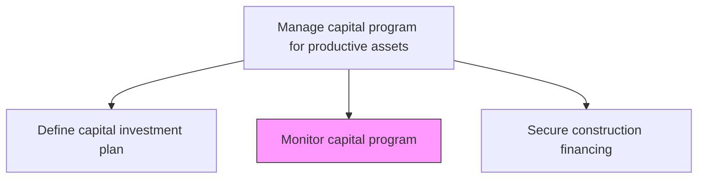
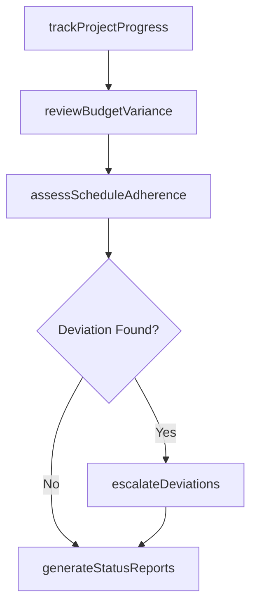

# Monitor capital program

> Business-as-Code definition for capital program monitoring. Models the complete process of tracking, reporting, and governing capital project portfolios against approved plans.

## Overview

Monitoring plans on capital projects. Capital projects can be purchasing buildings, lands, etc.

## Process Hierarchy



## GraphDL

```yaml
monitor:
  object: Capital Program
  actor: ProgramController
  result: ProgramStatusReport
```

## Actions

| Action | Description |
|--------|-------------|
| trackProjectProgress | Monitor milestones, deliverables, and completion percentages across capital projects |
| reviewBudgetVariance | Compare actual expenditures against approved capital budgets |
| assessScheduleAdherence | Evaluate whether projects are meeting planned timelines |
| escalateDeviations | Flag significant cost overruns or schedule delays to governance boards |
| generateStatusReports | Produce consolidated reports on capital program health |

## Events

| Event | Description |
|-------|-------------|
| progressTracked | Project milestone and completion data updated |
| budgetVarianceReviewed | Financial variance analysis completed for the reporting period |
| scheduleDeviationDetected | A capital project identified as behind schedule |
| deviationEscalated | Material deviation reported to governance board |
| statusReportGenerated | Consolidated capital program report published |

## Searches

| Search | Description |
|--------|-------------|
| findProjectsByStatus | List capital projects filtered by status or health indicator |
| getBudgetVarianceReport | Retrieve cost variance details for a specific project or portfolio |
| getScheduleTimeline | Retrieve Gantt-style timeline data for capital projects |
| findEscalatedIssues | List all escalated deviations requiring governance action |

## Process Flow



## RACI Matrix

| Activity | Responsible | Accountable | Consulted | Informed |
|----------|-------------|-------------|-----------|----------|
| trackProjectProgress | ProgramController | VP Capital Projects | ProjectManagers | Finance |
| reviewBudgetVariance | FinancialAnalyst | CFO | ProgramController | Board |
| assessScheduleAdherence | ProgramController | VP Capital Projects | Engineering | Operations |
| escalateDeviations | ProgramController | CFO | Legal | Executive |
| generateStatusReports | ProgramController | VP Capital Projects | Finance | Board |

## Related Processes

| Process | Relationship |
|---------|-------------|
| 10.2.1.1 Define capital investment plan | Upstream - provides the approved plan to monitor against |
| 10.2.1.3 Secure construction financing | Parallel - financing status impacts program health |
| 10.2.4.1 Monitor work performance | Downstream - detailed construction performance feeds program monitoring |

## Related Departments

| Department | Role |
|-----------|------|
| Finance | Tracks budget adherence and financial performance |
| Program Management Office | Oversees portfolio-level tracking and governance |
| Operations | Provides on-the-ground progress updates |
| Executive Leadership | Receives escalations and makes governance decisions |

## Related Occupations

| Occupation | Involvement |
|-----------|-------------|
| Program Controller | Primary monitor and report generator |
| Financial Analyst | Performs budget variance analysis |
| Project Manager | Provides project-level status updates |
| Portfolio Governance Board Member | Reviews escalations and approves corrective actions |

## KPIs

| KPI | Description | Unit |
|-----|-------------|------|
| Budget Variance | Percentage deviation from approved capital budget | % |
| Schedule Performance Index | Ratio of earned value to planned value | Ratio |
| Escalation Response Time | Average time to address escalated deviations | Days |
| Report Timeliness | Percentage of status reports delivered on schedule | % |

## Usage

```typescript
import { monitorCapitalProgram } from '@headlessly/monitor-capital-program'

const program = monitorCapitalProgram()

// Track progress across all active capital projects
const status = await program.trackProjectProgress({
  portfolioId: 'fy-2026-capital',
  reportingPeriod: 'Q1-2026'
})

// Review budget variance
const variance = await program.reviewBudgetVariance({
  projectId: 'plant-expansion-north',
  threshold: 0.10
})
```
