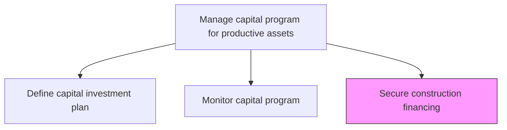
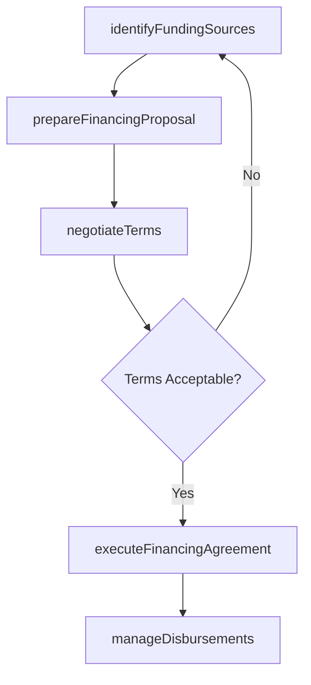

# Secure construction financing

> Business-as-Code definition for construction financing procurement. Models the complete process of identifying funding sources, negotiating terms, and securing financial instruments for asset construction.

## Overview

Acquiring the loans needed to construct necessary assets.

## Process Hierarchy



## GraphDL

```yaml
secure:
  object: Construction Financing
  actor: TreasuryManager
  result: FinancingAgreement
```

## Actions

| Action | Description |
|--------|-------------|
| identifyFundingSources | Evaluate banks, bond markets, internal reserves, and government programs for financing options |
| prepareFinancingProposal | Compile project financials, collateral details, and repayment projections for lender review |
| negotiateTerms | Negotiate interest rates, covenants, drawdown schedules, and repayment conditions |
| executeFinancingAgreement | Finalize and sign loan documents, bond indentures, or credit facilities |
| manageDisbursements | Coordinate the drawdown of funds aligned with construction milestones |

## Events

| Event | Description |
|-------|-------------|
| fundingSourcesIdentified | Potential financing options evaluated and shortlisted |
| proposalSubmitted | Financing proposal submitted to selected lenders or investors |
| termsNegotiated | Financing terms agreed upon with lender |
| agreementExecuted | Financing documents signed and funds committed |
| disbursementReleased | Construction funds drawn down per milestone schedule |

## Searches

| Search | Description |
|--------|-------------|
| findFinancingOptions | List available financing instruments by type, rate, or term |
| getFinancingAgreement | Retrieve details of an executed financing agreement |
| getDisbursementSchedule | Retrieve the planned and actual fund drawdown schedule |
| findOutstandingCovenants | List active financial covenants and compliance status |

## Process Flow



## RACI Matrix

| Activity | Responsible | Accountable | Consulted | Informed |
|----------|-------------|-------------|-----------|----------|
| identifyFundingSources | TreasuryManager | CFO | BankRelations | Board |
| prepareFinancingProposal | FinancialAnalyst | TreasuryManager | Legal | Accounting |
| negotiateTerms | TreasuryManager | CFO | Legal | Executive |
| executeFinancingAgreement | TreasuryManager | CFO | Legal | Board |
| manageDisbursements | TreasuryAnalyst | TreasuryManager | ProjectManager | Accounting |

## Related Processes

| Process | Relationship |
|---------|-------------|
| 10.2.1.1 Define capital investment plan | Upstream - investment plan determines financing needs |
| 10.2.1.2 Monitor capital program | Parallel - financing status feeds program monitoring |
| 10.2.3.1 Schedule construction work | Downstream - disbursement schedules align with construction timelines |

## Related Departments

| Department | Role |
|-----------|------|
| Treasury | Manages financing sourcing and negotiations |
| Finance | Provides project financials and repayment modeling |
| Legal | Reviews and negotiates financing agreements |
| Executive Leadership | Approves financing commitments |

## Related Occupations

| Occupation | Involvement |
|-----------|-------------|
| Treasury Manager | Primary executor of financing procurement |
| Financial Analyst | Prepares proposals and financial models |
| Corporate Counsel | Reviews loan agreements and covenants |
| Chief Financial Officer | Accountable for financing decisions |

## KPIs

| KPI | Description | Unit |
|-----|-------------|------|
| Financing Cycle Time | Time from funding need identification to agreement execution | Days |
| Weighted Average Cost of Capital | Blended interest rate across all financing instruments | % |
| Covenant Compliance Rate | Percentage of financial covenants met on time | % |
| Disbursement Alignment | Variance between planned and actual fund drawdowns | % |

## Usage

```typescript
import { secureConstructionFinancing } from '@headlessly/secure-construction-financing'

const financing = secureConstructionFinancing()

// Identify available funding sources
const sources = await financing.identifyFundingSources({
  projectId: 'plant-expansion-north',
  requiredAmount: 50000000,
  preferredTermYears: 10
})

// Execute the financing agreement
const agreement = await financing.executeFinancingAgreement({
  lenderId: sources.recommended[0].id,
  amount: 50000000,
  rate: 0.045
})
```
