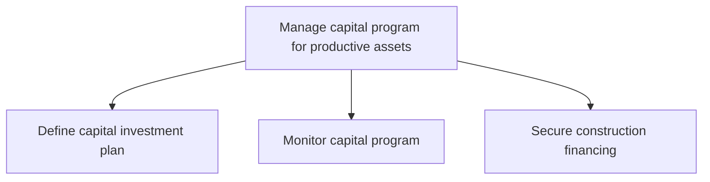
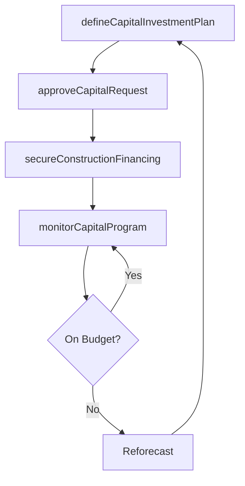

# Manage capital program for productive assets

> Business-as-Code definition for producing and maintaining capital investment plans, monitoring program budgets, and securing financing for the construction or acquisition of productive assets.

## Overview

Producing and maintaining a planning schedule and a financial plan to purchase or manufacture productive assets. Determine the investment plan, monitor capital, and secure the necessary financing in order to realize completion of the program.

## Process Hierarchy



## GraphDL

```yaml
manage:
  object: Capital Program For Productive Assets
  actor: CapitalProgramManager
  result: CapitalInvestmentPlan
```

## Actions

| Action | Description |
|--------|-------------|
| defineCapitalInvestmentPlan | Establish fund allocation, priorities, and timelines for productive asset investments |
| monitorCapitalProgram | Track capital expenditure against plan, flag variances, and forecast completion |
| secureConstructionFinancing | Obtain internal or external financing commitments for construction projects |
| approveCapitalRequest | Review and authorize individual capital expenditure requests |

## Events

| Event | Description |
|-------|-------------|
| capitalInvestmentPlanDefined | Capital investment plan approved with budget allocations |
| capitalProgramMonitored | Capital program review completed with variance analysis |
| constructionFinancingSecured | Financing commitments obtained for construction project |
| capitalRequestApproved | Individual capital expenditure request authorized |

## Searches

| Search | Description |
|--------|-------------|
| getCapitalBudget | Retrieve capital program budget with allocation breakdown |
| findCapitalProjects | List capital projects by status, budget, or priority |
| getFinancingTerms | Query financing arrangements by project or lender |

## Process Flow



## RACI Matrix

| Activity | Responsible | Accountable | Consulted | Informed |
|----------|-------------|-------------|-----------|----------|
| defineCapitalInvestmentPlan | CapitalPlanner | CFO | VP Operations | Board |
| monitorCapitalProgram | FinancialAnalyst | CapitalProgramManager | ProjectManagers | Executive |
| secureConstructionFinancing | TreasuryManager | CFO | Legal | CapitalPlanner |

## Sub-Processes

| ID | Name | Description |
|----|------|-------------|
| 10.2.1.1 | Define capital investment plan | Establishing what funds will be invested in the construction of productive assets for the advancemen |
| 10.2.1.2 | Monitor capital program | Monitoring plans on capital projects. Capital projects can be purchasing buildings, lands, etc. |
| 10.2.1.3 | Secure construction financing | Acquiring the loans needed to construct necessary assets. |

## Related Processes

| Process | Relationship |
|---------|-------------|
| 10.2.2 Design and plan asset construction | Downstream - funded projects proceed to design |
| 10.2.3 Schedule and perform construction work | Downstream - financing enables construction execution |
| 8.0 Manage Financial Resources | Upstream - corporate treasury provides financing |

## Related Departments

| Department | Role |
|-----------|------|
| Finance | Manages capital budgets, forecasting, and variance reporting |
| Treasury | Secures internal and external financing arrangements |
| Engineering | Provides cost estimates and project scope for capital requests |

## Related Occupations

| Occupation | Involvement |
|-----------|-------------|
| Capital Program Manager | Oversees investment plan development and program monitoring |
| Financial Analyst | Performs budget analysis, forecasting, and variance tracking |

## KPIs

| KPI | Description | Unit |
|-----|-------------|------|
| Capital Budget Utilization | Percentage of approved capital budget actually deployed | % |
| Budget Variance | Deviation between planned and actual capital expenditure | % |
| Financing Cost | Weighted average interest rate on construction financing | % |

## Usage

```typescript
import { manageCapitalProgramForProductiveAssets } from '@headlessly/manage-capital-program-for-productive-assets'

const capital = manageCapitalProgramForProductiveAssets()

// Define the annual capital investment plan
const plan = await capital.defineCapitalInvestmentPlan({
  fiscalYear: 2025,
  totalBudget: 75000000,
  priorities: ['capacity-expansion', 'automation', 'replacement']
})

// Monitor capital program status
const status = await capital.monitorCapitalProgram({
  period: '2025-Q1',
  includeVarianceAnalysis: true,
  alertThreshold: 10
})
```
