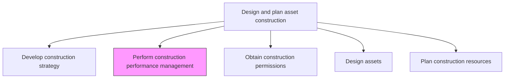
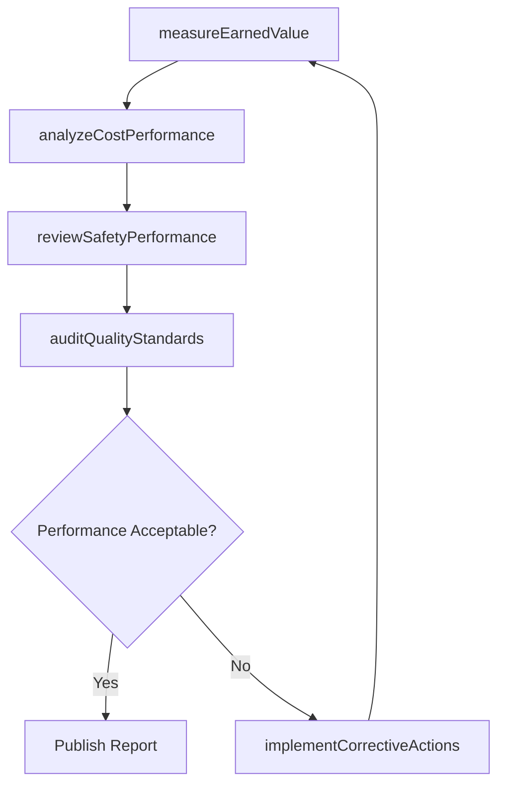

# Perform construction performance management

> Business-as-Code definition for construction performance management. Models the complete process of measuring, analyzing, and optimizing construction activities against targets for schedule, cost, safety, and quality.

## Overview

Managing the construction process to ensure that activates are on task, on budget, and are being performed with safety and quality in mind.

## Process Hierarchy



## GraphDL

```yaml
perform:
  object: Construction Performance Management
  actor: ConstructionManager
  result: PerformanceReport
```

## Actions

| Action | Description |
|--------|-------------|
| measureEarnedValue | Calculate earned value metrics including CPI and SPI for active construction |
| reviewSafetyPerformance | Assess safety incident rates, near-misses, and compliance with safety protocols |
| auditQualityStandards | Verify construction work meets design specifications and quality benchmarks |
| analyzeCostPerformance | Compare actual costs against budgeted amounts and forecast at completion |
| implementCorrectiveActions | Define and execute remediation plans for underperforming areas |

## Events

| Event | Description |
|-------|-------------|
| earnedValueCalculated | CPI and SPI metrics updated for the reporting period |
| safetyPerformanceReviewed | Safety metrics and incident reports evaluated |
| qualityAuditCompleted | Quality inspection results documented |
| costOverrunDetected | Actual costs exceeding budget thresholds identified |
| correctiveActionImplemented | Remediation plan activated for a performance gap |

## Searches

| Search | Description |
|--------|-------------|
| getPerformanceMetrics | Retrieve earned value and schedule performance data for a project |
| findSafetyIncidents | List safety incidents filtered by severity, date, or trade |
| getQualityAuditResults | Retrieve inspection results for a specific construction phase |
| findCorrectiveActions | List active corrective actions by project or category |

## Process Flow



## RACI Matrix

| Activity | Responsible | Accountable | Consulted | Informed |
|----------|-------------|-------------|-----------|----------|
| measureEarnedValue | ProjectController | ConstructionManager | Finance | Executive |
| reviewSafetyPerformance | SafetyOfficer | ConstructionManager | HR | Legal |
| auditQualityStandards | QualityInspector | ConstructionManager | Engineering | Operations |
| analyzeCostPerformance | CostEngineer | ConstructionManager | Finance | CFO |
| implementCorrectiveActions | ConstructionManager | VP Engineering | ProjectTeam | Executive |

## Related Processes

| Process | Relationship |
|---------|-------------|
| 10.2.2.1 Develop construction strategy | Upstream - strategy defines performance targets |
| 10.2.4.1 Monitor work performance | Downstream - feeds detailed work monitoring |
| 10.2.4.2 Undertake construction quality control | Parallel - quality control data informs performance |

## Related Departments

| Department | Role |
|-----------|------|
| Construction Management | Owns performance tracking and corrective actions |
| Finance | Provides cost analysis and earned value data |
| Safety | Monitors and reports on safety metrics |
| Quality Assurance | Conducts inspections and audits |

## Related Occupations

| Occupation | Involvement |
|-----------|-------------|
| Construction Manager | Primary performance accountability |
| Project Controller | Calculates earned value and schedule metrics |
| Safety Officer | Evaluates safety compliance |
| Quality Inspector | Conducts quality audits |

## KPIs

| KPI | Description | Unit |
|-----|-------------|------|
| Cost Performance Index | Ratio of earned value to actual cost (CPI) | Ratio |
| Schedule Performance Index | Ratio of earned value to planned value (SPI) | Ratio |
| Total Recordable Incident Rate | Number of safety incidents per 200,000 labor hours | Rate |
| First-Pass Quality Rate | Percentage of inspections passed without rework | % |

## Usage

```typescript
import { performConstructionPerformanceManagement } from '@headlessly/perform-construction-performance-management'

const performance = performConstructionPerformanceManagement()

// Measure earned value for the project
const ev = await performance.measureEarnedValue({
  projectId: 'plant-expansion-north',
  reportingPeriod: 'week-22'
})

// Review safety performance
const safety = await performance.reviewSafetyPerformance({
  projectId: 'plant-expansion-north',
  periodStart: '2026-01-01',
  periodEnd: '2026-03-31'
})
```
