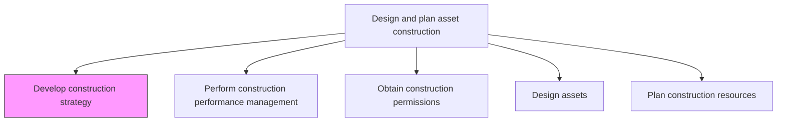
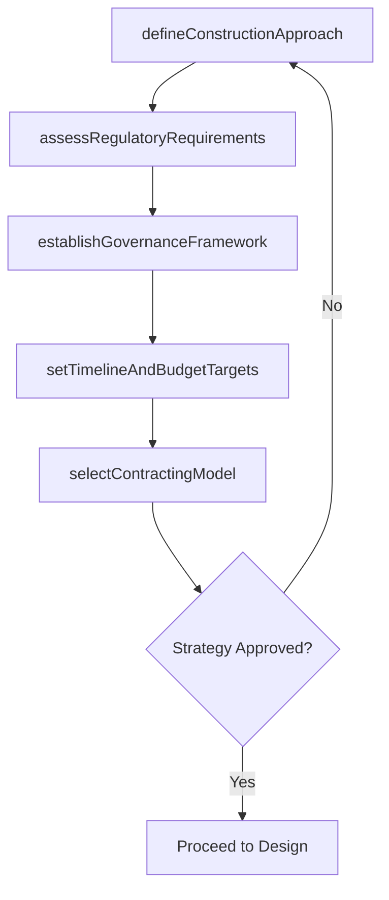

# Develop construction strategy

> Business-as-Code definition for construction strategy development. Models the complete process of defining the approach, methodology, and governance framework for constructing productive assets.

## Overview

Developing a strategy to perform asset construction. Assure that timelines, regulations, and resources are on task and on budget.

## Process Hierarchy



## GraphDL

```yaml
develop:
  object: Construction Strategy
  actor: ConstructionStrategist
  result: ConstructionStrategyDocument
```

## Actions

| Action | Description |
|--------|-------------|
| defineConstructionApproach | Select build methodology such as design-build, design-bid-build, or EPC |
| establishGovernanceFramework | Define decision-making authority, approval gates, and escalation paths |
| assessRegulatoryRequirements | Identify all applicable building codes, environmental regulations, and safety standards |
| setTimelineAndBudgetTargets | Establish high-level schedule milestones and cost envelopes |
| selectContractingModel | Determine contracting strategy including lump-sum, cost-plus, or unit-price approaches |

## Events

| Event | Description |
|-------|-------------|
| constructionApproachDefined | Build methodology selected and documented |
| governanceFrameworkEstablished | Decision authority and approval gates formalized |
| regulatoryRequirementsAssessed | Applicable regulations identified and cataloged |
| targetsSet | Timeline milestones and budget targets established |
| contractingModelSelected | Contracting approach finalized |

## Searches

| Search | Description |
|--------|-------------|
| getConstructionStrategy | Retrieve the strategy document for a specific construction project |
| findRegulatoryRequirements | List applicable regulations by jurisdiction and project type |
| getContractingModels | Retrieve available contracting approaches and their trade-offs |
| findStrategyTemplates | List reusable strategy templates from prior projects |

## Process Flow



## RACI Matrix

| Activity | Responsible | Accountable | Consulted | Informed |
|----------|-------------|-------------|-----------|----------|
| defineConstructionApproach | ConstructionStrategist | VP Engineering | ProjectManager | Finance |
| establishGovernanceFramework | ProgramManager | VP Engineering | Legal | Executive |
| assessRegulatoryRequirements | ComplianceOfficer | ConstructionStrategist | Legal | SafetyOfficer |
| setTimelineAndBudgetTargets | ProjectPlanner | VP Engineering | Finance | Operations |
| selectContractingModel | ProcurementManager | VP Engineering | Legal | Finance |

## Related Processes

| Process | Relationship |
|---------|-------------|
| 10.2.1.1 Define capital investment plan | Upstream - investment plan determines project scope |
| 10.2.2.4 Design assets | Downstream - strategy informs design approach |
| 10.2.2.3 Obtain construction permissions | Downstream - regulatory assessment feeds permitting |

## Related Departments

| Department | Role |
|-----------|------|
| Engineering | Leads construction strategy development |
| Legal | Advises on regulatory and contractual requirements |
| Procurement | Defines contracting and vendor engagement approach |
| Finance | Validates budget targets and funding alignment |

## Related Occupations

| Occupation | Involvement |
|-----------|-------------|
| Construction Strategist | Primary strategy developer |
| Program Manager | Establishes governance framework |
| Compliance Officer | Identifies regulatory requirements |
| Procurement Manager | Selects contracting models |

## KPIs

| KPI | Description | Unit |
|-----|-------------|------|
| Strategy Completion Time | Time from initiation to approved strategy | Days |
| Regulatory Coverage | Percentage of applicable regulations identified in strategy | % |
| Strategy Reuse Rate | Percentage of strategies leveraging prior templates | % |
| Stakeholder Approval Cycles | Number of review cycles before strategy approval | Count |

## Usage

```typescript
import { developConstructionStrategy } from '@headlessly/develop-construction-strategy'

const strategy = developConstructionStrategy()

// Define the construction approach
const approach = await strategy.defineConstructionApproach({
  projectId: 'plant-expansion-north',
  methodology: 'design-build',
  complexity: 'high'
})

// Assess regulatory requirements
const regulations = await strategy.assessRegulatoryRequirements({
  jurisdiction: 'state-of-texas',
  projectType: 'industrial-facility',
  environmentalImpact: true
})
```
