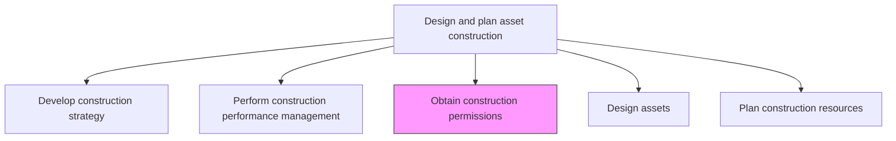
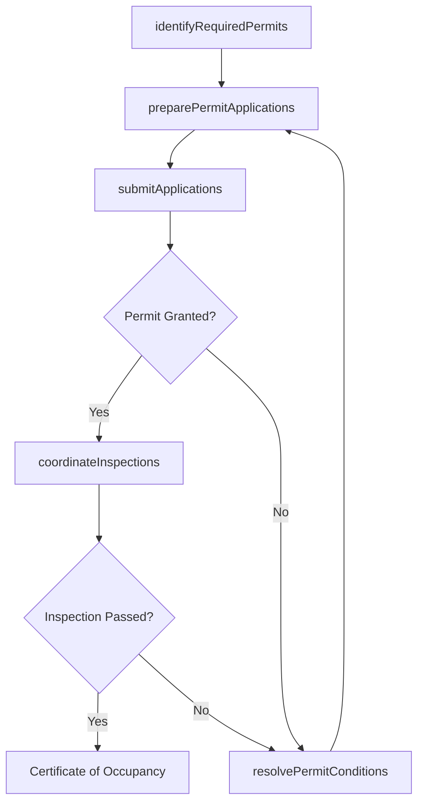

# Obtain construction permissions

> Business-as-Code definition for construction permitting. Models the complete process of identifying, applying for, and securing all required construction permits and regulatory approvals.

## Overview

Gathering the required permits for construction from the proper jurisdiction. This may include inspections during and after construction to verify that the new asset meets all national, regional, and local codes.

## Process Hierarchy



## GraphDL

```yaml
obtain:
  object: Construction Permissions
  actor: PermittingSpecialist
  result: ApprovedPermits
```

## Actions

| Action | Description |
|--------|-------------|
| identifyRequiredPermits | Determine all permits needed based on project type, location, and jurisdiction |
| preparePermitApplications | Compile drawings, specifications, and documentation for permit submissions |
| submitApplications | File permit applications with relevant municipal, state, and federal agencies |
| coordinateInspections | Schedule and facilitate required inspections during and after construction |
| resolvePermitConditions | Address any conditions, modifications, or corrections required by authorities |

## Events

| Event | Description |
|-------|-------------|
| permitsIdentified | Required permits cataloged with application deadlines |
| applicationsSubmitted | Permit applications filed with regulatory authorities |
| permitGranted | Construction permit approved and issued |
| inspectionPassed | Regulatory inspection completed with satisfactory results |
| conditionsResolved | All permit conditions and corrections addressed |

## Searches

| Search | Description |
|--------|-------------|
| findRequiredPermits | List permits needed for a project by jurisdiction and type |
| getPermitStatus | Retrieve the current status of a specific permit application |
| findUpcomingInspections | List scheduled inspections by date or project |
| getPermitConditions | Retrieve outstanding conditions attached to an issued permit |

## Process Flow



## RACI Matrix

| Activity | Responsible | Accountable | Consulted | Informed |
|----------|-------------|-------------|-----------|----------|
| identifyRequiredPermits | PermittingSpecialist | ProjectManager | Legal | Engineering |
| preparePermitApplications | PermittingSpecialist | ProjectManager | Architect | Engineering |
| submitApplications | PermittingSpecialist | ProjectManager | Legal | Finance |
| coordinateInspections | PermittingSpecialist | ConstructionManager | SafetyOfficer | Contractors |
| resolvePermitConditions | ProjectManager | ConstructionManager | Architect | Legal |

## Related Processes

| Process | Relationship |
|---------|-------------|
| 10.2.2.1 Develop construction strategy | Upstream - strategy identifies regulatory requirements |
| 10.2.2.4 Design assets | Parallel - design documents are required for permit applications |
| 10.2.3.3 Construct new assets | Downstream - permits must be in place before construction begins |

## Related Departments

| Department | Role |
|-----------|------|
| Construction Management | Coordinates permitting with project timelines |
| Legal | Advises on regulatory compliance and appeals |
| Architecture | Provides drawings and specifications for applications |
| Government Relations | Facilitates communication with regulatory agencies |

## Related Occupations

| Occupation | Involvement |
|-----------|-------------|
| Permitting Specialist | Primary executor of permit acquisition |
| Architect | Prepares construction drawings for submissions |
| Construction Manager | Coordinates inspections with build schedule |
| Regulatory Affairs Officer | Manages government agency relationships |

## KPIs

| KPI | Description | Unit |
|-----|-------------|------|
| Permit Approval Cycle Time | Average time from application submission to permit issuance | Days |
| First-Submission Approval Rate | Percentage of permits approved without resubmission | % |
| Inspection Pass Rate | Percentage of inspections passed on first attempt | % |
| Permitting Cost | Total cost of permit fees and application preparation | Currency |

## Usage

```typescript
import { obtainConstructionPermissions } from '@headlessly/obtain-construction-permissions'

const permits = obtainConstructionPermissions()

// Identify all required permits
const required = await permits.identifyRequiredPermits({
  projectId: 'plant-expansion-north',
  jurisdiction: 'harris-county-tx',
  projectType: 'industrial-construction'
})

// Submit applications
const submission = await permits.submitApplications({
  permits: required.permits,
  drawings: 'architectural-set-v3',
  expedited: true
})
```
