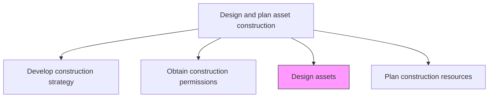
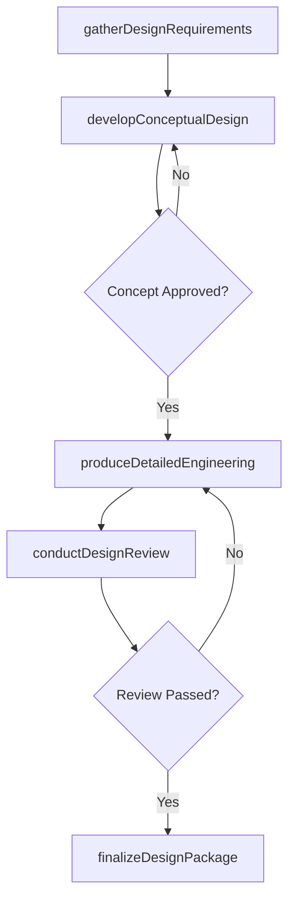

# Design assets

> Business-as-Code definition for asset design. Models the complete process of developing architectural, structural, and engineering designs for productive assets that meet organizational and regulatory requirements.

## Overview

Designing assets to meet organizational needs as well as ensuring that the asset adheres to all national, regional, and local construction codes.

## Process Hierarchy



## GraphDL

```yaml
design:
  object: Assets
  actor: DesignEngineer
  result: ApprovedDesignPackage
```

## Actions

| Action | Description |
|--------|-------------|
| gatherDesignRequirements | Collect functional, capacity, and operational requirements from stakeholders |
| developConceptualDesign | Create preliminary layouts, schematics, and feasibility studies |
| produceDetailedEngineering | Generate construction-ready drawings, specifications, and bill of materials |
| conductDesignReview | Facilitate peer and stakeholder reviews to validate design against requirements |
| finalizeDesignPackage | Incorporate review feedback and issue the approved design for construction |

## Events

| Event | Description |
|-------|-------------|
| requirementsGathered | Design requirements documented and baselined |
| conceptualDesignCompleted | Preliminary design approved for detailed engineering |
| detailedEngineeringCompleted | Construction-ready drawings and specifications produced |
| designReviewCompleted | Stakeholder review comments addressed |
| designPackageFinalized | Approved design package issued for construction |

## Searches

| Search | Description |
|--------|-------------|
| getDesignPackage | Retrieve the design package for a specific asset project |
| findDesignRevisions | List revision history for a design document |
| getRequirementsMatrix | Retrieve the requirements traceability matrix for a design |
| findOpenReviewComments | List unresolved design review comments |

## Process Flow



## RACI Matrix

| Activity | Responsible | Accountable | Consulted | Informed |
|----------|-------------|-------------|-----------|----------|
| gatherDesignRequirements | DesignEngineer | ChiefEngineer | Operations | Finance |
| developConceptualDesign | Architect | ChiefEngineer | DesignEngineer | ProjectManager |
| produceDetailedEngineering | DesignEngineer | ChiefEngineer | StructuralEngineer | Procurement |
| conductDesignReview | ChiefEngineer | VP Engineering | SafetyOfficer | Legal |
| finalizeDesignPackage | DesignEngineer | ChiefEngineer | QualityAssurance | ConstructionManager |

## Related Processes

| Process | Relationship |
|---------|-------------|
| 10.2.2.1 Develop construction strategy | Upstream - strategy defines design approach |
| 10.2.2.3 Obtain construction permissions | Parallel - design documents support permit applications |
| 10.2.2.5 Plan construction resources | Downstream - design determines resource requirements |

## Related Departments

| Department | Role |
|-----------|------|
| Engineering | Produces design drawings and specifications |
| Architecture | Develops spatial layouts and aesthetic design |
| Operations | Provides functional and capacity requirements |
| Quality Assurance | Validates design against standards |

## Related Occupations

| Occupation | Involvement |
|-----------|-------------|
| Design Engineer | Primary creator of technical designs |
| Architect | Develops spatial and structural concepts |
| Structural Engineer | Ensures structural integrity of designs |
| Chief Engineer | Accountable for design quality and approval |

## KPIs

| KPI | Description | Unit |
|-----|-------------|------|
| Design Cycle Time | Time from requirements gathering to approved design package | Weeks |
| Design Revision Count | Number of revisions before final approval | Count |
| Requirements Coverage | Percentage of stated requirements addressed in design | % |
| Design Error Rate | Number of design errors discovered during construction | Per Project |

## Usage

```typescript
import { designAssets } from '@headlessly/design-assets'

const design = designAssets()

// Gather design requirements
const requirements = await design.gatherDesignRequirements({
  projectId: 'plant-expansion-north',
  stakeholders: ['operations', 'safety', 'maintenance'],
  capacityTarget: '50000-units-per-month'
})

// Produce detailed engineering drawings
const drawings = await design.produceDetailedEngineering({
  conceptId: requirements.approvedConcept.id,
  standard: 'ASME',
  outputFormat: 'BIM'
})
```
