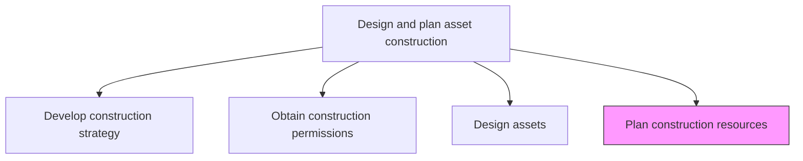
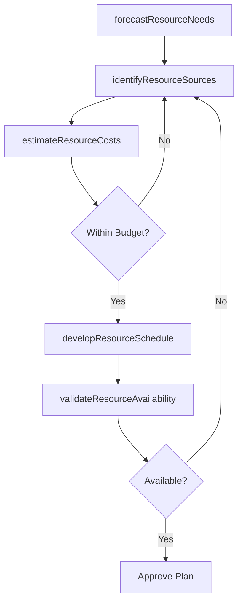

# Plan construction resources

> Business-as-Code definition for construction resource planning. Models the complete process of forecasting, sourcing, and scheduling labor, materials, and equipment needed for asset construction.

## Overview

Determining what resources will need to be acquired in order to carry out construction. Plan when, where, and how resources will be used. Determine the length of time resources will be utilized.

## Process Hierarchy



## GraphDL

```yaml
plan:
  object: Construction Resources
  actor: ResourcePlanner
  result: ResourcePlan
```

## Actions

| Action | Description |
|--------|-------------|
| forecastResourceNeeds | Estimate labor, material, and equipment quantities based on design specifications |
| identifyResourceSources | Determine suppliers, subcontractors, and workforce pools for required resources |
| developResourceSchedule | Create a timeline for resource mobilization, utilization, and demobilization |
| estimateResourceCosts | Calculate total cost of resources including procurement, logistics, and overhead |
| validateResourceAvailability | Confirm that planned resources can be secured within the required timeframes |

## Events

| Event | Description |
|-------|-------------|
| resourceNeedsForecasted | Labor, material, and equipment requirements quantified |
| resourceSourcesIdentified | Suppliers and subcontractors shortlisted |
| resourceScheduleCreated | Resource mobilization timeline established |
| resourceCostsEstimated | Total resource budget calculated and validated |
| resourceAvailabilityConfirmed | All critical resources confirmed available |

## Searches

| Search | Description |
|--------|-------------|
| getResourcePlan | Retrieve the resource plan for a specific construction project |
| findAvailableSuppliers | List qualified suppliers for a given material or equipment category |
| getResourceSchedule | Retrieve the mobilization and utilization timeline |
| findResourceConflicts | Identify scheduling conflicts across concurrent projects |

## Process Flow



## RACI Matrix

| Activity | Responsible | Accountable | Consulted | Informed |
|----------|-------------|-------------|-----------|----------|
| forecastResourceNeeds | ResourcePlanner | ProjectManager | Engineering | Finance |
| identifyResourceSources | ProcurementSpecialist | ResourcePlanner | Vendors | Legal |
| developResourceSchedule | ProjectScheduler | ProjectManager | ConstructionManager | Operations |
| estimateResourceCosts | CostEstimator | ProjectManager | Finance | CFO |
| validateResourceAvailability | ResourcePlanner | ProjectManager | Procurement | Contractors |

## Related Processes

| Process | Relationship |
|---------|-------------|
| 10.2.2.4 Design assets | Upstream - design specifications determine resource requirements |
| 10.2.3.1 Schedule construction work | Downstream - resource plan feeds construction scheduling |
| 10.2.3.2 Obtain resources | Downstream - resource plan guides procurement activities |

## Related Departments

| Department | Role |
|-----------|------|
| Project Management | Owns resource planning and scheduling |
| Procurement | Sources materials, equipment, and subcontractors |
| Finance | Validates resource cost estimates against budget |
| Engineering | Provides technical specifications for resource requirements |

## Related Occupations

| Occupation | Involvement |
|-----------|-------------|
| Resource Planner | Primary planner of construction resources |
| Cost Estimator | Develops resource cost projections |
| Procurement Specialist | Identifies and qualifies resource suppliers |
| Project Scheduler | Integrates resources into the construction schedule |

## KPIs

| KPI | Description | Unit |
|-----|-------------|------|
| Resource Forecast Accuracy | Variance between planned and actual resource consumption | % |
| Supplier Lead Time | Average time from order placement to delivery | Days |
| Resource Utilization Rate | Percentage of planned resources actually utilized | % |
| Resource Cost Variance | Difference between estimated and actual resource costs | Currency |

## Usage

```typescript
import { planConstructionResources } from '@headlessly/plan-construction-resources'

const resources = planConstructionResources()

// Forecast resource needs from design specifications
const forecast = await resources.forecastResourceNeeds({
  projectId: 'plant-expansion-north',
  designPackageId: 'design-v3-approved',
  trades: ['structural-steel', 'electrical', 'mechanical']
})

// Validate resource availability
const availability = await resources.validateResourceAvailability({
  forecastId: forecast.id,
  requiredByDate: '2026-05-01'
})
```
