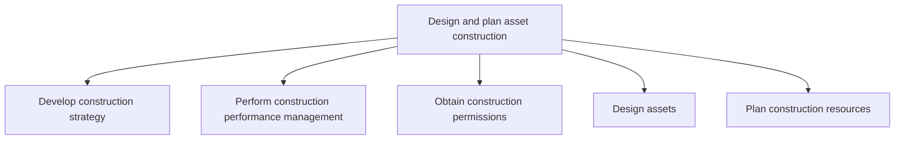
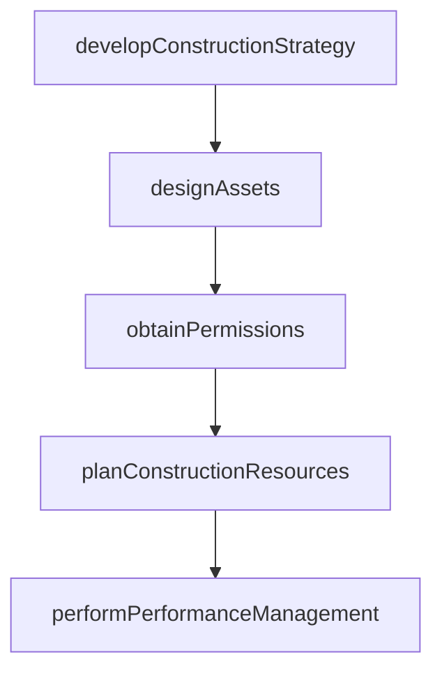

# Design and plan asset construction

> Business-as-Code definition for outlining construction strategies, obtaining regulatory permissions, designing productive assets, and planning resource requirements to ensure compliant and efficient asset construction.

## Overview

Outlining the steps and strategies needed to construct assets. Verify that all regulations are adhered to and that all permissions have been granted. Organize and plan for resources to complete construction.

## Process Hierarchy



## GraphDL

```yaml
design:
  object: And Plan Asset Construction
  actor: DesignEngineer
  result: ConstructionPlan
```

## Actions

| Action | Description |
|--------|-------------|
| developConstructionStrategy | Define approach, timeline, and regulatory requirements for construction |
| obtainPermissions | Secure building permits and regulatory approvals from relevant authorities |
| designAssets | Create engineering specifications, blueprints, and technical drawings |
| planConstructionResources | Determine labor, material, and equipment needs for construction |
| performPerformanceManagement | Monitor construction planning activities against milestones |

## Events

| Event | Description |
|-------|-------------|
| constructionStrategyDeveloped | Construction approach and timeline approved |
| permissionsObtained | All required permits and regulatory approvals secured |
| assetsDesigned | Engineering designs and specifications completed |
| constructionResourcesPlanned | Resource requirements and procurement plan finalized |
| performanceManaged | Planning milestone review completed |

## Searches

| Search | Description |
|--------|-------------|
| getDesignSpecifications | Retrieve engineering designs for a planned asset |
| findPermitStatus | Query permit application status by jurisdiction |
| getResourcePlan | Retrieve resource requirements and availability for construction |

## Process Flow



## RACI Matrix

| Activity | Responsible | Accountable | Consulted | Informed |
|----------|-------------|-------------|-----------|----------|
| developConstructionStrategy | ProjectManager | VP Engineering | Safety | Finance |
| designAssets | DesignEngineer | ChiefEngineer | Operations | Procurement |
| obtainPermissions | RegulatoryCoordinator | ProjectManager | Legal | Engineering |
| planConstructionResources | ResourcePlanner | ProjectManager | Procurement | HR |

## Sub-Processes

| ID | Name | Description |
|----|------|-------------|
| 10.2.2.1 | Develop construction strategy | Developing a strategy to perform asset construction. Assure that timelines, regulations, and resourc |
| 10.2.2.2 | Perform construction performance management | Managing the construction process to ensure that activates are on task, on budget, and are being per |
| 10.2.2.3 | Obtain construction permissions | Gathering the required permits for construction from the proper jurisdiction. This may include inspe |
| 10.2.2.4 | Design assets | Designing assets to meet organizational needs as well as ensuring that the asset adheres to all nati |
| 10.2.2.5 | Plan construction resources | Determining what resources will need to be acquired in order to carry out construction. Plan when, w |

## Related Processes

| Process | Relationship |
|---------|-------------|
| 10.2.1 Manage capital program for productive assets | Upstream - capital funding enables design and planning |
| 10.2.3 Schedule and perform construction work | Downstream - completed designs move to construction execution |
| 10.2.4 Manage asset construction | Parallel - construction management oversees quality during build |

## Related Departments

| Department | Role |
|-----------|------|
| Engineering | Creates asset designs and technical specifications |
| Regulatory Affairs | Manages permit applications and regulatory approvals |
| Procurement | Sources contractors and materials for construction |

## Related Occupations

| Occupation | Involvement |
|-----------|-------------|
| Design Engineer | Creates detailed asset engineering specifications |
| Project Manager | Coordinates design, permitting, and resource planning |

## KPIs

| KPI | Description | Unit |
|-----|-------------|------|
| Design Completion Rate | Percentage of designs completed on schedule | % |
| Permit Approval Time | Average time from permit submission to approval | Days |
| Design Change Rate | Number of design changes after initial approval | Count |

## Usage

```typescript
import { designAndPlanAssetConstruction } from '@headlessly/design-and-plan-asset-construction'

const design = designAndPlanAssetConstruction()

// Design a new production line
const specs = await design.designAssets({
  assetType: 'assembly-line',
  capacity: '500-units-per-day',
  compliance: ['OSHA', 'EPA', 'local-building-code']
})

// Check permit status
const permits = await design.findPermitStatus({
  projectId: 'CAP-2025-042',
  jurisdiction: 'Harris-County-TX'
})
```
