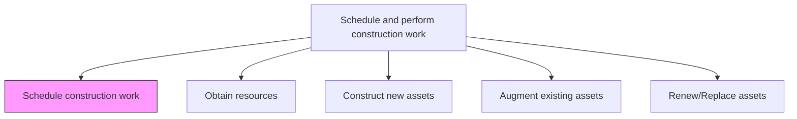
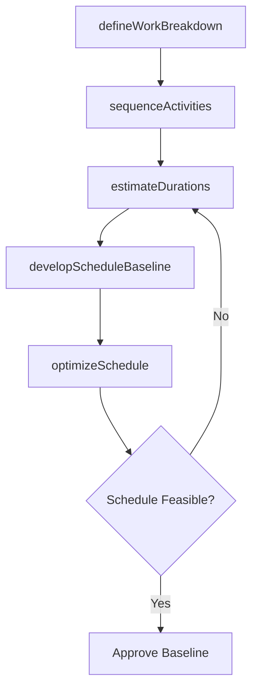

# Schedule construction work

> Business-as-Code definition for construction work scheduling. Models the complete process of sequencing, timing, and coordinating construction activities to optimize delivery within constraints.

## Overview

Defining a timetable for which to execute the construction of the asset.

## Process Hierarchy



## GraphDL

```yaml
schedule:
  object: Construction Work
  actor: ProjectScheduler
  result: ConstructionSchedule
```

## Actions

| Action | Description |
|--------|-------------|
| defineWorkBreakdown | Decompose the construction project into schedulable work packages and activities |
| sequenceActivities | Establish dependencies and logical relationships between construction activities |
| estimateDurations | Calculate the expected duration for each activity based on resources and scope |
| developScheduleBaseline | Create the approved master schedule with critical path analysis |
| optimizeSchedule | Apply resource leveling and schedule compression techniques to meet targets |

## Events

| Event | Description |
|-------|-------------|
| workBreakdownDefined | Work breakdown structure completed and approved |
| activitiesSequenced | Activity dependencies and relationships established |
| durationsEstimated | Duration estimates validated for all activities |
| scheduleBaselineApproved | Master construction schedule approved as baseline |
| scheduleOptimized | Schedule refined through leveling or compression |

## Searches

| Search | Description |
|--------|-------------|
| getConstructionSchedule | Retrieve the master schedule for a specific project |
| findCriticalPathActivities | List activities on the critical path |
| getScheduleVariance | Retrieve schedule performance data and variance analysis |
| findMilestones | List upcoming milestones by date range or project phase |

## Process Flow



## RACI Matrix

| Activity | Responsible | Accountable | Consulted | Informed |
|----------|-------------|-------------|-----------|----------|
| defineWorkBreakdown | ProjectScheduler | ProjectManager | Engineering | Contractors |
| sequenceActivities | ProjectScheduler | ProjectManager | ConstructionManager | Safety |
| estimateDurations | ProjectScheduler | ProjectManager | TradeForemen | ResourcePlanner |
| developScheduleBaseline | ProjectScheduler | ProjectManager | Finance | Executive |
| optimizeSchedule | ProjectScheduler | ProjectManager | ResourcePlanner | Procurement |

## Related Processes

| Process | Relationship |
|---------|-------------|
| 10.2.2.5 Plan construction resources | Upstream - resource plan informs schedule development |
| 10.2.3.2 Obtain resources | Downstream - schedule drives resource procurement timing |
| 10.2.3.3 Construct new assets | Downstream - schedule governs construction execution |

## Related Departments

| Department | Role |
|-----------|------|
| Project Management | Develops and maintains the construction schedule |
| Construction Management | Provides activity duration inputs and constraints |
| Procurement | Aligns material delivery with schedule milestones |
| Finance | Validates schedule against cash flow projections |

## Related Occupations

| Occupation | Involvement |
|-----------|-------------|
| Project Scheduler | Primary schedule developer and maintainer |
| Project Manager | Approves and governs the schedule baseline |
| Construction Superintendent | Provides field-level scheduling inputs |
| Cost Engineer | Aligns schedule with earned value management |

## KPIs

| KPI | Description | Unit |
|-----|-------------|------|
| Schedule Performance Index | Ratio of earned schedule to planned schedule | Ratio |
| Critical Path Float | Total float available on the critical path | Days |
| Milestone On-Time Rate | Percentage of milestones achieved on or before target date | % |
| Schedule Compression Efficiency | Reduction in duration achieved through optimization | % |

## Usage

```typescript
import { scheduleConstructionWork } from '@headlessly/schedule-construction-work'

const scheduler = scheduleConstructionWork()

// Define work breakdown structure
const wbs = await scheduler.defineWorkBreakdown({
  projectId: 'plant-expansion-north',
  designPackageId: 'design-v3-approved',
  levels: 4
})

// Develop the schedule baseline
const baseline = await scheduler.developScheduleBaseline({
  wbsId: wbs.id,
  startDate: '2026-06-01',
  criticalPathMethod: true
})
```
