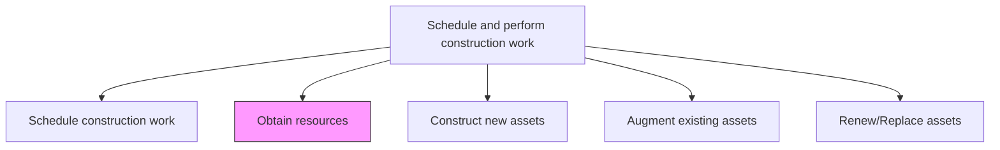
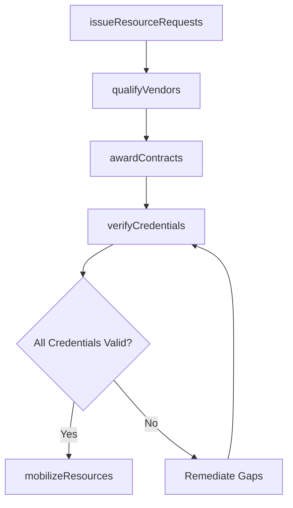

# Obtain resources

> Business-as-Code definition for construction resource procurement. Models the complete process of sourcing, qualifying, and mobilizing labor, materials, and equipment for construction projects.

## Overview

Gathering resources needed to complete all construction work. Verify that all resources have the proper training and skills to perform the work.

## Process Hierarchy



## GraphDL

```yaml
obtain:
  object: Resources
  actor: ProcurementManager
  result: MobilizedResources
```

## Actions

| Action | Description |
|--------|-------------|
| issueResourceRequests | Create and distribute procurement requests for materials, equipment, and labor |
| qualifyVendors | Evaluate subcontractors and suppliers for capability, safety record, and certifications |
| awardContracts | Select vendors and execute purchase orders or subcontracts |
| verifyCredentials | Confirm that all labor resources possess required training, licenses, and certifications |
| mobilizeResources | Coordinate delivery of materials and equipment and onboarding of labor to the site |

## Events

| Event | Description |
|-------|-------------|
| resourceRequestsIssued | Procurement requests distributed to qualified vendors |
| vendorsQualified | Vendor evaluation completed with approved vendor list |
| contractsAwarded | Purchase orders or subcontracts executed |
| credentialsVerified | All labor certifications and training records confirmed |
| resourcesMobilized | Materials delivered and labor onboarded at the construction site |

## Searches

| Search | Description |
|--------|-------------|
| findQualifiedVendors | List vendors by trade, certification, or performance rating |
| getResourceOrders | Retrieve open purchase orders and subcontracts for a project |
| trackDeliveryStatus | Check delivery status of ordered materials and equipment |
| findCredentialGaps | Identify labor resources missing required certifications |

## Process Flow



## RACI Matrix

| Activity | Responsible | Accountable | Consulted | Informed |
|----------|-------------|-------------|-----------|----------|
| issueResourceRequests | ProcurementManager | ProjectManager | ResourcePlanner | Finance |
| qualifyVendors | ProcurementSpecialist | ProcurementManager | SafetyOfficer | Legal |
| awardContracts | ProcurementManager | ProjectManager | Legal | Finance |
| verifyCredentials | SafetyOfficer | ConstructionManager | HR | ProcurementManager |
| mobilizeResources | SiteSuperintendent | ConstructionManager | Logistics | ProjectScheduler |

## Related Processes

| Process | Relationship |
|---------|-------------|
| 10.2.2.5 Plan construction resources | Upstream - resource plan defines what needs to be procured |
| 10.2.3.1 Schedule construction work | Upstream - schedule determines when resources are needed |
| 10.2.3.3 Construct new assets | Downstream - mobilized resources enable construction |

## Related Departments

| Department | Role |
|-----------|------|
| Procurement | Manages vendor qualification and contract execution |
| Construction Management | Coordinates resource mobilization at site |
| Safety | Verifies worker certifications and vendor safety records |
| Legal | Reviews and approves contract terms |

## Related Occupations

| Occupation | Involvement |
|-----------|-------------|
| Procurement Manager | Leads resource acquisition process |
| Site Superintendent | Coordinates on-site resource mobilization |
| Safety Officer | Validates credentials and safety qualifications |
| Contracts Administrator | Manages purchase orders and subcontract documentation |

## KPIs

| KPI | Description | Unit |
|-----|-------------|------|
| Procurement Cycle Time | Average time from request to resource mobilization | Days |
| Vendor Qualification Rate | Percentage of evaluated vendors meeting qualification criteria | % |
| On-Time Delivery Rate | Percentage of materials and equipment delivered on schedule | % |
| Credential Compliance Rate | Percentage of labor resources with valid certifications | % |

## Usage

```typescript
import { obtainResources } from '@headlessly/obtain-resources'

const procurement = obtainResources()

// Issue resource requests based on the plan
const requests = await procurement.issueResourceRequests({
  projectId: 'plant-expansion-north',
  resourcePlanId: 'plan-v2',
  trades: ['structural-steel', 'electrical', 'plumbing']
})

// Mobilize resources to the site
const mobilization = await procurement.mobilizeResources({
  contractIds: requests.awardedContracts,
  siteId: 'construction-site-north',
  mobilizationDate: '2026-06-01'
})
```
