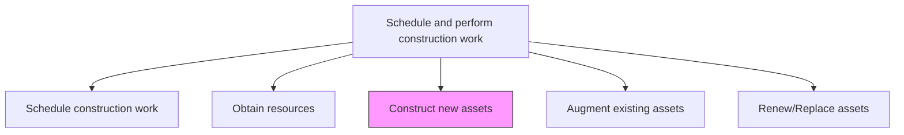
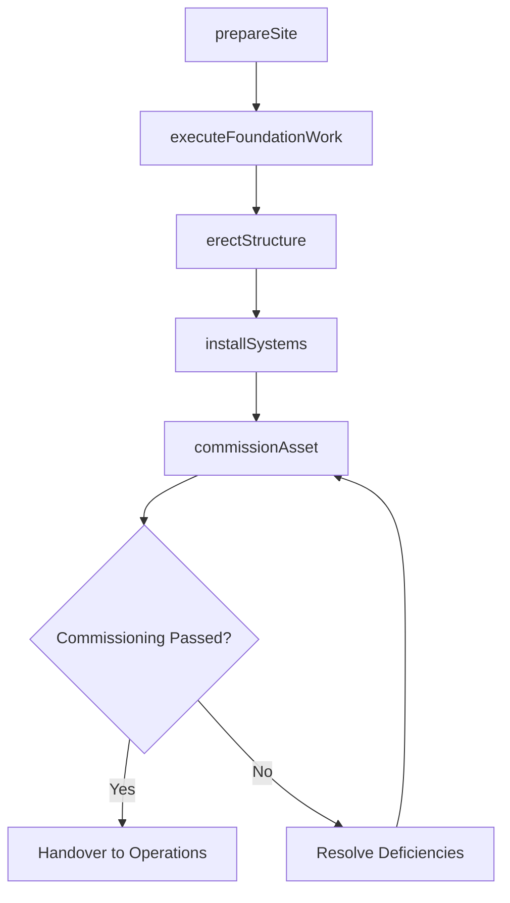

# Construct new assets

> Business-as-Code definition for new asset construction. Models the complete process of executing the physical build of new productive assets from ground-breaking through commissioning.

## Overview

Building new assets necessary for the organization. Be aware of any construction codes and permits that need to be addressed.

## Process Hierarchy



## GraphDL

```yaml
construct:
  object: New Assets
  actor: ConstructionSuperintendent
  result: CompletedAsset
```

## Actions

| Action | Description |
|--------|-------------|
| prepareSite | Clear, grade, and prepare the construction site including temporary facilities |
| executeFoundationWork | Construct foundations, footings, and below-grade infrastructure |
| erectStructure | Build the primary structural framework including steel, concrete, or masonry |
| installSystems | Install mechanical, electrical, plumbing, and specialty systems |
| commissionAsset | Test, verify, and hand over the completed asset for operational use |

## Events

| Event | Description |
|-------|-------------|
| sitePrepared | Construction site cleared, graded, and ready for foundation work |
| foundationCompleted | Foundations and below-grade work finished and inspected |
| structureErected | Primary structural framework completed |
| systemsInstalled | All mechanical, electrical, and plumbing systems installed |
| assetCommissioned | Asset tested, verified, and accepted for operations |

## Searches

| Search | Description |
|--------|-------------|
| getConstructionStatus | Retrieve the current phase and completion percentage of a new build |
| findActiveWorkOrders | List open work orders by trade, phase, or priority |
| getInspectionResults | Retrieve inspection outcomes for a specific construction phase |
| findPunchListItems | List outstanding deficiencies requiring correction before handover |

## Process Flow



## RACI Matrix

| Activity | Responsible | Accountable | Consulted | Informed |
|----------|-------------|-------------|-----------|----------|
| prepareSite | SiteSuperintendent | ConstructionManager | Environmental | SafetyOfficer |
| executeFoundationWork | TradeForeman | ConstructionSuperintendent | StructuralEngineer | QualityInspector |
| erectStructure | TradeForeman | ConstructionSuperintendent | DesignEngineer | ProjectManager |
| installSystems | SystemsContractor | ConstructionSuperintendent | MechanicalEngineer | Operations |
| commissionAsset | CommissioningEngineer | ConstructionManager | Operations | Executive |

## Related Processes

| Process | Relationship |
|---------|-------------|
| 10.2.3.1 Schedule construction work | Upstream - schedule governs construction sequence |
| 10.2.3.2 Obtain resources | Upstream - procured resources enable construction |
| 10.2.4.2 Undertake construction quality control | Parallel - quality control during build phases |

## Related Departments

| Department | Role |
|-----------|------|
| Construction Management | Directs and supervises all construction activities |
| Engineering | Provides technical oversight and design clarifications |
| Operations | Participates in commissioning and acceptance |
| Safety | Monitors site safety compliance throughout construction |

## Related Occupations

| Occupation | Involvement |
|-----------|-------------|
| Construction Superintendent | Directs on-site construction activities |
| Trade Foreman | Leads specific trade crews |
| Commissioning Engineer | Tests and validates completed systems |
| Quality Inspector | Verifies workmanship against specifications |

## KPIs

| KPI | Description | Unit |
|-----|-------------|------|
| Construction Completion Rate | Percentage of work completed versus planned | % |
| Safety Incident Rate | Number of recordable incidents per 200,000 labor hours | Rate |
| Rework Rate | Percentage of completed work requiring correction | % |
| Commissioning Punch List | Number of deficiency items at handover | Count |

## Usage

```typescript
import { constructNewAssets } from '@headlessly/construct-new-assets'

const construction = constructNewAssets()

// Prepare the construction site
const site = await construction.prepareSite({
  projectId: 'plant-expansion-north',
  siteId: 'lot-42-industrial-park',
  activities: ['clearing', 'grading', 'temporary-facilities']
})

// Commission the completed asset
const commissioning = await construction.commissionAsset({
  assetId: site.assetId,
  testProtocol: 'full-systems-validation',
  acceptanceCriteria: 'operational-readiness'
})
```
