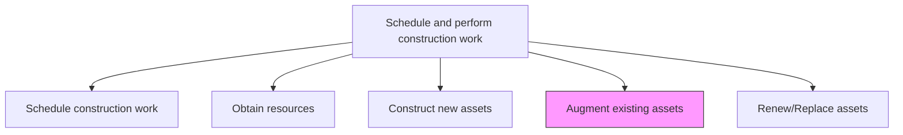
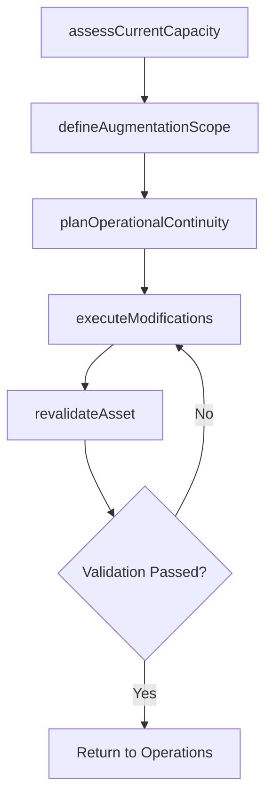

# Augment existing assets

> Business-as-Code definition for existing asset augmentation. Models the complete process of expanding, upgrading, or enhancing productive assets to meet evolving organizational requirements.

## Overview

Modifying existing assets to align with the changing needs of the organization. Be aware of any construction codes and permits that need to be addressed.

## Process Hierarchy



## GraphDL

```yaml
augment:
  object: Existing Assets
  actor: ModificationEngineer
  result: AugmentedAsset
```

## Actions

| Action | Description |
|--------|-------------|
| assessCurrentCapacity | Evaluate the existing asset condition, capacity, and remaining useful life |
| defineAugmentationScope | Specify what modifications, expansions, or upgrades are required |
| planOperationalContinuity | Develop strategies to maintain operations during modification work |
| executeModifications | Perform physical expansion, upgrade, or enhancement work on the existing asset |
| revalidateAsset | Test and certify the augmented asset meets new performance requirements |

## Events

| Event | Description |
|-------|-------------|
| currentCapacityAssessed | Existing asset condition and capacity documented |
| augmentationScopeDefined | Modification requirements specified and approved |
| continuityPlanEstablished | Operational continuity strategy during modifications approved |
| modificationsExecuted | Physical augmentation work completed |
| assetRevalidated | Augmented asset tested and certified for operational use |

## Searches

| Search | Description |
|--------|-------------|
| findAugmentationProjects | List active or planned asset augmentation projects |
| getAssetConditionReport | Retrieve the current condition assessment for an existing asset |
| getModificationScope | Retrieve the detailed scope of work for an augmentation project |
| findOperationalImpacts | List production or operational impacts during augmentation |

## Process Flow



## RACI Matrix

| Activity | Responsible | Accountable | Consulted | Informed |
|----------|-------------|-------------|-----------|----------|
| assessCurrentCapacity | AssetEngineer | ConstructionManager | Operations | Maintenance |
| defineAugmentationScope | ModificationEngineer | ProjectManager | DesignEngineer | Finance |
| planOperationalContinuity | OperationsManager | ProjectManager | Safety | Maintenance |
| executeModifications | ConstructionSuperintendent | ConstructionManager | Engineering | Operations |
| revalidateAsset | CommissioningEngineer | ConstructionManager | QualityInspector | Operations |

## Related Processes

| Process | Relationship |
|---------|-------------|
| 10.2.3.3 Construct new assets | Alternative - new construction versus augmenting existing |
| 10.2.3.5 Renew/Replace assets | Alternative - replacement versus augmentation decision |
| 10.3.1.2 Analyze assets and predict maintenance requirements | Upstream - asset analysis may trigger augmentation |

## Related Departments

| Department | Role |
|-----------|------|
| Engineering | Designs augmentation specifications |
| Construction Management | Executes modification work |
| Operations | Ensures continuity during augmentation |
| Maintenance | Provides asset condition data and post-augmentation support |

## Related Occupations

| Occupation | Involvement |
|-----------|-------------|
| Modification Engineer | Designs and specifies augmentation work |
| Construction Superintendent | Directs on-site modification activities |
| Operations Manager | Manages production continuity |
| Commissioning Engineer | Validates augmented asset performance |

## KPIs

| KPI | Description | Unit |
|-----|-------------|------|
| Augmentation Cycle Time | Time from scope definition to asset revalidation | Days |
| Operational Downtime | Total production hours lost during augmentation | Hours |
| Capacity Increase | Percentage increase in asset capacity post-augmentation | % |
| Budget Adherence | Variance between planned and actual augmentation costs | % |

## Usage

```typescript
import { augmentExistingAssets } from '@headlessly/augment-existing-assets'

const augmentation = augmentExistingAssets()

// Assess current asset capacity
const assessment = await augmentation.assessCurrentCapacity({
  assetId: 'production-line-3',
  metrics: ['throughput', 'utilization', 'remaining-life']
})

// Execute the modifications
const result = await augmentation.executeModifications({
  scopeId: assessment.recommendedScope.id,
  continuityPlan: 'shift-to-line-4',
  startDate: '2026-07-01'
})
```
