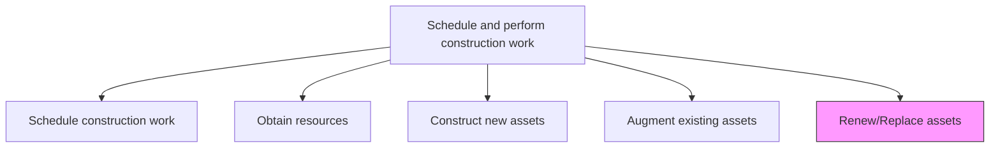
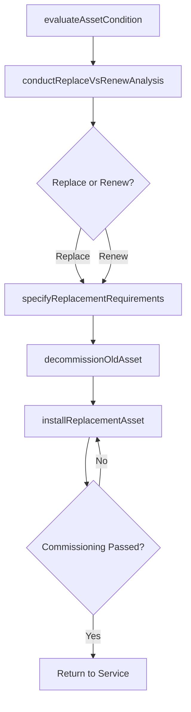

# Renew/Replace assets

> Business-as-Code definition for asset renewal and replacement. Models the complete process of evaluating end-of-life assets and executing their renewal or replacement with modern equivalents.

## Overview

Determining the need to replace existing assets. Be aware of any construction codes and permits that need to be addressed.

## Process Hierarchy



## GraphDL

```yaml
renew/replace:
  object: Assets
  actor: AssetEngineer
  result: RenewedAsset
```

## Actions

| Action | Description |
|--------|-------------|
| evaluateAssetCondition | Assess the current state, performance, and remaining useful life of the asset |
| conductReplaceVsRenewAnalysis | Compare costs and benefits of full replacement versus refurbishment |
| specifyReplacementRequirements | Define technical specifications for the renewed or replacement asset |
| decommissionOldAsset | Safely shut down and remove the existing asset from service |
| installReplacementAsset | Construct, install, and commission the new or renewed asset |

## Events

| Event | Description |
|-------|-------------|
| assetConditionEvaluated | Current asset performance and condition data documented |
| analysisCompleted | Replace-versus-renew decision analysis finalized |
| replacementSpecified | Technical requirements for replacement asset defined |
| oldAssetDecommissioned | Existing asset safely removed from service |
| replacementInstalled | New or renewed asset installed and commissioned |

## Searches

| Search | Description |
|--------|-------------|
| findAssetsForRenewal | List assets approaching or past end of useful life |
| getReplaceVsRenewAnalysis | Retrieve the cost-benefit analysis for a specific asset |
| getReplacementSpecifications | Retrieve technical specifications for a planned replacement |
| findDecommissionedAssets | List assets that have been decommissioned and their disposition |

## Process Flow



## RACI Matrix

| Activity | Responsible | Accountable | Consulted | Informed |
|----------|-------------|-------------|-----------|----------|
| evaluateAssetCondition | AssetEngineer | MaintenanceManager | Operations | Finance |
| conductReplaceVsRenewAnalysis | FinancialAnalyst | ProjectManager | Engineering | CFO |
| specifyReplacementRequirements | DesignEngineer | ProjectManager | Operations | Procurement |
| decommissionOldAsset | MaintenanceTechnician | ConstructionManager | SafetyOfficer | Environmental |
| installReplacementAsset | ConstructionSuperintendent | ConstructionManager | Engineering | Operations |

## Related Processes

| Process | Relationship |
|---------|-------------|
| 10.2.3.4 Augment existing assets | Alternative - augmentation versus full replacement |
| 10.4.2 Decommission productive assets | Downstream - old assets go through decommissioning |
| 10.3.1.2 Analyze assets and predict maintenance requirements | Upstream - asset analysis triggers renewal decisions |

## Related Departments

| Department | Role |
|-----------|------|
| Engineering | Specifies replacement requirements and validates designs |
| Maintenance | Provides asset condition data and assists with decommissioning |
| Finance | Conducts replacement cost-benefit analysis |
| Operations | Manages transition from old to new assets |

## Related Occupations

| Occupation | Involvement |
|-----------|-------------|
| Asset Engineer | Evaluates condition and specifies replacement |
| Financial Analyst | Performs replace-versus-renew analysis |
| Construction Superintendent | Manages installation of replacement asset |
| Maintenance Technician | Assists with decommissioning and commissioning |

## KPIs

| KPI | Description | Unit |
|-----|-------------|------|
| Asset Replacement Cycle Time | Time from condition evaluation to new asset commissioning | Days |
| Transition Downtime | Duration of production disruption during replacement | Hours |
| Replacement Cost Accuracy | Variance between estimated and actual replacement costs | % |
| New Asset Performance Gain | Improvement in performance metrics of replacement versus old asset | % |

## Usage

```typescript
import { renewReplaceAssets } from '@headlessly/renew-replace-assets'

const renewal = renewReplaceAssets()

// Evaluate current asset condition
const condition = await renewal.evaluateAssetCondition({
  assetId: 'compressor-unit-7',
  metrics: ['efficiency', 'reliability', 'maintenance-cost-trend']
})

// Conduct replace vs renew analysis
const analysis = await renewal.conductReplaceVsRenewAnalysis({
  assetId: 'compressor-unit-7',
  remainingLife: condition.estimatedRemainingLife,
  replacementCost: 750000
})
```
