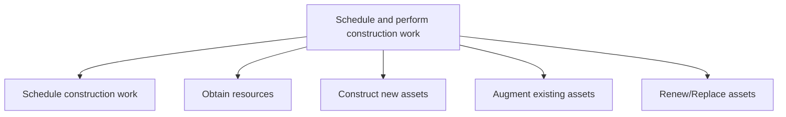
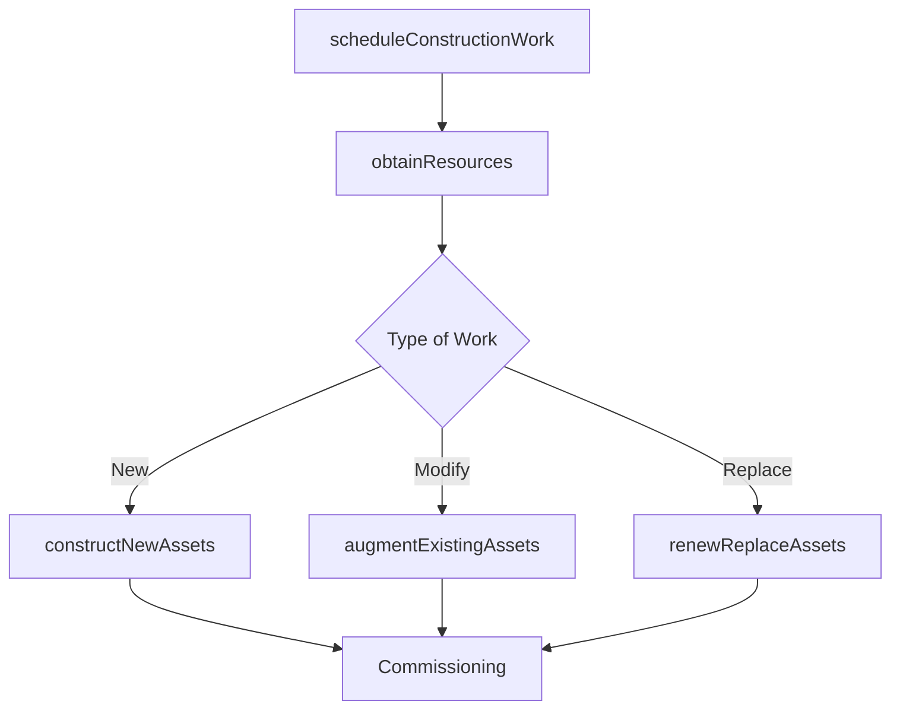

# Schedule and perform construction work

> Business-as-Code definition for scheduling construction timelines, obtaining resources, and executing the physical construction, augmentation, or replacement of productive assets.

## Overview

Arranging a timetable for which to perform construction work. Schedule resources to contract assets for new or replacement assets. Reschedule or redesign assets if needed.

## Process Hierarchy



## GraphDL

```yaml
schedule:
  object: And Perform Construction Work
  actor: ConstructionSuperintendent
  result: CompletedAsset
```

## Actions

| Action | Description |
|--------|-------------|
| scheduleConstructionWork | Define construction timeline with milestones and dependencies |
| obtainResources | Procure labor, materials, equipment, and contractor services |
| constructNewAssets | Execute physical construction of new productive assets |
| augmentExistingAssets | Modify or expand existing assets to meet changing requirements |
| renewReplaceAssets | Replace worn or obsolete assets with new equivalents |

## Events

| Event | Description |
|-------|-------------|
| constructionWorkScheduled | Construction timeline and milestones finalized |
| resourcesObtained | Labor, materials, and equipment procured for construction |
| newAssetsConstructed | New productive asset construction completed |
| existingAssetsAugmented | Existing asset modification or expansion completed |
| assetsRenewedReplaced | Asset replacement or renewal work completed |

## Searches

| Search | Description |
|--------|-------------|
| getConstructionSchedule | Retrieve construction timeline with milestones and progress |
| findResourceAvailability | Check availability of labor, materials, and equipment |
| getConstructionProgress | Query completion percentage and upcoming milestones |

## Process Flow



## RACI Matrix

| Activity | Responsible | Accountable | Consulted | Informed |
|----------|-------------|-------------|-----------|----------|
| scheduleConstructionWork | ConstructionScheduler | ProjectManager | Contractors | Operations |
| obtainResources | ProcurementLead | ProjectManager | Finance | Engineering |
| constructNewAssets | ConstructionSuperintendent | ProjectManager | QualityInspector | Safety |

## Sub-Processes

| ID | Name | Description |
|----|------|-------------|
| 10.2.3.1 | Schedule construction work | Defining a timetable for which to execute the construction of the asset. |
| 10.2.3.2 | Obtain resources | Gathering resources needed to complete all construction work. Verify that all resources have the pro |
| 10.2.3.3 | Construct new assets | Building new assets necessary for the organization. Be aware of any construction codes and permits t |
| 10.2.3.4 | Augment existing assets | Modifying existing assets to align with the changing needs of the organization. Be aware of any cons |
| 10.2.3.5 | Renew/Replace assets | Determining the need to replace existing assets. Be aware of any construction codes and permits that |

## Related Processes

| Process | Relationship |
|---------|-------------|
| 10.2.2 Design and plan asset construction | Upstream - approved designs feed into construction scheduling |
| 10.2.4 Manage asset construction | Parallel - construction management ensures quality during build |
| 10.3 Maintain productive assets | Downstream - completed assets enter maintenance lifecycle |

## Related Departments

| Department | Role |
|-----------|------|
| Construction | Executes physical building and assembly work |
| Procurement | Sources contractors, materials, and equipment |
| Project Management | Schedules work and coordinates resource allocation |

## Related Occupations

| Occupation | Involvement |
|-----------|-------------|
| Construction Superintendent | Manages on-site construction execution |
| Scheduler | Creates and maintains construction timelines |

## KPIs

| KPI | Description | Unit |
|-----|-------------|------|
| Schedule Performance Index | Ratio of earned value to planned value | Ratio |
| Resource Utilization | Percentage of allocated resources actively deployed | % |
| Construction Rework Rate | Percentage of work requiring correction | % |

## Usage

```typescript
import { scheduleAndPerformConstructionWork } from '@headlessly/schedule-and-perform-construction-work'

const construction = scheduleAndPerformConstructionWork()

// Schedule construction work
const schedule = await construction.scheduleConstructionWork({
  projectId: 'CAP-2025-042',
  startDate: '2025-06-01',
  milestones: ['foundation', 'framing', 'mechanical', 'finish']
})

// Track construction progress
const progress = await construction.getConstructionProgress({
  projectId: 'CAP-2025-042',
  asOfDate: '2025-08-15'
})
```
