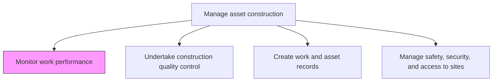
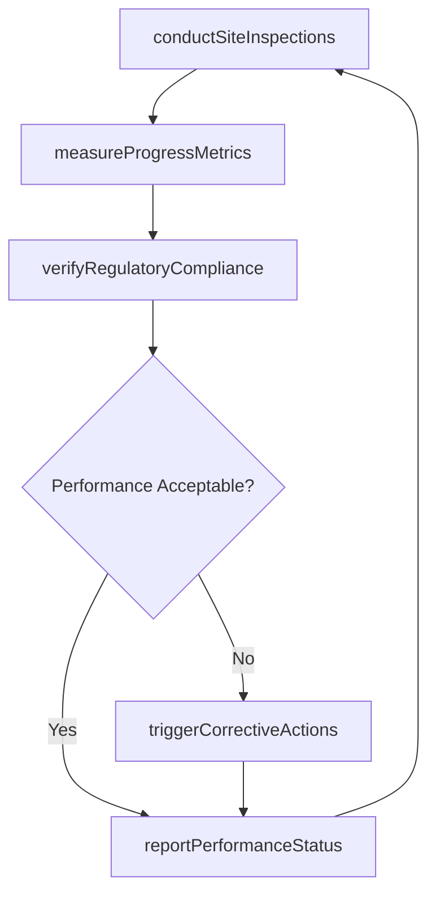

# Monitor work performance

> Business-as-Code definition for construction work performance monitoring. Models the complete process of tracking, measuring, and reporting on construction activity progress, regulatory compliance, and quality standards.

## Overview

Monitoring construction to insure that all regulatory laws are being adhered to, that all work is being performed in a timely manner, and that quality assurance is met at all steps of the construction process.

## Process Hierarchy



## GraphDL

```yaml
monitor:
  object: Work Performance
  actor: FieldEngineer
  result: PerformanceAssessment
```

## Actions

| Action | Description |
|--------|-------------|
| conductSiteInspections | Perform regular field inspections to verify work quality and progress |
| measureProgressMetrics | Collect and calculate earned value, schedule, and productivity data |
| verifyRegulatoryCompliance | Confirm that all work adheres to applicable building codes and regulations |
| reportPerformanceStatus | Produce periodic performance reports for project management review |
| triggerCorrectiveActions | Initiate remediation plans when performance falls below acceptable thresholds |

## Events

| Event | Description |
|-------|-------------|
| siteInspectionCompleted | Field inspection conducted with findings documented |
| progressMetricsMeasured | Earned value and schedule performance data updated |
| complianceVerified | Regulatory compliance confirmed for the reporting period |
| performanceReported | Status report published to stakeholders |
| correctiveActionTriggered | Remediation plan initiated for a performance shortfall |

## Searches

| Search | Description |
|--------|-------------|
| getPerformanceMetrics | Retrieve earned value and schedule performance data for a project |
| findInspectionFindings | List inspection findings filtered by severity or trade |
| getComplianceStatus | Retrieve regulatory compliance status for active construction |
| findCorrectiveActions | List open corrective actions and their resolution status |

## Process Flow



## RACI Matrix

| Activity | Responsible | Accountable | Consulted | Informed |
|----------|-------------|-------------|-----------|----------|
| conductSiteInspections | FieldEngineer | ConstructionManager | QualityInspector | ProjectManager |
| measureProgressMetrics | ProjectController | ConstructionManager | Finance | Executive |
| verifyRegulatoryCompliance | ComplianceOfficer | ConstructionManager | Legal | SafetyOfficer |
| reportPerformanceStatus | FieldEngineer | ConstructionManager | ProjectManager | Stakeholders |
| triggerCorrectiveActions | ConstructionManager | VP Engineering | TradeForemen | Finance |

## Related Processes

| Process | Relationship |
|---------|-------------|
| 10.2.2.2 Perform construction performance management | Upstream - performance management framework guides monitoring |
| 10.2.4.2 Undertake construction quality control | Parallel - quality data feeds performance monitoring |
| 10.2.4.3 Create work and asset records | Downstream - monitoring data feeds record creation |

## Related Departments

| Department | Role |
|-----------|------|
| Construction Management | Conducts inspections and monitors site performance |
| Project Management Office | Tracks portfolio-level performance metrics |
| Compliance | Verifies regulatory adherence |
| Finance | Monitors cost performance |

## Related Occupations

| Occupation | Involvement |
|-----------|-------------|
| Field Engineer | Primary on-site performance monitor |
| Project Controller | Calculates earned value metrics |
| Quality Inspector | Assesses work quality during inspections |
| Compliance Officer | Verifies regulatory adherence |

## KPIs

| KPI | Description | Unit |
|-----|-------------|------|
| Inspection Frequency | Number of site inspections conducted per week | Count/Week |
| Schedule Variance | Difference between planned and actual progress | Days |
| Compliance Finding Rate | Number of regulatory findings per inspection | Count |
| Corrective Action Closure Rate | Percentage of corrective actions resolved within target timeframe | % |

## Usage

```typescript
import { monitorWorkPerformance } from '@headlessly/monitor-work-performance'

const monitor = monitorWorkPerformance()

// Conduct a site inspection
const inspection = await monitor.conductSiteInspections({
  projectId: 'plant-expansion-north',
  inspectionType: 'weekly-progress',
  areas: ['structural', 'electrical', 'mechanical']
})

// Measure progress metrics
const metrics = await monitor.measureProgressMetrics({
  projectId: 'plant-expansion-north',
  asOfDate: '2026-08-15'
})
```
