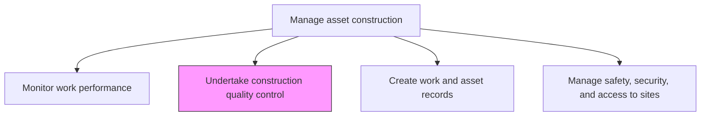
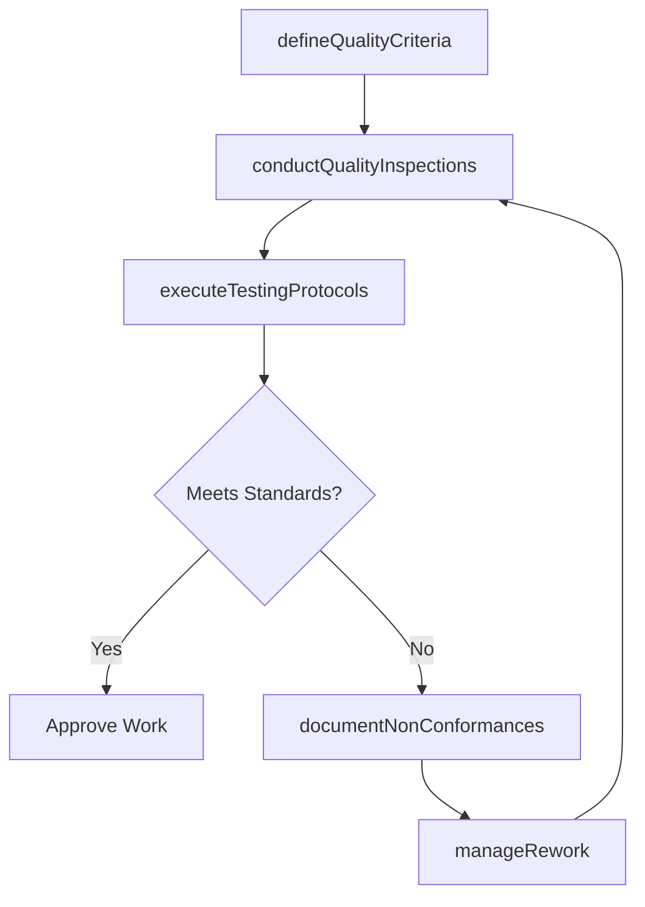

# Undertake construction quality control

> Business-as-Code definition for construction quality control. Models the complete process of inspecting, testing, and verifying that construction work meets design specifications, quality standards, and regulatory requirements.

## Overview

Implementing a checks and balances system to verify that the construction was performed correctly. Rework when errors are found.

## Process Hierarchy



## GraphDL

```yaml
undertake:
  object: Construction Quality Control
  actor: QualityInspector
  result: QualityAssuranceReport
```

## Actions

| Action | Description |
|--------|-------------|
| defineQualityCriteria | Establish acceptance criteria and testing protocols for each construction phase |
| conductQualityInspections | Perform systematic inspections of completed work against specifications |
| executeTestingProtocols | Conduct material testing, structural testing, and system testing as required |
| documentNonConformances | Record deficiencies, deviations, and non-conformances found during inspection |
| manageRework | Coordinate correction of deficient work and verify repairs meet standards |

## Events

| Event | Description |
|-------|-------------|
| qualityCriteriaDefined | Acceptance standards and test protocols established |
| inspectionCompleted | Quality inspection conducted with results documented |
| testingCompleted | Material or system tests executed with results recorded |
| nonConformanceDocumented | Construction deficiency formally recorded |
| reworkCompleted | Corrective work finished and verified |

## Searches

| Search | Description |
|--------|-------------|
| findOpenNonConformances | List unresolved quality issues by project, trade, or severity |
| getInspectionResults | Retrieve quality inspection results for a specific phase or area |
| getTestResults | Retrieve material or system test results |
| findReworkItems | List construction elements requiring rework |

## Process Flow



## RACI Matrix

| Activity | Responsible | Accountable | Consulted | Informed |
|----------|-------------|-------------|-----------|----------|
| defineQualityCriteria | QualityManager | ConstructionManager | DesignEngineer | Contractors |
| conductQualityInspections | QualityInspector | QualityManager | FieldEngineer | ProjectManager |
| executeTestingProtocols | TestingLaboratory | QualityManager | StructuralEngineer | SafetyOfficer |
| documentNonConformances | QualityInspector | QualityManager | ConstructionSuperintendent | ProjectManager |
| manageRework | ConstructionSuperintendent | ConstructionManager | QualityInspector | Finance |

## Related Processes

| Process | Relationship |
|---------|-------------|
| 10.2.4.1 Monitor work performance | Parallel - quality data feeds performance reporting |
| 10.2.4.3 Create work and asset records | Downstream - quality records are part of asset documentation |
| 10.2.3.3 Construct new assets | Parallel - quality control runs concurrently with construction |

## Related Departments

| Department | Role |
|-----------|------|
| Quality Assurance | Defines standards and conducts inspections |
| Construction Management | Coordinates rework and correction activities |
| Engineering | Provides technical specifications for quality criteria |
| Testing Laboratory | Performs material and structural testing |

## Related Occupations

| Occupation | Involvement |
|-----------|-------------|
| Quality Inspector | Primary executor of inspections and testing |
| Quality Manager | Defines quality criteria and manages the QC program |
| Testing Technician | Conducts material and system tests |
| Construction Superintendent | Manages rework activities |

## KPIs

| KPI | Description | Unit |
|-----|-------------|------|
| First-Pass Inspection Rate | Percentage of inspections passed without deficiencies | % |
| Non-Conformance Rate | Number of non-conformances per 1000 inspection points | Rate |
| Rework Cost Ratio | Rework costs as percentage of total construction cost | % |
| Rework Closure Time | Average time to resolve a non-conformance | Days |

## Usage

```typescript
import { undertakeConstructionQualityControl } from '@headlessly/undertake-construction-quality-control'

const qc = undertakeConstructionQualityControl()

// Conduct a quality inspection
const inspection = await qc.conductQualityInspections({
  projectId: 'plant-expansion-north',
  phase: 'structural-steel',
  inspectionPoints: ['welding', 'bolt-torque', 'alignment']
})

// Document and manage non-conformances
const ncr = await qc.documentNonConformances({
  inspectionId: inspection.id,
  findings: inspection.deficiencies,
  severity: 'major'
})
```
