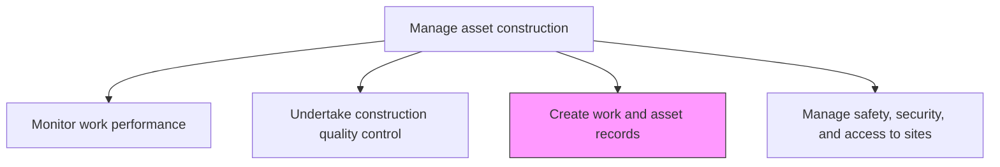
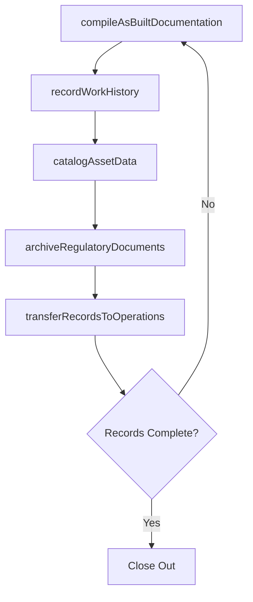

# Create work and asset records

> Business-as-Code definition for construction work and asset record creation. Models the complete process of documenting, cataloging, and archiving all construction activities, as-built conditions, and asset data.

## Overview

Implementing records to include all construction work that has been performed. Include all new or modified construction, and any construction or regulatory issues that might have occurred.

## Process Hierarchy



## GraphDL

```yaml
create:
  object: Work And Asset Records
  actor: DocumentController
  result: AssetRecordPackage
```

## Actions

| Action | Description |
|--------|-------------|
| compileAsBuiltDocumentation | Gather final drawings, specifications, and field modifications into as-built records |
| recordWorkHistory | Document all construction activities, labor hours, and material usage |
| catalogAssetData | Register new or modified assets in the enterprise asset management system |
| archiveRegulatoryDocuments | Store permits, inspection reports, and compliance certificates |
| transferRecordsToOperations | Hand over complete asset documentation to the operations and maintenance teams |

## Events

| Event | Description |
|-------|-------------|
| asBuiltDocumentationCompiled | Final as-built drawings and specifications assembled |
| workHistoryRecorded | Construction activity logs and resource records completed |
| assetDataCataloged | New assets registered in the enterprise asset management system |
| regulatoryDocumentsArchived | Permits and compliance records stored in the document management system |
| recordsTransferred | Complete documentation package delivered to operations |

## Searches

| Search | Description |
|--------|-------------|
| getAsBuiltDrawings | Retrieve as-built drawings for a specific asset or project |
| findWorkHistory | List construction activities by date, trade, or project phase |
| getAssetRegistration | Retrieve asset registration data from the enterprise system |
| findRegulatoryDocuments | List permits and compliance certificates by project or jurisdiction |

## Process Flow



## RACI Matrix

| Activity | Responsible | Accountable | Consulted | Informed |
|----------|-------------|-------------|-----------|----------|
| compileAsBuiltDocumentation | DocumentController | ProjectManager | DesignEngineer | Contractors |
| recordWorkHistory | ProjectAdministrator | ProjectManager | ConstructionSuperintendent | Finance |
| catalogAssetData | AssetManager | FacilitiesManager | Engineering | Maintenance |
| archiveRegulatoryDocuments | DocumentController | ProjectManager | ComplianceOfficer | Legal |
| transferRecordsToOperations | ProjectManager | ConstructionManager | Operations | Maintenance |

## Related Processes

| Process | Relationship |
|---------|-------------|
| 10.2.4.1 Monitor work performance | Upstream - performance data feeds work records |
| 10.2.4.2 Undertake construction quality control | Upstream - quality records are part of asset documentation |
| 10.3.2.4 Update work and asset records | Downstream - maintenance updates build on construction records |

## Related Departments

| Department | Role |
|-----------|------|
| Document Control | Manages compilation and archival of records |
| Engineering | Provides as-built drawings and technical data |
| Asset Management | Registers assets in the enterprise system |
| Operations | Receives documentation for ongoing asset management |

## Related Occupations

| Occupation | Involvement |
|-----------|-------------|
| Document Controller | Primary compiler and organizer of records |
| Project Administrator | Records work history and resource data |
| Asset Manager | Catalogs assets in enterprise systems |
| Project Manager | Oversees record completeness and handover |

## KPIs

| KPI | Description | Unit |
|-----|-------------|------|
| Record Completeness | Percentage of required documents compiled at project closeout | % |
| Documentation Cycle Time | Time from construction completion to full record package | Days |
| Asset Registration Accuracy | Percentage of assets correctly registered in enterprise system | % |
| Handover Timeliness | Percentage of record packages delivered within target timeframe | % |

## Usage

```typescript
import { createWorkAndAssetRecords } from '@headlessly/create-work-and-asset-records'

const records = createWorkAndAssetRecords()

// Compile as-built documentation
const asBuilt = await records.compileAsBuiltDocumentation({
  projectId: 'plant-expansion-north',
  designRevision: 'v3-final',
  fieldModifications: true
})

// Catalog assets in the enterprise system
const catalog = await records.catalogAssetData({
  projectId: 'plant-expansion-north',
  assets: asBuilt.newAssets,
  eamSystem: 'maximo'
})
```
