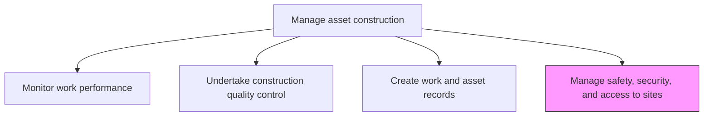
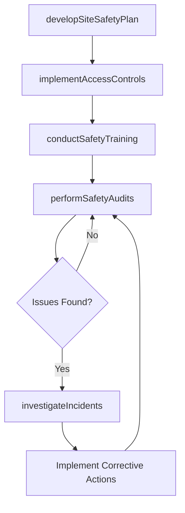

# Manage safety, security, and access to sites

> Business-as-Code definition for construction site safety, security, and access management. Models the complete process of establishing, enforcing, and monitoring safety protocols, security measures, and access controls at construction sites.

## Overview

Ensuring that safety, security, and access is maintained. Provide a workplace that meets and exceeds all local, state, and federal guidelines. Provide security and access to the building site as set forth by safety and organizational guidelines.

## Process Hierarchy



## GraphDL

```yaml
manage:
  object: Safety, Security, And Access To Sites
  actor: SiteSafetyManager
  result: SafetyComplianceReport
```

## Actions

| Action | Description |
|--------|-------------|
| developSiteSafetyPlan | Create comprehensive safety plans addressing hazards, PPE requirements, and emergency procedures |
| implementAccessControls | Establish badging, fencing, and entry protocols to restrict site access to authorized personnel |
| conductSafetyTraining | Deliver orientation and ongoing safety training to all site workers and visitors |
| performSafetyAudits | Conduct regular inspections to identify hazards and verify compliance with safety standards |
| investigateIncidents | Analyze safety incidents, near-misses, and hazards to prevent recurrence |

## Events

| Event | Description |
|-------|-------------|
| safetyPlanDeveloped | Comprehensive site safety plan approved and distributed |
| accessControlsImplemented | Site security measures and access protocols activated |
| safetyTrainingCompleted | Workers and visitors completed required safety orientation |
| safetyAuditConducted | Site safety inspection completed with findings documented |
| incidentInvestigated | Safety incident root cause analysis completed |

## Searches

| Search | Description |
|--------|-------------|
| getSiteSafetyPlan | Retrieve the safety plan for a specific construction site |
| findAccessAuthorizations | List personnel authorized to access a construction site |
| getTrainingRecords | Retrieve safety training completion records by worker or site |
| findSafetyIncidents | List safety incidents filtered by severity, date, or type |

## Process Flow



## RACI Matrix

| Activity | Responsible | Accountable | Consulted | Informed |
|----------|-------------|-------------|-----------|----------|
| developSiteSafetyPlan | SiteSafetyManager | ConstructionManager | Legal | HR |
| implementAccessControls | SecuritySupervisor | SiteSafetyManager | IT | ProjectManager |
| conductSafetyTraining | SafetyTrainer | SiteSafetyManager | TradeForemen | Contractors |
| performSafetyAudits | SafetyInspector | SiteSafetyManager | ConstructionSuperintendent | Legal |
| investigateIncidents | SiteSafetyManager | ConstructionManager | HR | Executive |

## Related Processes

| Process | Relationship |
|---------|-------------|
| 10.2.4.1 Monitor work performance | Parallel - safety performance is a key monitoring dimension |
| 10.2.3.3 Construct new assets | Parallel - safety management runs throughout construction |
| 10.3.2.5 Manage maintenance work safety | Related - similar safety framework for maintenance activities |

## Related Departments

| Department | Role |
|-----------|------|
| Safety | Develops and enforces safety protocols |
| Security | Manages physical site security and access |
| Human Resources | Supports incident investigation and worker welfare |
| Legal | Advises on regulatory compliance and liability |

## Related Occupations

| Occupation | Involvement |
|-----------|-------------|
| Site Safety Manager | Primary safety program owner |
| Security Supervisor | Manages physical access and surveillance |
| Safety Inspector | Conducts audits and inspections |
| Safety Trainer | Delivers orientation and training programs |

## KPIs

| KPI | Description | Unit |
|-----|-------------|------|
| Total Recordable Incident Rate | Number of recordable incidents per 200,000 labor hours | Rate |
| Safety Training Compliance | Percentage of site workers with current safety training | % |
| Access Control Violations | Number of unauthorized access attempts detected | Count/Month |
| Safety Audit Score | Average compliance score across safety inspections | Score (0-100) |

## Usage

```typescript
import { manageSafetySecurityAndAccessToSites } from '@headlessly/manage-safety-security-and-access-to-sites'

const safety = manageSafetySecurityAndAccessToSites()

// Develop a site safety plan
const plan = await safety.developSiteSafetyPlan({
  siteId: 'construction-site-north',
  hazardCategories: ['fall-protection', 'confined-space', 'electrical'],
  regulatoryFramework: 'OSHA-1926'
})

// Perform a safety audit
const audit = await safety.performSafetyAudits({
  siteId: 'construction-site-north',
  auditType: 'weekly-walkthrough',
  areas: ['scaffolding', 'excavation', 'crane-operations']
})
```
