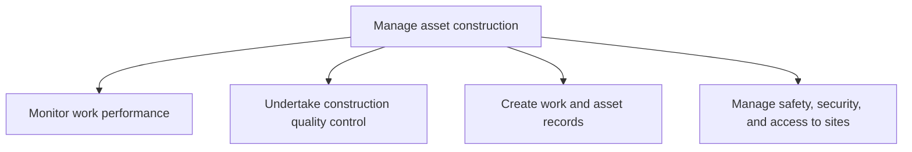
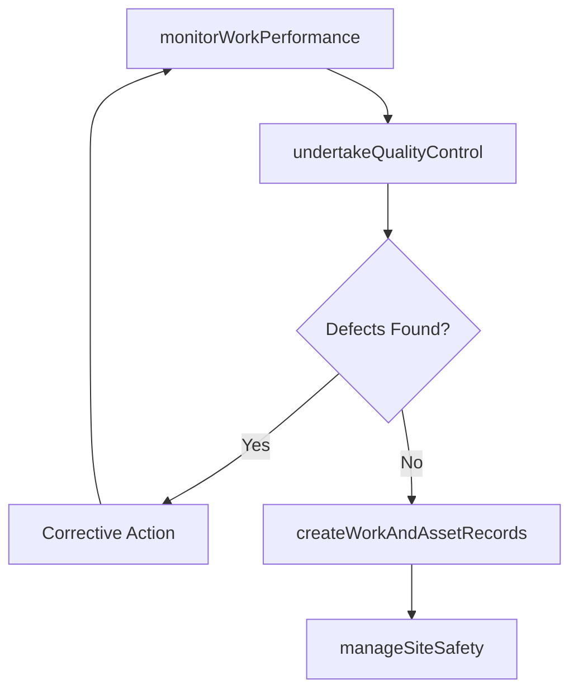

# Manage asset construction

> Business-as-Code definition for overseeing construction performance, quality control, record-keeping, and site safety to ensure productive assets are built to specification and in compliance with all standards.

## Overview

Overseeing the performance and quality of work. Assure that records are maintained throughout the construction process. Adhere to all safety, security, and access regulations set forth by the organization and all government standards.

## Process Hierarchy



## GraphDL

```yaml
manage:
  object: Asset Construction
  actor: ConstructionManager
  result: ConstructionComplianceRecord
```

## Actions

| Action | Description |
|--------|-------------|
| monitorWorkPerformance | Track construction progress, milestones, and budget adherence |
| undertakeQualityControl | Inspect construction work against specifications and standards |
| createWorkAndAssetRecords | Document all construction activities, changes, and as-built conditions |
| manageSiteSafety | Enforce safety protocols, security access, and compliance on construction sites |

## Events

| Event | Description |
|-------|-------------|
| workPerformanceMonitored | Construction progress review completed |
| qualityControlUndertaken | Quality inspection completed with findings documented |
| workAndAssetRecordsCreated | Construction records and as-built documentation updated |
| siteSafetyManaged | Site safety audit or inspection completed |

## Searches

| Search | Description |
|--------|-------------|
| getConstructionStatus | Retrieve construction project progress and milestone status |
| findQualityInspections | Query quality inspection results by project or finding severity |
| getSafetyIncidents | List construction site safety incidents by type or severity |

## Process Flow



## RACI Matrix

| Activity | Responsible | Accountable | Consulted | Informed |
|----------|-------------|-------------|-----------|----------|
| monitorWorkPerformance | ProjectManager | VP Engineering | Contractors | Finance |
| undertakeQualityControl | QualityInspector | ConstructionManager | Engineering | Safety |
| createWorkAndAssetRecords | DocumentController | ConstructionManager | Engineering | AssetManagement |
| manageSiteSafety | SafetyOfficer | ConstructionManager | Legal | HR |

## Sub-Processes

| ID | Name | Description |
|----|------|-------------|
| 10.2.4.1 | Monitor work performance | Monitoring construction to insure that all regulatory laws are being adhered to, that all work is be |
| 10.2.4.2 | Undertake construction quality control | Implementing a checks and balances system to verify that the construction was performed correctly. R |
| 10.2.4.3 | Create work and asset records | Implementing records to include all construction work that has been performed. Include all new or mo |
| 10.2.4.4 | Manage safety, security, and access to sites | Ensuring that safety, security, and access is maintained. Provide a workplace that meets and exceeds |

## Related Processes

| Process | Relationship |
|---------|-------------|
| 10.2.3 Schedule and perform construction work | Parallel - manages quality while construction is executed |
| 10.2.2 Design and plan asset construction | Upstream - specifications provide quality benchmarks |
| 10.3 Maintain productive assets | Downstream - as-built records support future maintenance |

## Related Departments

| Department | Role |
|-----------|------|
| Quality Assurance | Inspects construction work against specifications |
| Safety | Enforces site safety protocols and regulatory compliance |
| Document Control | Maintains construction records and as-built documentation |

## Related Occupations

| Occupation | Involvement |
|-----------|-------------|
| Construction Manager | Oversees all aspects of construction oversight |
| Quality Inspector | Performs physical inspections and conformance testing |
| Safety Officer | Manages site safety compliance and incident prevention |

## KPIs

| KPI | Description | Unit |
|-----|-------------|------|
| Quality Inspection Pass Rate | Percentage of inspections passing on first attempt | % |
| Safety Incident Rate | Recordable incidents per 200,000 construction hours | Rate |
| Record Completeness | Percentage of as-built documentation completed at handover | % |

## Usage

```typescript
import { manageAssetConstruction } from '@headlessly/manage-asset-construction'

const mgmt = manageAssetConstruction()

// Monitor construction work performance
const status = await mgmt.monitorWorkPerformance({
  projectId: 'CAP-2025-042',
  metrics: ['schedule-variance', 'cost-variance', 'quality-score']
})

// Conduct quality control inspection
const inspection = await mgmt.undertakeQualityControl({
  projectId: 'CAP-2025-042',
  phase: 'mechanical-installation',
  checklist: 'standard-manufacturing'
})
```
