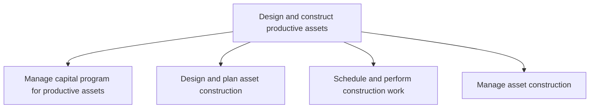
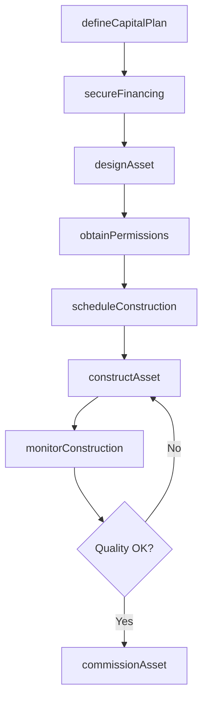

# Design and construct productive assets

> Business-as-Code definition for conceptualizing, financing, designing, and building income-generating productive assets such as manufacturing plants, equipment, and infrastructure.

## Overview

Conceptualizing and realizing dividend and income generating assets such as machines, tools, factories, etc. Manage steps to acquire assets including managing capital, as well as planning, scheduling, and overseeing construction.

## Process Hierarchy



## GraphDL

```yaml
design:
  object: And Construct Productive Assets
  actor: CapitalProjectManager
  result: ProductiveAsset
```

## Actions

| Action | Description |
|--------|-------------|
| defineCapitalPlan | Establish investment plan and budget for productive asset construction |
| secureFinancing | Obtain construction financing through internal or external sources |
| designAsset | Develop detailed engineering designs and specifications |
| obtainPermissions | Secure regulatory permits and construction approvals |
| scheduleConstruction | Create construction timeline with resource allocation |
| constructAsset | Execute physical construction or manufacturing of the asset |
| monitorConstruction | Track construction progress, quality, and safety compliance |
| commissionAsset | Complete final inspections and bring the asset into operational service |

## Events

| Event | Description |
|-------|-------------|
| capitalPlanDefined | Capital investment plan approved and funded |
| financingSecured | Construction financing obtained and committed |
| assetDesigned | Engineering designs and specifications completed |
| permissionsObtained | All required permits and regulatory approvals received |
| constructionScheduled | Construction timeline finalized and resources allocated |
| assetConstructed | Physical construction completed |
| constructionMonitored | Construction progress and quality review completed |
| assetCommissioned | Asset inspected, tested, and placed into operational service |

## Searches

| Search | Description |
|--------|-------------|
| findCapitalProjects | List capital construction projects by status, budget, or timeline |
| getProjectBudget | Retrieve detailed budget breakdown for a capital project |
| getConstructionSchedule | Query construction milestones and completion percentages |
| findPermitStatus | Check permit application status across jurisdictions |
| getAssetRecords | Retrieve as-built records and commissioning documentation |

## Process Flow



## RACI Matrix

| Activity | Responsible | Accountable | Consulted | Informed |
|----------|-------------|-------------|-----------|----------|
| defineCapitalPlan | CapitalPlanner | CFO | OperationsDirector | Board |
| designAsset | EngineeringLead | VP Engineering | SafetyOfficer | Operations |
| obtainPermissions | RegulatoryAffairs | GeneralCounsel | Engineering | Facilities |
| constructAsset | ConstructionManager | VP Engineering | Contractors | Finance |
| commissionAsset | ProjectManager | VP Operations | QualityAssurance | Maintenance |

## Sub-Processes

| ID | Name | Description |
|----|------|-------------|
| 10.2.1 | Manage capital program for productive assets | Producing and maintaining a planning schedule and a financial plan to purchase or manufacture produc |
| 10.2.2 | Design and plan asset construction | Outlining the steps and strategies needed to construct assets. Verify that all regulations are adher |
| 10.2.3 | Schedule and perform construction work | Arranging a timetable for which to perform construction work. Schedule resources to contract assets  |
| 10.2.4 | Manage asset construction | Overseeing the performance and quality of work. Assure that records are maintained throughout the co |

## Related Processes

| Process | Relationship |
|---------|-------------|
| 10.1 Plan and acquire assets | Upstream - property acquisition precedes construction |
| 10.3 Maintain productive assets | Downstream - constructed assets enter maintenance lifecycle |
| 10.4 Dispose of assets | Downstream - assets eventually reach end of useful life |
| 8.0 Manage Financial Resources | Upstream - capital financing enables construction |

## Related Departments

| Department | Role |
|-----------|------|
| Engineering | Designs productive assets and oversees construction quality |
| Finance | Manages capital program budgets and construction financing |
| Procurement | Sources contractors, materials, and equipment |
| Safety and Compliance | Ensures construction meets regulatory and safety standards |
| Operations | Defines asset requirements and accepts commissioned assets |

## Related Occupations

| Occupation | Involvement |
|-----------|-------------|
| Capital Project Manager | Leads end-to-end construction project delivery |
| Design Engineer | Creates engineering designs and specifications |
| Construction Superintendent | Manages on-site construction execution |
| Quantity Surveyor | Estimates costs and manages project budgets |

## KPIs

| KPI | Description | Unit |
|-----|-------------|------|
| Capital Project On-Budget Rate | Percentage of projects completed within approved budget | % |
| Construction Schedule Variance | Deviation from planned completion date | Days |
| Safety Incident Rate | Recordable incidents per 200,000 construction work hours | Rate |
| Design Rework Rate | Percentage of design changes after construction begins | % |
| Asset Commissioning Success Rate | Percentage of assets passing first-time commissioning inspection | % |

## Usage

```typescript
import { designAndConstructProductiveAssets } from '@headlessly/design-and-construct-productive-assets'

const construction = designAndConstructProductiveAssets()

// Define capital investment plan
const plan = await construction.defineCapitalPlan({
  assetType: 'manufacturing-line',
  estimatedCost: 15000000,
  targetCompletion: '2026-Q3'
})

// Monitor active construction project
const progress = await construction.monitorConstruction({
  projectId: 'CAP-2025-042',
  metrics: ['schedule-variance', 'cost-variance', 'safety-incidents']
})

// Commission completed asset
const commissioning = await construction.commissionAsset({
  projectId: 'CAP-2025-042',
  inspectionChecklist: 'standard-manufacturing',
  operationalReadiness: true
})
```
