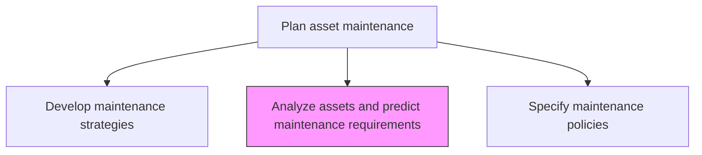
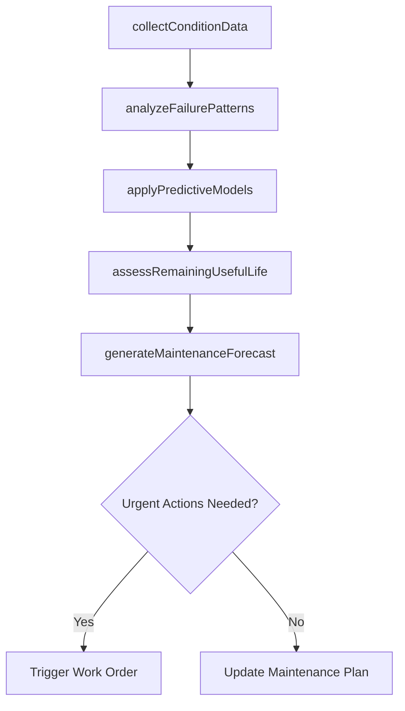

# Analyze assets and predict maintenance requirements

> Business-as-Code definition for predictive asset analysis. Models the complete process of evaluating asset condition data, applying predictive analytics, and forecasting future maintenance requirements.

## Overview

Evaluating assets in order to project future requirements for maintenance. Evaluate the present working condition of assets. Determine the future maintenance requirements of assets.

## Process Hierarchy



## GraphDL

```yaml
analyze:
  object: Assets And Predict Maintenance Requirements
  actor: PredictiveAnalyst
  result: MaintenanceForecast
```

## Actions

| Action | Description |
|--------|-------------|
| collectConditionData | Gather sensor readings, inspection results, and performance metrics from assets |
| analyzeFailurePatterns | Study historical failure modes, frequencies, and root causes |
| applyPredictiveModels | Use statistical and machine learning models to forecast asset degradation |
| assessRemainingUsefulLife | Estimate the remaining operational life of each critical asset |
| generateMaintenanceForecast | Produce a forward-looking maintenance demand plan based on predictions |

## Events

| Event | Description |
|-------|-------------|
| conditionDataCollected | Asset sensor and inspection data aggregated for analysis |
| failurePatternsAnalyzed | Historical failure mode analysis completed |
| predictiveModelsApplied | Degradation forecasts generated from analytical models |
| remainingLifeAssessed | Remaining useful life estimates produced for critical assets |
| maintenanceForecastGenerated | Forward maintenance demand plan published |

## Searches

| Search | Description |
|--------|-------------|
| getAssetConditionData | Retrieve current condition metrics for a specific asset |
| findFailureHistory | List historical failures by asset, mode, or time period |
| getPredictiveForecast | Retrieve the maintenance forecast for an asset or asset group |
| findAssetsAtRisk | List assets predicted to fail within a specified timeframe |

## Process Flow



## RACI Matrix

| Activity | Responsible | Accountable | Consulted | Informed |
|----------|-------------|-------------|-----------|----------|
| collectConditionData | ConditionMonitoringTechnician | ReliabilityEngineer | Operations | IT |
| analyzeFailurePatterns | ReliabilityEngineer | MaintenanceManager | Engineering | Finance |
| applyPredictiveModels | PredictiveAnalyst | ReliabilityEngineer | DataScientist | MaintenancePlanner |
| assessRemainingUsefulLife | ReliabilityEngineer | MaintenanceManager | AssetEngineer | Operations |
| generateMaintenanceForecast | MaintenancePlanner | MaintenanceManager | Operations | Finance |

## Related Processes

| Process | Relationship |
|---------|-------------|
| 10.3.1.1 Develop maintenance strategies | Upstream - strategies define the predictive approach |
| 10.3.1.4 Integrate preventive maintenance into operations schedule | Downstream - forecasts inform preventive scheduling |
| 10.3.3.4 Identify unplanned maintenance requirements | Parallel - predictive analysis reduces unplanned events |

## Related Departments

| Department | Role |
|-----------|------|
| Maintenance | Owns predictive analysis and forecasting |
| Engineering | Provides asset technical data and failure mode expertise |
| Operations | Supplies operational condition data |
| IT | Supports sensor infrastructure and data collection |

## Related Occupations

| Occupation | Involvement |
|-----------|-------------|
| Reliability Engineer | Leads failure pattern analysis |
| Predictive Analyst | Applies analytical models to condition data |
| Condition Monitoring Technician | Collects sensor and inspection data |
| Maintenance Planner | Translates forecasts into maintenance plans |

## KPIs

| KPI | Description | Unit |
|-----|-------------|------|
| Prediction Accuracy | Percentage of predicted failures that occurred within forecasted window | % |
| Unplanned Downtime Reduction | Decrease in unplanned downtime attributed to predictive analysis | % |
| Condition Monitoring Coverage | Percentage of critical assets with active condition monitoring | % |
| Mean Time Between Failures | Average operational time between asset failures | Hours |

## Usage

```typescript
import { analyzeAssetsAndPredictMaintenanceRequirements } from '@headlessly/analyze-assets-and-predict-maintenance-requirements'

const analysis = analyzeAssetsAndPredictMaintenanceRequirements()

// Collect condition data from sensors
const data = await analysis.collectConditionData({
  assetIds: ['pump-101', 'compressor-205', 'motor-310'],
  metrics: ['vibration', 'temperature', 'pressure']
})

// Generate maintenance forecast
const forecast = await analysis.generateMaintenanceForecast({
  analysisId: data.analysisId,
  horizonMonths: 12,
  confidenceLevel: 0.90
})
```
