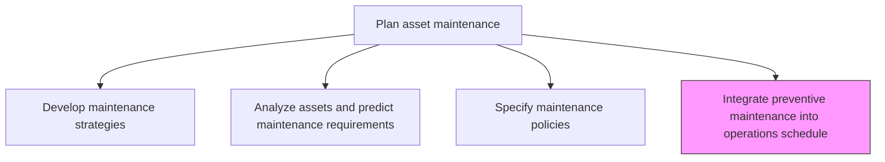
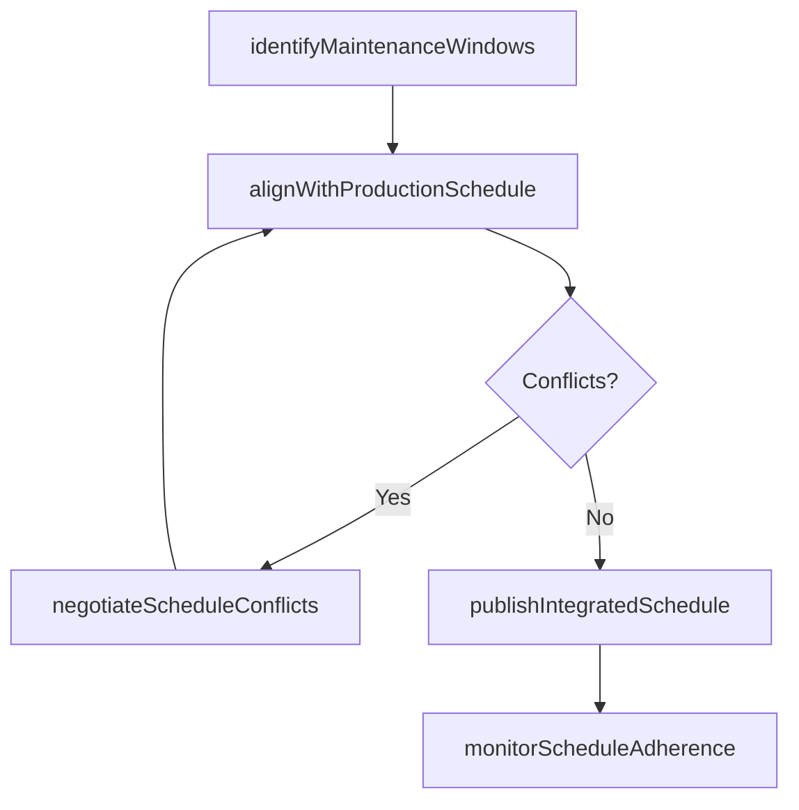

# Integrate preventive maintenance into operations schedule

> Business-as-Code definition for preventive maintenance scheduling integration. Models the complete process of coordinating planned maintenance windows with production schedules to minimize operational disruption.

## Overview

Devising a methodology and procedure for assimilating the works of planned maintenance into the schedule scheme for the processing of finished products that utilizes the same machinery.

## Process Hierarchy



## GraphDL

```yaml
integrate:
  object: Preventive Maintenance Into Operations Schedule
  actor: MaintenancePlanner
  result: IntegratedSchedule
```

## Actions

| Action | Description |
|--------|-------------|
| identifyMaintenanceWindows | Determine available time slots when assets can be taken offline for maintenance |
| alignWithProductionSchedule | Coordinate maintenance windows with production planning to minimize downtime |
| negotiateScheduleConflicts | Resolve competing demands between maintenance needs and production targets |
| publishIntegratedSchedule | Issue the combined maintenance-production schedule to all stakeholders |
| monitorScheduleAdherence | Track execution of planned maintenance against the integrated schedule |

## Events

| Event | Description |
|-------|-------------|
| maintenanceWindowsIdentified | Available maintenance time slots determined |
| schedulesAligned | Maintenance and production schedules coordinated |
| conflictsResolved | Scheduling conflicts between maintenance and production negotiated |
| integratedSchedulePublished | Combined schedule distributed to stakeholders |
| scheduleAdherenceMonitored | Actual maintenance execution compared against plan |

## Searches

| Search | Description |
|--------|-------------|
| getIntegratedSchedule | Retrieve the combined maintenance-production schedule for a facility |
| findMaintenanceWindows | List available maintenance windows by asset or time period |
| findScheduleConflicts | Identify overlapping maintenance and production demands |
| getScheduleComplianceData | Retrieve adherence metrics for the integrated schedule |

## Process Flow



## RACI Matrix

| Activity | Responsible | Accountable | Consulted | Informed |
|----------|-------------|-------------|-----------|----------|
| identifyMaintenanceWindows | MaintenancePlanner | MaintenanceManager | ReliabilityEngineer | Operations |
| alignWithProductionSchedule | MaintenancePlanner | MaintenanceManager | ProductionPlanner | SupplyChain |
| negotiateScheduleConflicts | MaintenanceManager | VP Operations | ProductionManager | Finance |
| publishIntegratedSchedule | MaintenancePlanner | MaintenanceManager | Operations | AllStaff |
| monitorScheduleAdherence | MaintenanceSupervisor | MaintenanceManager | Operations | Finance |

## Related Processes

| Process | Relationship |
|---------|-------------|
| 10.3.1.2 Analyze assets and predict maintenance requirements | Upstream - predictive data informs scheduling priorities |
| 10.3.1.7 Create work plans | Downstream - integrated schedule feeds detailed work planning |
| 10.3.3.1 Perform preventative asset maintenance | Downstream - scheduled windows enable preventive execution |

## Related Departments

| Department | Role |
|-----------|------|
| Maintenance | Plans and coordinates preventive maintenance windows |
| Operations | Provides production schedule and negotiates conflicts |
| Supply Chain | Aligns material delivery with maintenance schedule |
| Finance | Evaluates cost impact of scheduling decisions |

## Related Occupations

| Occupation | Involvement |
|-----------|-------------|
| Maintenance Planner | Primary schedule integrator |
| Production Planner | Coordinates production capacity with maintenance needs |
| Maintenance Manager | Resolves scheduling conflicts |
| Operations Manager | Approves integrated schedule |

## KPIs

| KPI | Description | Unit |
|-----|-------------|------|
| Schedule Integration Rate | Percentage of preventive maintenance incorporated into production schedule | % |
| Planned Downtime Utilization | Percentage of scheduled maintenance windows fully utilized | % |
| Production Impact | Hours of production lost due to maintenance activities | Hours/Month |
| Schedule Adherence | Percentage of planned maintenance executed within scheduled windows | % |

## Usage

```typescript
import { integratePreventiveMaintenanceIntoOperationsSchedule } from '@headlessly/integrate-preventive-maintenance-into-operations-schedule'

const integration = integratePreventiveMaintenanceIntoOperationsSchedule()

// Identify available maintenance windows
const windows = await integration.identifyMaintenanceWindows({
  facilityId: 'plant-north',
  assets: ['production-line-1', 'production-line-2'],
  planningHorizon: '3-months'
})

// Align with production schedule
const aligned = await integration.alignWithProductionSchedule({
  maintenanceWindows: windows.id,
  productionScheduleId: 'q2-2026-production',
  priority: 'minimize-downtime'
})
```
