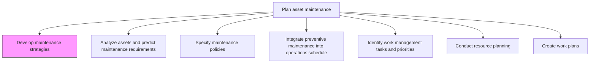
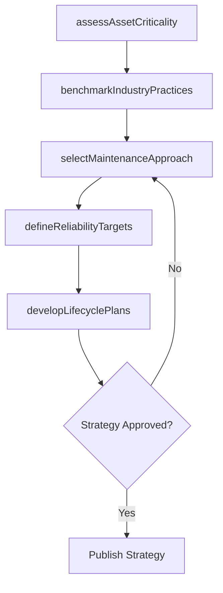

# Develop maintenance strategies

> Business-as-Code definition for maintenance strategy development. Models the complete process of defining reliability-centered approaches, maintenance philosophies, and long-term asset care strategies.

## Overview

Creating goals and agendas to better realize the success of the maintenance policies that have been put into place.

## Process Hierarchy



## GraphDL

```yaml
develop:
  object: Maintenance Strategies
  actor: ReliabilityEngineer
  result: MaintenanceStrategyDocument
```

## Actions

| Action | Description |
|--------|-------------|
| assessAssetCriticality | Rank assets by operational impact, failure consequences, and replacement cost |
| selectMaintenanceApproach | Choose between preventive, predictive, condition-based, or run-to-failure strategies per asset class |
| defineReliabilityTargets | Establish availability, mean time between failures, and uptime goals |
| developLifecyclePlans | Create long-term maintenance roadmaps aligned with asset lifecycle stages |
| benchmarkIndustryPractices | Compare maintenance strategies against industry standards and best practices |

## Events

| Event | Description |
|-------|-------------|
| assetCriticalityAssessed | Asset criticality rankings completed and validated |
| maintenanceApproachSelected | Maintenance strategy selected for each asset class |
| reliabilityTargetsSet | Availability and reliability goals established |
| lifecyclePlansCreated | Long-term maintenance roadmaps documented |
| benchmarkingCompleted | Industry comparison analysis finalized |

## Searches

| Search | Description |
|--------|-------------|
| getMaintenanceStrategy | Retrieve the strategy document for a specific asset class |
| findAssetsByCriticality | List assets ranked by criticality score |
| getReliabilityTargets | Retrieve availability and uptime targets for an asset group |
| findBenchmarkData | List industry benchmarks for maintenance performance |

## Process Flow



## RACI Matrix

| Activity | Responsible | Accountable | Consulted | Informed |
|----------|-------------|-------------|-----------|----------|
| assessAssetCriticality | ReliabilityEngineer | MaintenanceManager | Operations | Finance |
| selectMaintenanceApproach | ReliabilityEngineer | MaintenanceManager | Engineering | SafetyOfficer |
| defineReliabilityTargets | ReliabilityEngineer | VP Operations | Operations | Executive |
| developLifecyclePlans | MaintenancePlanner | MaintenanceManager | Finance | AssetManager |
| benchmarkIndustryPractices | ReliabilityEngineer | MaintenanceManager | ExternalConsultant | Executive |

## Related Processes

| Process | Relationship |
|---------|-------------|
| 10.3.1.2 Analyze assets and predict maintenance requirements | Downstream - strategy informs predictive analysis approach |
| 10.3.1.3 Specify maintenance policies | Downstream - strategy provides the foundation for policy specification |
| 10.3.2.6 Define maintenance performance targets | Downstream - strategy feeds target-setting process |

## Related Departments

| Department | Role |
|-----------|------|
| Maintenance | Develops and owns maintenance strategies |
| Operations | Provides asset utilization and criticality inputs |
| Engineering | Contributes technical reliability expertise |
| Finance | Validates lifecycle cost projections |

## Related Occupations

| Occupation | Involvement |
|-----------|-------------|
| Reliability Engineer | Primary strategy developer |
| Maintenance Manager | Accountable for strategy approval and implementation |
| Maintenance Planner | Develops lifecycle maintenance roadmaps |
| Operations Manager | Provides criticality and utilization context |

## KPIs

| KPI | Description | Unit |
|-----|-------------|------|
| Strategy Coverage | Percentage of asset classes with defined maintenance strategies | % |
| Overall Equipment Effectiveness | Combined availability, performance, and quality metric | % |
| Maintenance Cost as Percentage of RAV | Annual maintenance cost relative to replacement asset value | % |
| Strategy Review Frequency | How often maintenance strategies are reviewed and updated | Months |

## Usage

```typescript
import { developMaintenanceStrategies } from '@headlessly/develop-maintenance-strategies'

const strategy = developMaintenanceStrategies()

// Assess asset criticality across the plant
const criticality = await strategy.assessAssetCriticality({
  facilityId: 'plant-north',
  assetClasses: ['rotating-equipment', 'electrical-systems', 'instrumentation'],
  riskMatrix: 'consequence-likelihood'
})

// Select maintenance approach per asset class
const approaches = await strategy.selectMaintenanceApproach({
  criticalityResults: criticality.id,
  options: ['preventive', 'predictive', 'condition-based', 'run-to-failure']
})
```
