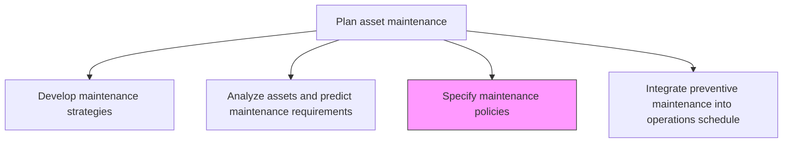
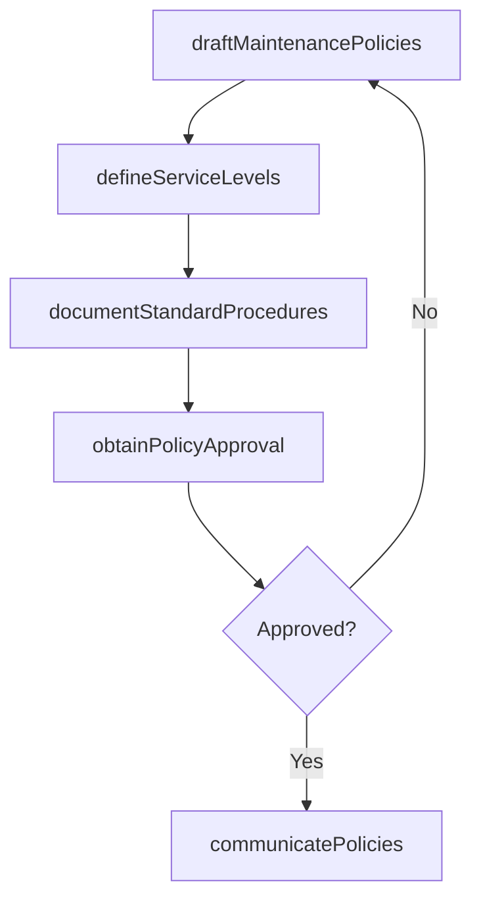

# Specify maintenance policies

> Business-as-Code definition for maintenance policy specification. Models the complete process of defining, documenting, and communicating standardized maintenance policies, procedures, and service levels.

## Overview

Communicating policies in regards to asset maintenance. Provide a clear set of procedures and policies that outline what will be involved in the maintenance process.

## Process Hierarchy



## GraphDL

```yaml
specify:
  object: Maintenance Policies
  actor: MaintenanceManager
  result: MaintenancePolicyDocument
```

## Actions

| Action | Description |
|--------|-------------|
| draftMaintenancePolicies | Write maintenance policies covering scope, responsibilities, and procedures |
| defineServiceLevels | Establish response times, resolution targets, and escalation paths for maintenance requests |
| documentStandardProcedures | Create step-by-step maintenance procedures for each asset class |
| obtainPolicyApproval | Route policies through management review and approval |
| communicatePolicies | Distribute approved policies to maintenance staff, operations, and contractors |

## Events

| Event | Description |
|-------|-------------|
| policiesDrafted | Maintenance policy documents created for review |
| serviceLevelsDefined | Response and resolution targets established |
| proceduresDocumented | Standard maintenance procedures compiled |
| policiesApproved | Management formally approved maintenance policies |
| policiesCommunicated | Approved policies distributed to all stakeholders |

## Searches

| Search | Description |
|--------|-------------|
| getMaintenancePolicy | Retrieve the current policy document for a specific asset class or facility |
| findServiceLevelAgreements | List service level targets by asset criticality or type |
| getStandardProcedure | Retrieve the documented procedure for a specific maintenance task |
| findPolicyRevisions | List revision history for maintenance policies |

## Process Flow



## RACI Matrix

| Activity | Responsible | Accountable | Consulted | Informed |
|----------|-------------|-------------|-----------|----------|
| draftMaintenancePolicies | MaintenanceManager | VP Operations | ReliabilityEngineer | Legal |
| defineServiceLevels | MaintenancePlanner | MaintenanceManager | Operations | Finance |
| documentStandardProcedures | MaintenanceSupervisor | MaintenanceManager | SafetyOfficer | Technicians |
| obtainPolicyApproval | MaintenanceManager | VP Operations | Legal | Executive |
| communicatePolicies | MaintenanceManager | VP Operations | HR | AllStaff |

## Related Processes

| Process | Relationship |
|---------|-------------|
| 10.3.1.1 Develop maintenance strategies | Upstream - strategies provide the foundation for policies |
| 10.3.1.5 Identify work management tasks and priorities | Downstream - policies guide task identification |
| 10.3.2.5 Manage maintenance work safety | Parallel - safety policies complement maintenance policies |

## Related Departments

| Department | Role |
|-----------|------|
| Maintenance | Authors and owns maintenance policies |
| Operations | Provides input on operational requirements and constraints |
| Safety | Ensures policies include safety requirements |
| Legal | Reviews policies for regulatory compliance |

## Related Occupations

| Occupation | Involvement |
|-----------|-------------|
| Maintenance Manager | Primary policy author and owner |
| Maintenance Planner | Defines service levels and procedures |
| Reliability Engineer | Provides technical input on maintenance approaches |
| Safety Officer | Reviews safety aspects of procedures |

## KPIs

| KPI | Description | Unit |
|-----|-------------|------|
| Policy Coverage | Percentage of asset classes with documented maintenance policies | % |
| Policy Currency | Percentage of policies reviewed within the past 12 months | % |
| SLA Compliance | Percentage of maintenance requests resolved within service level targets | % |
| Procedure Adherence | Percentage of maintenance tasks performed per documented procedure | % |

## Usage

```typescript
import { specifyMaintenancePolicies } from '@headlessly/specify-maintenance-policies'

const policies = specifyMaintenancePolicies()

// Draft maintenance policies for a facility
const draft = await policies.draftMaintenancePolicies({
  facilityId: 'plant-north',
  assetClasses: ['rotating-equipment', 'electrical', 'instrumentation'],
  complianceFramework: 'ISO-55001'
})

// Define service levels
const sla = await policies.defineServiceLevels({
  policyId: draft.id,
  criticalResponseTime: '2h',
  routineResponseTime: '24h',
  emergencyResponseTime: '30m'
})
```
