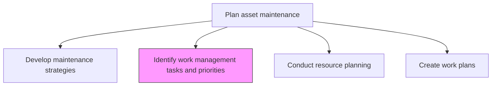
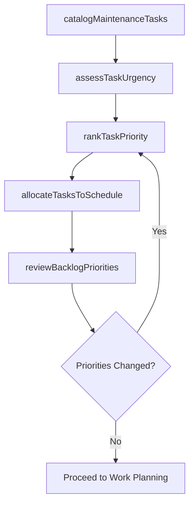

# Identify work management tasks & priorities

> Business-as-Code definition for maintenance work task identification and prioritization. Models the complete process of cataloging maintenance tasks, assessing urgency, and establishing priority rankings.

## Overview

Identifying the steps needed for asset maintenance. List out the those tasks that are involved in completing this process. Prioritize the tasks that are created.

## Process Hierarchy



## GraphDL

```yaml
identify:
  object: Work Management Tasks & Priorities
  actor: MaintenancePlanner
  result: PrioritizedTaskList
```

## Actions

| Action | Description |
|--------|-------------|
| catalogMaintenanceTasks | Enumerate all maintenance activities required for each asset class |
| assessTaskUrgency | Evaluate the time-sensitivity and operational impact of each maintenance task |
| rankTaskPriority | Assign priority levels based on criticality, safety impact, and resource constraints |
| allocateTasksToSchedule | Place prioritized tasks into the maintenance schedule backlog |
| reviewBacklogPriorities | Periodically reassess task priorities based on changing conditions |

## Events

| Event | Description |
|-------|-------------|
| tasksCataloged | Comprehensive maintenance task list created for asset classes |
| urgencyAssessed | Task urgency evaluations completed |
| prioritiesRanked | Tasks assigned priority levels and sequenced |
| tasksAllocated | Prioritized tasks placed into the scheduling backlog |
| backlogReviewed | Task priorities reassessed and updated |

## Searches

| Search | Description |
|--------|-------------|
| findTasksByPriority | List maintenance tasks filtered by priority level |
| getTaskBacklog | Retrieve the current maintenance task backlog for a facility |
| findOverdueTasks | List tasks that have exceeded their planned execution date |
| getTaskDependencies | Retrieve prerequisite tasks or dependencies for a specific maintenance task |

## Process Flow



## RACI Matrix

| Activity | Responsible | Accountable | Consulted | Informed |
|----------|-------------|-------------|-----------|----------|
| catalogMaintenanceTasks | MaintenancePlanner | MaintenanceManager | ReliabilityEngineer | Operations |
| assessTaskUrgency | MaintenancePlanner | MaintenanceManager | SafetyOfficer | Operations |
| rankTaskPriority | MaintenanceManager | VP Operations | Operations | Finance |
| allocateTasksToSchedule | MaintenancePlanner | MaintenanceManager | Scheduler | Technicians |
| reviewBacklogPriorities | MaintenancePlanner | MaintenanceManager | Operations | Finance |

## Related Processes

| Process | Relationship |
|---------|-------------|
| 10.3.1.3 Specify maintenance policies | Upstream - policies define prioritization criteria |
| 10.3.1.6 Conduct resource planning | Downstream - prioritized tasks drive resource requirements |
| 10.3.1.7 Create work plans | Downstream - prioritized tasks are detailed into work plans |

## Related Departments

| Department | Role |
|-----------|------|
| Maintenance | Catalogs tasks and assigns priorities |
| Operations | Provides input on operational impact and urgency |
| Safety | Identifies safety-critical maintenance requirements |
| Finance | Evaluates cost implications of priority decisions |

## Related Occupations

| Occupation | Involvement |
|-----------|-------------|
| Maintenance Planner | Primary task cataloger and prioritizer |
| Maintenance Manager | Approves priority rankings |
| Reliability Engineer | Provides failure risk data for prioritization |
| Operations Supervisor | Communicates operational urgency |

## KPIs

| KPI | Description | Unit |
|-----|-------------|------|
| Backlog Size | Total number of pending maintenance tasks | Count |
| Backlog Age | Average age of tasks in the maintenance backlog | Days |
| Priority Compliance | Percentage of high-priority tasks completed within target timeframe | % |
| Task Identification Rate | Number of new maintenance tasks identified per period | Count/Month |

## Usage

```typescript
import { identifyWorkManagementTasksPriorities } from '@headlessly/identify-work-management-tasks-and-priorities'

const tasks = identifyWorkManagementTasksPriorities()

// Catalog all maintenance tasks for a facility
const catalog = await tasks.catalogMaintenanceTasks({
  facilityId: 'plant-north',
  assetClasses: ['pumps', 'compressors', 'heat-exchangers'],
  source: 'manufacturer-recommendations'
})

// Rank tasks by priority
const prioritized = await tasks.rankTaskPriority({
  taskListId: catalog.id,
  criteria: ['safety-impact', 'production-impact', 'regulatory-requirement'],
  method: 'weighted-scoring'
})
```
