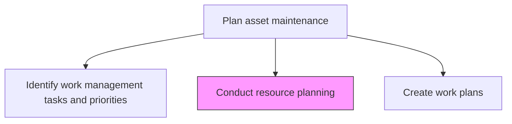
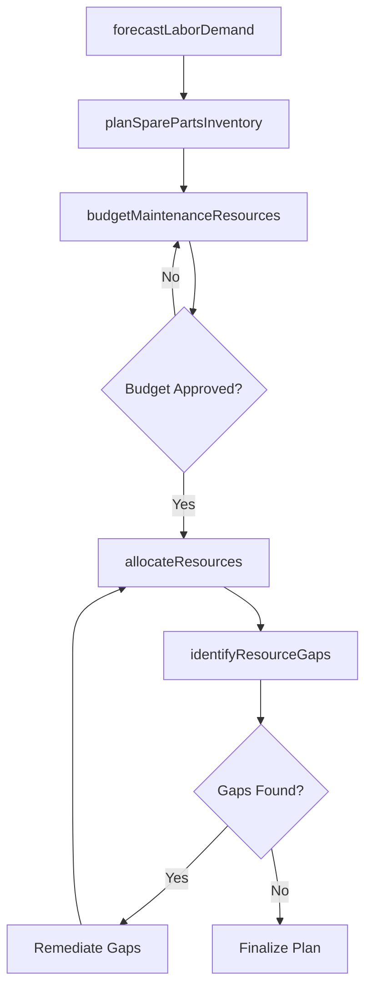

# Conduct resource planning

> Business-as-Code definition for maintenance resource planning. Models the complete process of forecasting, budgeting, and allocating labor, materials, and tools required for asset maintenance activities.

## Overview

Analyzing workload needs in relation to asset maintenance and plan resources around those needs.

## Process Hierarchy



## GraphDL

```yaml
conduct:
  object: Resource Planning
  actor: MaintenancePlanner
  result: ResourceAllocationPlan
```

## Actions

| Action | Description |
|--------|-------------|
| forecastLaborDemand | Estimate maintenance labor hours by trade, skill level, and time period |
| planSparePartsInventory | Determine spare parts and consumables needed to support planned maintenance |
| budgetMaintenanceResources | Develop cost estimates for labor, materials, tools, and contracted services |
| allocateResources | Assign available labor, materials, and equipment to scheduled maintenance tasks |
| identifyResourceGaps | Detect shortfalls between resource demand and availability |

## Events

| Event | Description |
|-------|-------------|
| laborDemandForecasted | Maintenance labor requirements estimated by trade and period |
| sparePartsPlanned | Spare parts and consumables requirements identified |
| resourcesBudgeted | Maintenance resource budget compiled and submitted |
| resourcesAllocated | Labor and materials assigned to maintenance tasks |
| resourceGapsIdentified | Shortfalls between demand and capacity documented |

## Searches

| Search | Description |
|--------|-------------|
| getResourcePlan | Retrieve the resource allocation plan for a facility or period |
| findSparePartsNeeds | List spare parts requirements by asset or maintenance task |
| getLaborAvailability | Retrieve available maintenance labor by trade and time period |
| findResourceGaps | List resource shortfalls requiring remediation |

## Process Flow



## RACI Matrix

| Activity | Responsible | Accountable | Consulted | Informed |
|----------|-------------|-------------|-----------|----------|
| forecastLaborDemand | MaintenancePlanner | MaintenanceManager | HR | Operations |
| planSparePartsInventory | MaterialsCoordinator | MaintenancePlanner | Procurement | Warehouse |
| budgetMaintenanceResources | MaintenancePlanner | MaintenanceManager | Finance | CFO |
| allocateResources | MaintenancePlanner | MaintenanceManager | Supervisors | Technicians |
| identifyResourceGaps | MaintenancePlanner | MaintenanceManager | HR | Procurement |

## Related Processes

| Process | Relationship |
|---------|-------------|
| 10.3.1.5 Identify work management tasks and priorities | Upstream - prioritized tasks determine resource requirements |
| 10.3.1.7 Create work plans | Downstream - resource allocations feed into detailed work plans |
| 10.3.2.2 Obtain required resources | Downstream - plan guides resource procurement |

## Related Departments

| Department | Role |
|-----------|------|
| Maintenance | Plans and allocates maintenance resources |
| Procurement | Sources spare parts and contracted services |
| Finance | Approves maintenance resource budgets |
| Human Resources | Supports labor capacity planning and recruitment |

## Related Occupations

| Occupation | Involvement |
|-----------|-------------|
| Maintenance Planner | Primary resource planner |
| Materials Coordinator | Manages spare parts planning |
| Maintenance Manager | Approves resource allocation decisions |
| Procurement Specialist | Sources materials and contracted labor |

## KPIs

| KPI | Description | Unit |
|-----|-------------|------|
| Resource Utilization Rate | Percentage of allocated resources actually consumed | % |
| Spare Parts Availability | Percentage of required parts available when needed | % |
| Budget Accuracy | Variance between planned and actual resource expenditure | % |
| Resource Gap Rate | Percentage of tasks delayed due to resource unavailability | % |

## Usage

```typescript
import { conductResourcePlanning } from '@headlessly/conduct-resource-planning'

const planning = conductResourcePlanning()

// Forecast labor demand for the quarter
const forecast = await planning.forecastLaborDemand({
  facilityId: 'plant-north',
  period: 'Q2-2026',
  trades: ['mechanical', 'electrical', 'instrumentation']
})

// Plan spare parts inventory
const parts = await planning.planSparePartsInventory({
  forecastId: forecast.id,
  leadTimeBuffer: 14,
  safetyStockLevel: 'standard'
})
```
