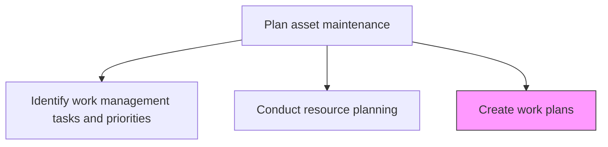
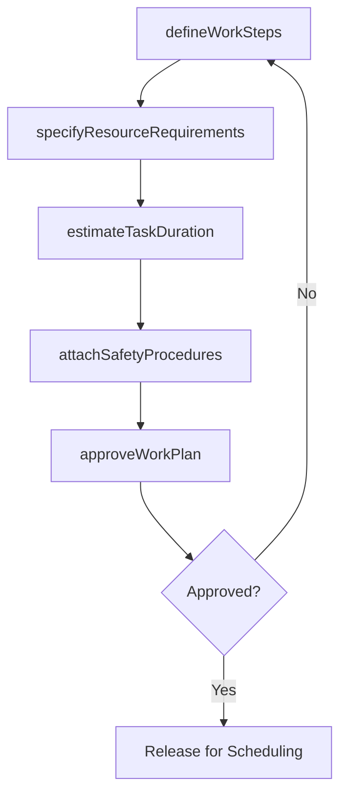

# Create work plans

> Business-as-Code definition for maintenance work plan creation. Models the complete process of developing detailed, step-by-step work plans that define how maintenance tasks will be executed.

## Overview

Creating procedures on how to maintain productive assets.

## Process Hierarchy



## GraphDL

```yaml
create:
  object: Work Plans
  actor: MaintenancePlanner
  result: DetailedWorkPlan
```

## Actions

| Action | Description |
|--------|-------------|
| defineWorkSteps | Document the sequential steps required to complete each maintenance task |
| specifyResourceRequirements | List the labor, tools, parts, and permits needed for each work plan |
| estimateTaskDuration | Calculate expected time to complete each step and the overall task |
| attachSafetyProcedures | Include lockout/tagout, PPE requirements, and safety checklists |
| approveWorkPlan | Submit the completed work plan for supervisory review and approval |

## Events

| Event | Description |
|-------|-------------|
| workStepsDefined | Step-by-step maintenance procedures documented |
| resourceRequirementsSpecified | Labor, parts, and tools listed for the work plan |
| taskDurationEstimated | Time estimates assigned to each work step |
| safetyProceduresAttached | Safety requirements and checklists included in the plan |
| workPlanApproved | Work plan reviewed and approved for execution |

## Searches

| Search | Description |
|--------|-------------|
| getWorkPlan | Retrieve a detailed work plan by asset or task identifier |
| findWorkPlanTemplates | List reusable work plan templates by asset class or task type |
| getResourceRequirements | Retrieve the resource list for a specific work plan |
| findPendingApprovals | List work plans awaiting supervisory approval |

## Process Flow



## RACI Matrix

| Activity | Responsible | Accountable | Consulted | Informed |
|----------|-------------|-------------|-----------|----------|
| defineWorkSteps | MaintenancePlanner | MaintenanceManager | Technicians | ReliabilityEngineer |
| specifyResourceRequirements | MaintenancePlanner | MaintenanceManager | MaterialsCoordinator | Procurement |
| estimateTaskDuration | MaintenancePlanner | MaintenanceManager | Supervisors | Scheduler |
| attachSafetyProcedures | SafetyOfficer | MaintenancePlanner | Technicians | HR |
| approveWorkPlan | MaintenanceSupervisor | MaintenanceManager | Operations | Finance |

## Related Processes

| Process | Relationship |
|---------|-------------|
| 10.3.1.5 Identify work management tasks and priorities | Upstream - prioritized tasks are detailed in work plans |
| 10.3.1.6 Conduct resource planning | Upstream - resource allocations feed work plan resource specifications |
| 10.3.2.1 Schedule work | Downstream - approved work plans are scheduled for execution |

## Related Departments

| Department | Role |
|-----------|------|
| Maintenance | Creates and manages work plans |
| Safety | Contributes safety procedures and lockout/tagout requirements |
| Procurement | Ensures parts and materials specified in plans are available |
| Operations | Reviews plans for operational impact |

## Related Occupations

| Occupation | Involvement |
|-----------|-------------|
| Maintenance Planner | Primary work plan author |
| Maintenance Supervisor | Reviews and approves work plans |
| Safety Officer | Validates safety procedures in plans |
| Maintenance Technician | Provides practical input on work steps |

## KPIs

| KPI | Description | Unit |
|-----|-------------|------|
| Work Plan Coverage | Percentage of maintenance tasks with documented work plans | % |
| Plan Accuracy | Percentage of tasks completed within estimated duration | % |
| Plan Reuse Rate | Percentage of work plans based on standardized templates | % |
| Approval Cycle Time | Average time from plan creation to approval | Days |

## Usage

```typescript
import { createWorkPlans } from '@headlessly/create-work-plans'

const planner = createWorkPlans()

// Define work steps for a pump overhaul
const plan = await planner.defineWorkSteps({
  assetId: 'pump-101',
  taskType: 'major-overhaul',
  steps: [
    'isolate-and-lock-out',
    'drain-and-flush',
    'disassemble-impeller',
    'inspect-bearings',
    'replace-seals',
    'reassemble-and-align',
    'test-run'
  ]
})

// Approve the work plan
const approval = await planner.approveWorkPlan({
  planId: plan.id,
  reviewer: 'maintenance-supervisor-north'
})
```
