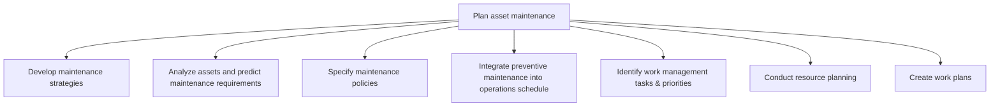
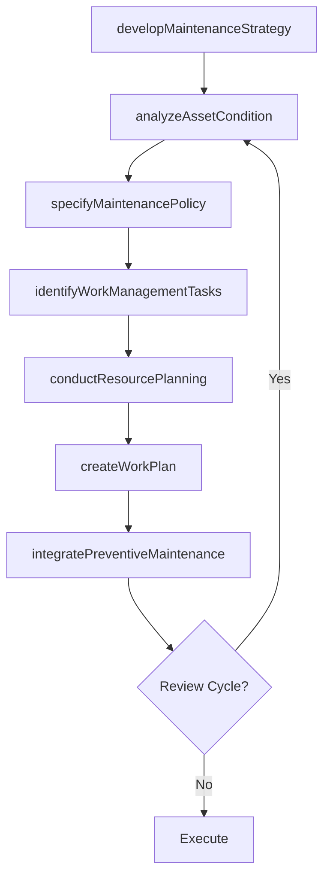

# Plan asset maintenance

> Business-as-Code definition for developing maintenance strategies, analyzing asset condition, specifying maintenance policies, and creating work plans to ensure productive assets remain reliable and cost-effective.

## Overview

Ensuring that necessary resources are available and tasks are prioritized accordingly through planning. Provide strategies and policies that identify tasks that need to be completed, and the resources necessary to fulfill those tasks.

## Process Hierarchy



## GraphDL

```yaml
plan:
  object: Asset Maintenance
  actor: MaintenancePlanner
  result: MaintenancePlan
```

## Actions

| Action | Description |
|--------|-------------|
| developMaintenanceStrategy | Define reliability-centered maintenance approach, goals, and resource allocation |
| analyzeAssetCondition | Evaluate asset health data to predict maintenance requirements and failure modes |
| specifyMaintenancePolicy | Establish maintenance standards, intervals, and compliance requirements |
| integratePreventiveMaintenance | Incorporate planned maintenance activities into the production schedule |
| identifyWorkManagementTasks | Determine task priorities and sequencing for maintenance work orders |
| conductResourcePlanning | Assess labor, parts, and equipment needs for planned maintenance activities |
| createWorkPlan | Develop detailed work instructions, safety procedures, and resource assignments |

## Events

| Event | Description |
|-------|-------------|
| maintenanceStrategyDeveloped | Maintenance strategy approved with goals and resource allocations |
| assetConditionAnalyzed | Asset health assessment completed with predicted maintenance needs |
| maintenancePolicySpecified | Maintenance policy and standards documented and published |
| preventiveMaintenanceIntegrated | Preventive maintenance schedule aligned with production calendar |
| workManagementTasksIdentified | Maintenance tasks prioritized and sequenced |
| resourcePlanningConducted | Labor, parts, and equipment requirements confirmed |
| workPlanCreated | Detailed maintenance work plan with instructions finalized |

## Searches

| Search | Description |
|--------|-------------|
| getMaintenanceStrategy | Retrieve current maintenance strategy and reliability goals |
| findAssetsByCondition | Query assets by health score, criticality, or predicted failure date |
| getMaintenancePolicy | Retrieve maintenance standards and interval requirements by asset class |
| getWorkPlan | Retrieve detailed work plans with resource assignments |
| findScheduledMaintenance | List planned maintenance activities by date range or asset |

## Process Flow



## RACI Matrix

| Activity | Responsible | Accountable | Consulted | Informed |
|----------|-------------|-------------|-----------|----------|
| developMaintenanceStrategy | ReliabilityEngineer | MaintenanceManager | Operations | Finance |
| analyzeAssetCondition | ConditionMonitoringAnalyst | ReliabilityEngineer | Engineering | Maintenance |
| specifyMaintenancePolicy | MaintenancePlanner | MaintenanceManager | Safety | Operations |
| conductResourcePlanning | MaintenancePlanner | MaintenanceManager | Procurement | HR |
| createWorkPlan | MaintenancePlanner | MaintenanceSupervisor | Technicians | Operations |

## Sub-Processes

| ID | Name | Description |
|----|------|-------------|
| 10.3.1.1 | Develop maintenance strategies | Creating goals and agendas to better realize the success of the maintenance policies that have been  |
| 10.3.1.2 | Analyze assets and predict maintenance requirements | Evaluating assets in order to project future requirements for maintenance. Evaluate the present work |
| 10.3.1.3 | Specify maintenance policies | Communicating policies in regards to asset maintenance. Provide a clear set of procedures and polici |
| 10.3.1.4 | Integrate preventive maintenance into operations schedule | Devising a methodology and procedure for assimilating the works of planned maintenance into the sche |
| 10.3.1.5 | Identify work management tasks & priorities | Identifying the steps needed for asset maintenance. List out the those tasks that are involved in co |
| 10.3.1.6 | Conduct resource planning | Analyzing workload needs in relation to asset maintenance and plan resources around those needs. |
| 10.3.1.7 | Create work plans | Creating procedures on how to maintain productive assets. |

## Related Processes

| Process | Relationship |
|---------|-------------|
| 10.3.2 Manage asset maintenance | Downstream - plans guide maintenance scheduling and execution |
| 10.3.3 Perform asset maintenance | Downstream - work plans direct maintenance technicians |
| 10.2.4 Manage asset construction | Upstream - as-built records inform maintenance planning |

## Related Departments

| Department | Role |
|-----------|------|
| Maintenance Planning | Develops work plans, schedules, and resource allocations |
| Reliability Engineering | Analyzes failure modes and recommends maintenance strategies |
| Operations | Coordinates maintenance windows with production schedules |
| Procurement | Sources spare parts and maintenance service contracts |

## Related Occupations

| Occupation | Involvement |
|-----------|-------------|
| Maintenance Planner | Creates work plans and coordinates resource allocation |
| Reliability Engineer | Develops RCM strategies and analyzes failure data |
| Condition Monitoring Analyst | Interprets vibration, thermal, and oil analysis data |

## KPIs

| KPI | Description | Unit |
|-----|-------------|------|
| Planned Maintenance Percentage | Ratio of planned to total maintenance work orders | % |
| Schedule Compliance | Percentage of planned work completed on schedule | % |
| Preventive-to-Corrective Ratio | Ratio of preventive work orders to corrective work orders | Ratio |
| Work Plan Accuracy | Percentage of work plans completed within estimated time | % |

## Usage

```typescript
import { planAssetMaintenance } from '@headlessly/plan-asset-maintenance'

const planning = planAssetMaintenance()

// Analyze asset condition and predict maintenance needs
const analysis = await planning.analyzeAssetCondition({
  assetId: 'PUMP-4501',
  dataSource: ['vibration', 'temperature', 'oil-analysis'],
  predictionHorizon: '90-days'
})

// Create detailed work plan
const workPlan = await planning.createWorkPlan({
  assetId: 'PUMP-4501',
  maintenanceType: 'preventive',
  estimatedDuration: '4h',
  requiredParts: ['seal-kit', 'bearing-set'],
  safetyRequirements: ['LOTO', 'confined-space']
})
```
