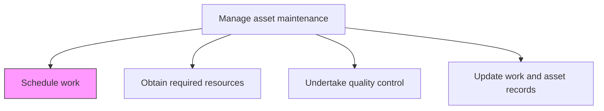
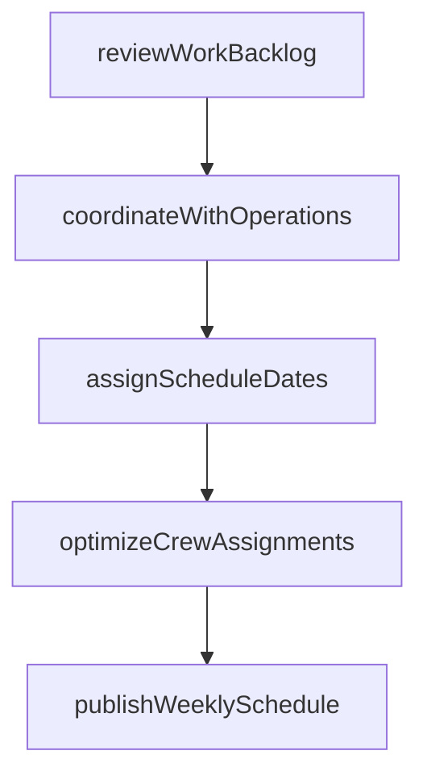

# Schedule work

> Business-as-Code definition for maintenance work scheduling. Models the complete process of assigning dates, times, and sequences to approved maintenance work orders for execution.

## Overview

Defining a timetable for which to execute the maintenance of the asset.

## Process Hierarchy



## GraphDL

```yaml
schedule:
  object: Work
  actor: MaintenanceScheduler
  result: MaintenanceSchedule
```

## Actions

| Action | Description |
|--------|-------------|
| reviewWorkBacklog | Assess the queue of approved work orders awaiting scheduling |
| assignScheduleDates | Set execution dates and times for each work order based on priority and availability |
| coordinateWithOperations | Confirm asset availability windows with production and operations teams |
| optimizeCrewAssignments | Match available maintenance crews to scheduled tasks based on skills and location |
| publishWeeklySchedule | Distribute the finalized weekly maintenance schedule to all stakeholders |

## Events

| Event | Description |
|-------|-------------|
| backlogReviewed | Work order backlog assessed and ready for scheduling |
| scheduleDatesAssigned | Execution dates set for work orders |
| operationsCoordinated | Asset availability confirmed with operations |
| crewsAssigned | Maintenance crews matched to scheduled tasks |
| weeklySchedulePublished | Finalized schedule distributed to stakeholders |

## Searches

| Search | Description |
|--------|-------------|
| getWeeklySchedule | Retrieve the maintenance schedule for a specific week and facility |
| findUnscheduledWorkOrders | List approved work orders not yet assigned to a schedule |
| getCrewAvailability | Retrieve available maintenance crew capacity by date and skill |
| findScheduleConflicts | Identify overlapping or conflicting maintenance assignments |

## Process Flow



## RACI Matrix

| Activity | Responsible | Accountable | Consulted | Informed |
|----------|-------------|-------------|-----------|----------|
| reviewWorkBacklog | MaintenanceScheduler | MaintenanceManager | MaintenancePlanner | Supervisors |
| assignScheduleDates | MaintenanceScheduler | MaintenanceManager | Operations | Safety |
| coordinateWithOperations | MaintenanceScheduler | MaintenanceManager | ProductionPlanner | OperationsManager |
| optimizeCrewAssignments | MaintenanceScheduler | MaintenanceSupervisor | HR | Technicians |
| publishWeeklySchedule | MaintenanceScheduler | MaintenanceManager | Operations | AllStaff |

## Related Processes

| Process | Relationship |
|---------|-------------|
| 10.3.1.7 Create work plans | Upstream - approved work plans feed the scheduling backlog |
| 10.3.2.2 Obtain required resources | Downstream - schedule triggers resource procurement |
| 10.3.3.2 Perform routine asset maintenance | Downstream - scheduled work is executed |

## Related Departments

| Department | Role |
|-----------|------|
| Maintenance | Schedules and assigns maintenance work |
| Operations | Provides asset availability windows |
| Human Resources | Supports workforce capacity planning |
| Safety | Validates scheduling of safety-critical maintenance |

## Related Occupations

| Occupation | Involvement |
|-----------|-------------|
| Maintenance Scheduler | Primary schedule creator |
| Maintenance Supervisor | Reviews and validates crew assignments |
| Production Planner | Coordinates asset availability |
| Maintenance Manager | Approves the weekly schedule |

## KPIs

| KPI | Description | Unit |
|-----|-------------|------|
| Schedule Compliance | Percentage of scheduled work orders completed on time | % |
| Backlog Weeks | Total backlog hours divided by weekly capacity | Weeks |
| Crew Utilization | Percentage of available crew hours scheduled | % |
| Schedule Break-In Rate | Percentage of unplanned work added to the active schedule | % |

## Usage

```typescript
import { scheduleWork } from '@headlessly/schedule-work'

const scheduler = scheduleWork()

// Review the maintenance backlog
const backlog = await scheduler.reviewWorkBacklog({
  facilityId: 'plant-north',
  status: 'approved',
  sortBy: 'priority'
})

// Publish the weekly schedule
const schedule = await scheduler.publishWeeklySchedule({
  facilityId: 'plant-north',
  weekStarting: '2026-04-06',
  workOrders: backlog.topPriority
})
```
