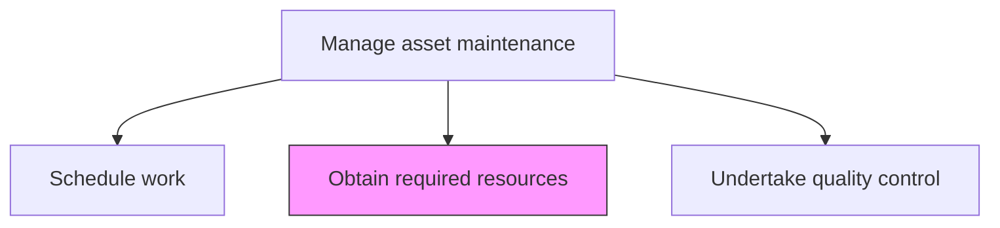
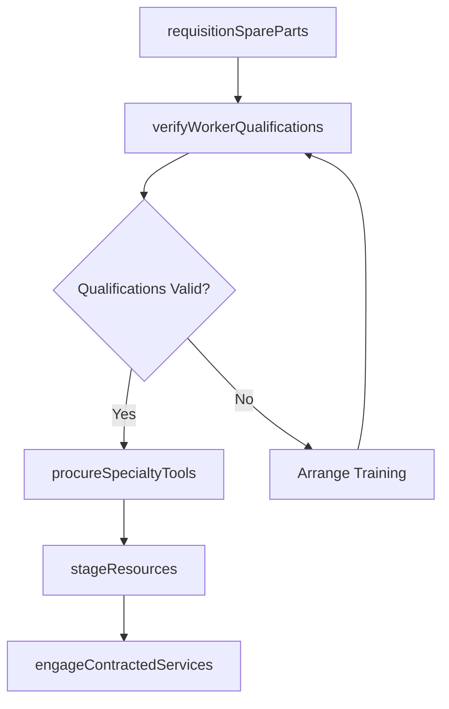

# Obtain required resources

> Business-as-Code definition for maintenance resource procurement. Models the complete process of sourcing, verifying, and staging labor, parts, tools, and contracted services for scheduled maintenance work.

## Overview

Gathering resources needed to complete all maintenance work. Verify that all resources have the proper training and skills to perform the work.

## Process Hierarchy



## GraphDL

```yaml
obtain:
  object: Required Resources
  actor: MaterialsCoordinator
  result: StagedResources
```

## Actions

| Action | Description |
|--------|-------------|
| requisitionSpareParts | Generate purchase or warehouse requests for required spare parts and consumables |
| verifyWorkerQualifications | Confirm maintenance personnel possess the certifications and skills for assigned tasks |
| procureSpecialtyTools | Source specialized tools or equipment not available in the standard tool inventory |
| stageResources | Deliver and organize parts, tools, and materials at the work site before task execution |
| engageContractedServices | Secure third-party maintenance contractors for specialized or overflow work |

## Events

| Event | Description |
|-------|-------------|
| sparePartsRequisitioned | Parts and consumables ordered or picked from warehouse |
| qualificationsVerified | Worker certifications and training records confirmed |
| specialtyToolsProcured | Specialized tools or equipment sourced and available |
| resourcesStaged | All required resources delivered and organized at work site |
| contractorsEngaged | Third-party maintenance services confirmed and scheduled |

## Searches

| Search | Description |
|--------|-------------|
| findPartsAvailability | Check stock levels for required spare parts |
| getWorkerCertifications | Retrieve certification and training records for maintenance staff |
| findToolInventory | List available specialty tools by type or location |
| getContractorCapacity | Retrieve available capacity from contracted maintenance providers |

## Process Flow



## RACI Matrix

| Activity | Responsible | Accountable | Consulted | Informed |
|----------|-------------|-------------|-----------|----------|
| requisitionSpareParts | MaterialsCoordinator | MaintenancePlanner | Warehouse | Procurement |
| verifyWorkerQualifications | MaintenanceSupervisor | MaintenanceManager | HR | SafetyOfficer |
| procureSpecialtyTools | MaterialsCoordinator | MaintenancePlanner | Procurement | ToolRoom |
| stageResources | MaintenanceTechnician | MaintenanceSupervisor | Scheduler | Operations |
| engageContractedServices | ProcurementSpecialist | MaintenanceManager | Legal | Finance |

## Related Processes

| Process | Relationship |
|---------|-------------|
| 10.3.2.1 Schedule work | Upstream - schedule determines when resources are needed |
| 10.3.1.6 Conduct resource planning | Upstream - resource plan defines what needs to be obtained |
| 10.3.3.2 Perform routine asset maintenance | Downstream - staged resources enable maintenance execution |

## Related Departments

| Department | Role |
|-----------|------|
| Maintenance | Requisitions and stages resources for scheduled work |
| Procurement | Sources parts, tools, and contractor services |
| Warehouse | Manages spare parts inventory and distribution |
| Human Resources | Maintains worker certification records |

## Related Occupations

| Occupation | Involvement |
|-----------|-------------|
| Materials Coordinator | Manages parts requisition and staging |
| Maintenance Supervisor | Verifies worker qualifications |
| Procurement Specialist | Sources specialty items and contractor services |
| Warehouse Clerk | Picks and delivers spare parts |

## KPIs

| KPI | Description | Unit |
|-----|-------------|------|
| Parts Availability Rate | Percentage of required parts available at time of need | % |
| Staging Completion Rate | Percentage of resources fully staged before scheduled start time | % |
| Qualification Compliance | Percentage of assigned workers with valid certifications | % |
| Contractor Response Time | Average time for contractor mobilization | Hours |

## Usage

```typescript
import { obtainRequiredResources } from '@headlessly/obtain-required-resources'

const resources = obtainRequiredResources()

// Requisition spare parts for a work order
const parts = await resources.requisitionSpareParts({
  workOrderId: 'wo-2026-1234',
  partsList: ['bearing-6205', 'mechanical-seal-type-a', 'gasket-kit-pump-101'],
  requiredBy: '2026-04-07'
})

// Stage all resources at the work site
const staging = await resources.stageResources({
  workOrderId: 'wo-2026-1234',
  location: 'pump-house-north',
  includeTools: true
})
```
