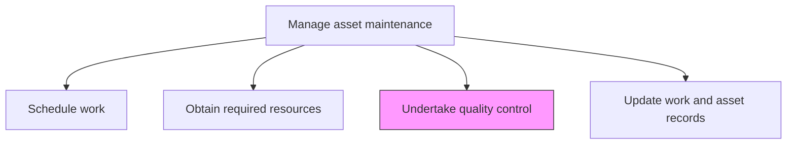
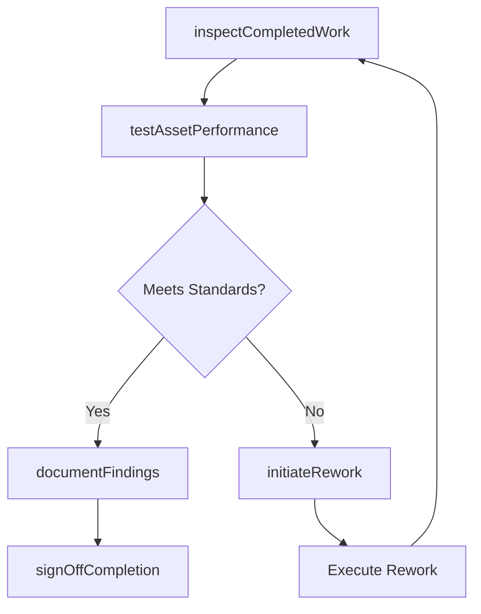

# Undertake quality control

> Business-as-Code definition for maintenance quality control. Models the complete process of verifying, inspecting, and validating that completed maintenance work meets quality standards and specifications.

## Overview

Implementing a checks and balances system to verify that the maintenance was performed correctly. Rework when errors are found.

## Process Hierarchy



## GraphDL

```yaml
undertake:
  object: Quality Control
  actor: QualityInspector
  result: QualityVerificationReport
```

## Actions

| Action | Description |
|--------|-------------|
| inspectCompletedWork | Verify that maintenance tasks were performed according to work plan specifications |
| testAssetPerformance | Run functional and performance tests on maintained assets to confirm proper operation |
| documentFindings | Record inspection results, test data, and any deviations from standards |
| initiateRework | Generate rework orders for maintenance tasks that failed quality inspection |
| signOffCompletion | Formally approve completed maintenance work that passes quality checks |

## Events

| Event | Description |
|-------|-------------|
| workInspected | Post-maintenance inspection completed |
| performanceTested | Asset functional and performance tests executed |
| findingsDocumented | Quality inspection findings recorded |
| reworkInitiated | Rework order generated for deficient maintenance work |
| completionSignedOff | Maintenance work formally approved and closed |

## Searches

| Search | Description |
|--------|-------------|
| findPendingInspections | List completed work orders awaiting quality inspection |
| getInspectionResults | Retrieve quality inspection findings for a specific work order |
| findReworkOrders | List active rework orders by priority or trade |
| getQualityTrends | Retrieve quality pass/fail trends over time |

## Process Flow



## RACI Matrix

| Activity | Responsible | Accountable | Consulted | Informed |
|----------|-------------|-------------|-----------|----------|
| inspectCompletedWork | QualityInspector | MaintenanceSupervisor | Technicians | MaintenanceManager |
| testAssetPerformance | MaintenanceTechnician | QualityInspector | ReliabilityEngineer | Operations |
| documentFindings | QualityInspector | MaintenanceSupervisor | DocumentControl | MaintenanceManager |
| initiateRework | MaintenanceSupervisor | MaintenanceManager | QualityInspector | Scheduler |
| signOffCompletion | MaintenanceSupervisor | MaintenanceManager | QualityInspector | Operations |

## Related Processes

| Process | Relationship |
|---------|-------------|
| 10.3.3.2 Perform routine asset maintenance | Upstream - completed maintenance triggers quality inspection |
| 10.3.2.4 Update work and asset records | Downstream - quality results feed record updates |
| 10.3.2.7 Monitor maintenance performance against targets/contracts | Downstream - quality data feeds performance monitoring |

## Related Departments

| Department | Role |
|-----------|------|
| Maintenance | Performs inspections and manages rework |
| Quality Assurance | Defines inspection standards and criteria |
| Operations | Confirms asset performance post-maintenance |
| Engineering | Provides technical specifications for testing |

## Related Occupations

| Occupation | Involvement |
|-----------|-------------|
| Quality Inspector | Conducts post-maintenance inspections |
| Maintenance Supervisor | Manages rework and signs off completions |
| Maintenance Technician | Performs functional tests |
| Reliability Engineer | Provides performance testing criteria |

## KPIs

| KPI | Description | Unit |
|-----|-------------|------|
| First-Time Quality Rate | Percentage of maintenance work passing inspection on first attempt | % |
| Rework Rate | Percentage of work orders requiring rework | % |
| Inspection Cycle Time | Average time from work completion to quality sign-off | Hours |
| Quality Finding Rate | Number of quality deficiencies per 100 inspections | Rate |

## Usage

```typescript
import { undertakeQualityControl } from '@headlessly/undertake-quality-control'

const qc = undertakeQualityControl()

// Inspect completed maintenance work
const inspection = await qc.inspectCompletedWork({
  workOrderId: 'wo-2026-1234',
  checkpoints: ['torque-verification', 'alignment-check', 'leak-test']
})

// Sign off on quality-verified work
const signoff = await qc.signOffCompletion({
  workOrderId: 'wo-2026-1234',
  inspectionId: inspection.id,
  approver: 'maintenance-supervisor-north'
})
```
