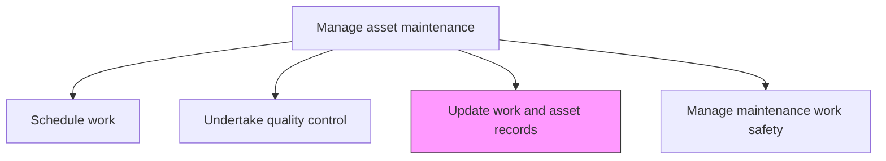
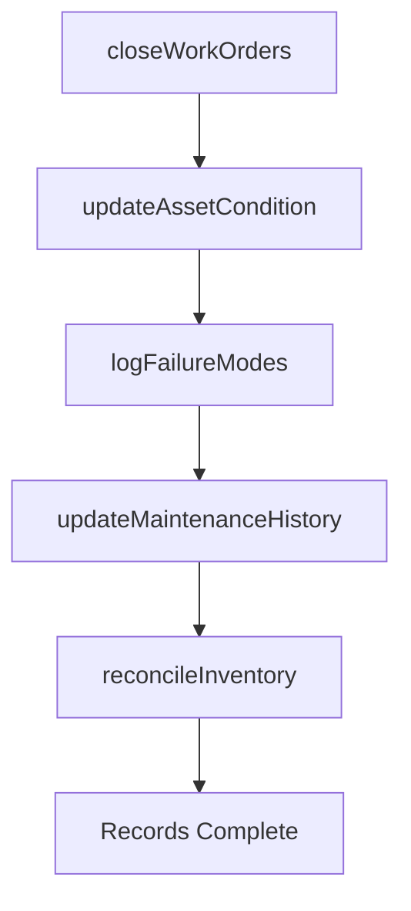

# Update work and asset records

> Business-as-Code definition for maintenance record updates. Models the complete process of recording completed maintenance activities, updating asset condition data, and maintaining work history in enterprise systems.

## Overview

Modifying existing maintenance records to include all new work that has been performed, what assets were serviced, and any issues that might have arisen.

## Process Hierarchy



## GraphDL

```yaml
update:
  object: Work And Asset Records
  actor: MaintenanceTechnician
  result: UpdatedAssetRecord
```

## Actions

| Action | Description |
|--------|-------------|
| closeWorkOrders | Document task completion details including labor hours, parts used, and findings |
| updateAssetCondition | Record current asset condition, readings, and any observed anomalies |
| logFailureModes | Document failure modes, root causes, and corrective actions taken |
| updateMaintenanceHistory | Add completed maintenance activities to the asset history log |
| reconcileInventory | Adjust spare parts inventory to reflect materials consumed during maintenance |

## Events

| Event | Description |
|-------|-------------|
| workOrderClosed | Maintenance task completion details recorded |
| assetConditionUpdated | Current asset condition data entered into the system |
| failureModesLogged | Failure analysis data documented |
| maintenanceHistoryUpdated | Asset maintenance log updated with completed activities |
| inventoryReconciled | Spare parts inventory adjusted for consumed materials |

## Searches

| Search | Description |
|--------|-------------|
| getAssetMaintenanceHistory | Retrieve the complete maintenance history for a specific asset |
| findRecentWorkOrders | List recently closed work orders by date, asset, or technician |
| getFailureModeData | Retrieve failure mode and root cause data for an asset or asset class |
| getInventoryAdjustments | Retrieve spare parts consumption data for a given period |

## Process Flow



## RACI Matrix

| Activity | Responsible | Accountable | Consulted | Informed |
|----------|-------------|-------------|-----------|----------|
| closeWorkOrders | MaintenanceTechnician | MaintenanceSupervisor | Scheduler | MaintenanceManager |
| updateAssetCondition | MaintenanceTechnician | MaintenanceSupervisor | ReliabilityEngineer | Operations |
| logFailureModes | MaintenanceTechnician | ReliabilityEngineer | Engineering | MaintenanceManager |
| updateMaintenanceHistory | MaintenanceTechnician | MaintenanceSupervisor | DocumentControl | AssetManager |
| reconcileInventory | MaterialsCoordinator | MaintenancePlanner | Warehouse | Finance |

## Related Processes

| Process | Relationship |
|---------|-------------|
| 10.3.2.3 Undertake quality control | Upstream - quality results are part of the record update |
| 10.3.1.2 Analyze assets and predict maintenance requirements | Downstream - updated records feed predictive analysis |
| 10.3.2.7 Monitor maintenance performance against targets/contracts | Downstream - records feed performance reporting |

## Related Departments

| Department | Role |
|-----------|------|
| Maintenance | Records work completion and asset condition data |
| Asset Management | Maintains the enterprise asset management system |
| Warehouse | Reconciles spare parts inventory |
| Engineering | Reviews failure mode data for design improvements |

## Related Occupations

| Occupation | Involvement |
|-----------|-------------|
| Maintenance Technician | Records work completion details and asset observations |
| Maintenance Supervisor | Reviews and validates record entries |
| Materials Coordinator | Reconciles inventory consumption |
| Reliability Engineer | Analyzes failure mode data |

## KPIs

| KPI | Description | Unit |
|-----|-------------|------|
| Record Completion Rate | Percentage of work orders with fully completed records | % |
| Record Timeliness | Average time from work completion to record closure | Hours |
| Data Accuracy | Percentage of records passing data quality audits | % |
| Inventory Reconciliation Accuracy | Match rate between recorded and actual parts consumption | % |

## Usage

```typescript
import { updateWorkAndAssetRecords } from '@headlessly/update-work-and-asset-records'

const records = updateWorkAndAssetRecords()

// Close a completed work order
const closure = await records.closeWorkOrders({
  workOrderId: 'wo-2026-1234',
  laborHours: 4.5,
  partsUsed: ['bearing-6205', 'mechanical-seal-type-a'],
  findings: 'Bearing showed excessive wear on inner race'
})

// Update asset condition
const condition = await records.updateAssetCondition({
  assetId: 'pump-101',
  readings: { vibration: 2.1, temperature: 65, pressure: 145 },
  overallCondition: 'good'
})
```
