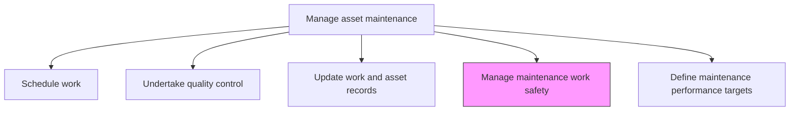
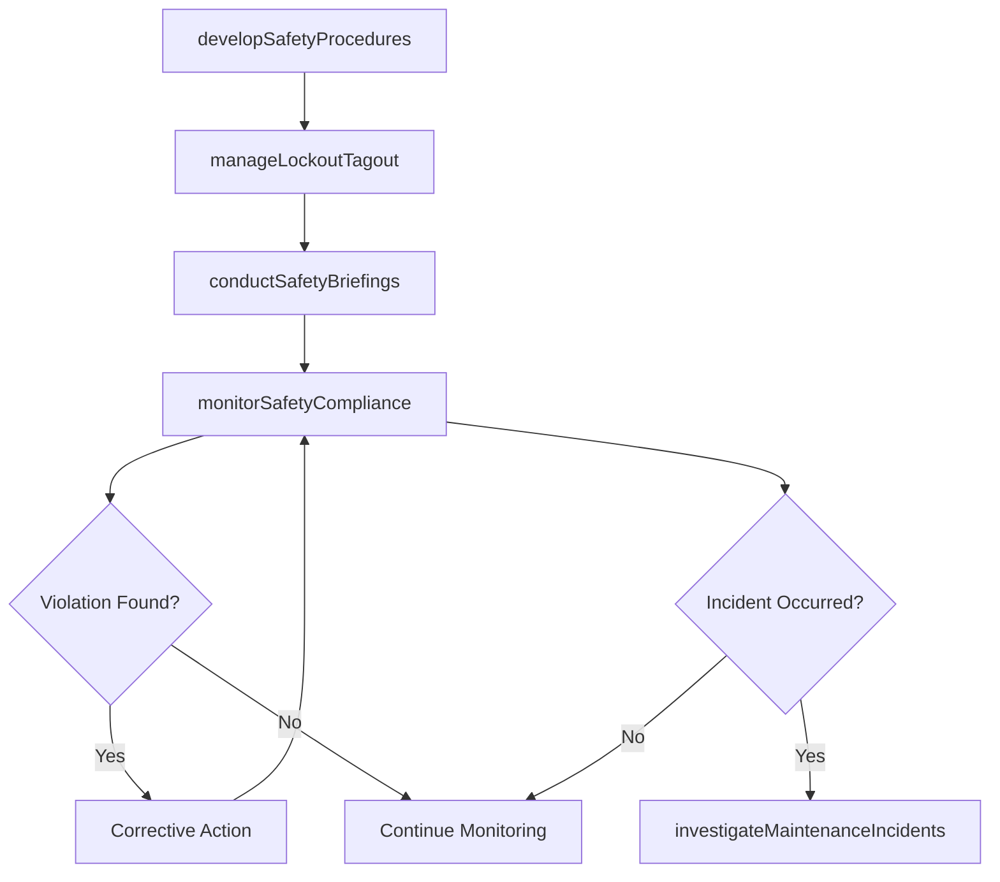

# Manage maintenance work safety

> Business-as-Code definition for maintenance work safety management. Models the complete process of implementing, monitoring, and enforcing safety protocols for maintenance activities in compliance with OSHA, EHS, and ISO standards.

## Overview

Assuring that all safety laws and regulations are being implemented and followed. Align practices with regulatory bureaus such as OSHA , EHS, and ISO.

## Process Hierarchy



## GraphDL

```yaml
manage:
  object: Maintenance Work Safety
  actor: EHSOfficer
  result: SafetyComplianceReport
```

## Actions

| Action | Description |
|--------|-------------|
| developSafetyProcedures | Create job safety analyses and safe work procedures for maintenance tasks |
| manageLockoutTagout | Administer energy isolation procedures for equipment being serviced |
| conductSafetyBriefings | Deliver pre-task safety briefings covering hazards, PPE, and emergency procedures |
| monitorSafetyCompliance | Observe maintenance work in progress to verify adherence to safety protocols |
| investigateMaintenanceIncidents | Analyze safety events during maintenance to identify root causes and prevent recurrence |

## Events

| Event | Description |
|-------|-------------|
| safetyProceduresDeveloped | Job safety analyses and safe work procedures created |
| lockoutTagoutApplied | Energy isolation procedures implemented for a maintenance task |
| safetyBriefingConducted | Pre-task safety briefing delivered to maintenance crew |
| safetyViolationDetected | Non-compliance with safety protocols identified during observation |
| incidentInvestigated | Root cause analysis completed for a maintenance safety event |

## Searches

| Search | Description |
|--------|-------------|
| getSafetyProcedure | Retrieve the job safety analysis for a specific maintenance task |
| findActiveLockouts | List all active lockout/tagout applications by asset or area |
| getSafetyComplianceData | Retrieve safety compliance metrics for a facility or period |
| findMaintenanceIncidents | List safety incidents during maintenance by severity or date |

## Process Flow



## RACI Matrix

| Activity | Responsible | Accountable | Consulted | Informed |
|----------|-------------|-------------|-----------|----------|
| developSafetyProcedures | EHSOfficer | MaintenanceManager | Engineering | Technicians |
| manageLockoutTagout | MaintenanceSupervisor | EHSOfficer | Operations | Safety |
| conductSafetyBriefings | MaintenanceSupervisor | EHSOfficer | SafetyTrainer | Technicians |
| monitorSafetyCompliance | SafetyInspector | EHSOfficer | MaintenanceSupervisor | MaintenanceManager |
| investigateMaintenanceIncidents | EHSOfficer | VP Operations | HR | Legal |

## Related Processes

| Process | Relationship |
|---------|-------------|
| 10.2.4.4 Manage safety, security, and access to sites | Related - similar safety framework for construction sites |
| 10.3.1.3 Specify maintenance policies | Upstream - policies define safety requirements |
| 10.3.3.1 Perform preventative asset maintenance | Parallel - safety applies during all maintenance execution |

## Related Departments

| Department | Role |
|-----------|------|
| EHS | Develops safety procedures and monitors compliance |
| Maintenance | Implements safety protocols during work execution |
| Human Resources | Manages safety training records and incident reporting |
| Legal | Advises on regulatory compliance and liability |

## Related Occupations

| Occupation | Involvement |
|-----------|-------------|
| EHS Officer | Primary safety program owner |
| Safety Inspector | Conducts compliance monitoring |
| Maintenance Supervisor | Implements lockout/tagout and safety briefings |
| Safety Trainer | Delivers safety training and briefings |

## KPIs

| KPI | Description | Unit |
|-----|-------------|------|
| Maintenance Incident Rate | Recordable incidents per 200,000 maintenance labor hours | Rate |
| LOTO Compliance | Percentage of maintenance tasks with proper lockout/tagout | % |
| Safety Briefing Completion | Percentage of maintenance tasks preceded by safety briefing | % |
| Days Without Incident | Consecutive days without a recordable maintenance safety incident | Days |

## Usage

```typescript
import { manageMaintenanceWorkSafety } from '@headlessly/manage-maintenance-work-safety'

const safety = manageMaintenanceWorkSafety()

// Manage lockout/tagout for a maintenance task
const loto = await safety.manageLockoutTagout({
  workOrderId: 'wo-2026-1234',
  assetId: 'pump-101',
  energySources: ['electrical', 'hydraulic', 'pneumatic'],
  isolationPoints: ['breaker-panel-3', 'valve-hv-101', 'valve-pv-101']
})

// Conduct a pre-task safety briefing
const briefing = await safety.conductSafetyBriefings({
  workOrderId: 'wo-2026-1234',
  crew: ['tech-001', 'tech-002'],
  hazards: ['confined-space', 'chemical-exposure'],
  ppe: ['face-shield', 'chemical-gloves', 'respirator']
})
```
