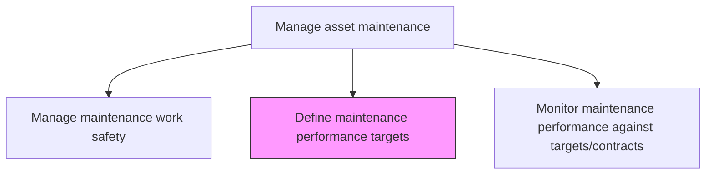
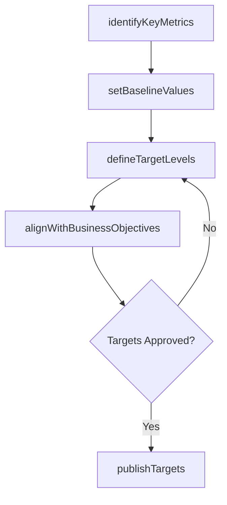

# Define maintenance performance targets

> Business-as-Code definition for maintenance performance target setting. Models the complete process of establishing measurable performance objectives, benchmarks, and key indicators for maintenance operations.

## Overview

Outlining what should be achieved through predictive indicators with regard to performing maintenance. This could include the length of time it takes to perform routine maintenance or how often unplanned maintenance feasibly occur.

## Process Hierarchy



## GraphDL

```yaml
define:
  object: Maintenance Performance Targets
  actor: MaintenanceManager
  result: PerformanceTargetDocument
```

## Actions

| Action | Description |
|--------|-------------|
| identifyKeyMetrics | Select the KPIs that best measure maintenance effectiveness and efficiency |
| setBaselineValues | Establish current performance levels from historical data as a starting point |
| defineTargetLevels | Set achievable but challenging performance targets for each metric |
| alignWithBusinessObjectives | Ensure maintenance targets support overall operational and financial goals |
| publishTargets | Communicate approved performance targets to maintenance teams and stakeholders |

## Events

| Event | Description |
|-------|-------------|
| keyMetricsIdentified | Performance metrics selected for the maintenance program |
| baselinesEstablished | Current performance levels documented from historical data |
| targetLevelsDefined | Specific performance targets set for each metric |
| targetsAligned | Maintenance targets confirmed to support business objectives |
| targetsPublished | Approved targets distributed to all maintenance stakeholders |

## Searches

| Search | Description |
|--------|-------------|
| getPerformanceTargets | Retrieve the current performance targets for a facility or asset class |
| getBaselineData | Retrieve historical performance data used to set baselines |
| findTargetGaps | Identify metrics where current performance falls short of targets |
| getBenchmarkComparisons | Retrieve industry benchmark data for comparison |

## Process Flow



## RACI Matrix

| Activity | Responsible | Accountable | Consulted | Informed |
|----------|-------------|-------------|-----------|----------|
| identifyKeyMetrics | MaintenanceManager | VP Operations | ReliabilityEngineer | Finance |
| setBaselineValues | ReliabilityEngineer | MaintenanceManager | DataAnalyst | Operations |
| defineTargetLevels | MaintenanceManager | VP Operations | Finance | Executive |
| alignWithBusinessObjectives | MaintenanceManager | VP Operations | StrategyTeam | CFO |
| publishTargets | MaintenanceManager | VP Operations | HR | AllMaintenanceStaff |

## Related Processes

| Process | Relationship |
|---------|-------------|
| 10.3.1.1 Develop maintenance strategies | Upstream - strategies inform target-setting approach |
| 10.3.2.7 Monitor maintenance performance against targets/contracts | Downstream - targets are the benchmark for performance monitoring |
| 10.3.1.2 Analyze assets and predict maintenance requirements | Parallel - predictive data informs achievable target levels |

## Related Departments

| Department | Role |
|-----------|------|
| Maintenance | Defines and owns performance targets |
| Operations | Provides operational context for target levels |
| Finance | Validates cost-related targets and budget alignment |
| Strategy | Ensures alignment with organizational goals |

## Related Occupations

| Occupation | Involvement |
|-----------|-------------|
| Maintenance Manager | Primary target setter and owner |
| Reliability Engineer | Provides data analysis for baseline and target levels |
| VP Operations | Approves performance targets |
| Data Analyst | Compiles historical performance data |

## KPIs

| KPI | Description | Unit |
|-----|-------------|------|
| Target Coverage | Percentage of maintenance functions with defined performance targets | % |
| Target Achievement Rate | Percentage of targets met or exceeded in the reporting period | % |
| Target Review Frequency | How often performance targets are formally reviewed | Months |
| Baseline Data Quality | Percentage of metrics with statistically valid baseline data | % |

## Usage

```typescript
import { defineMaintenancePerformanceTargets } from '@headlessly/define-maintenance-performance-targets'

const targets = defineMaintenancePerformanceTargets()

// Identify key metrics for the maintenance program
const metrics = await targets.identifyKeyMetrics({
  facilityId: 'plant-north',
  categories: ['availability', 'cost', 'safety', 'quality'],
  framework: 'ISO-55001'
})

// Define target levels
const levels = await targets.defineTargetLevels({
  metricsId: metrics.id,
  targets: {
    overallEquipmentEffectiveness: 0.85,
    plannedMaintenancePercentage: 0.80,
    meanTimeBetweenFailures: 720,
    maintenanceCostPerRAV: 0.03
  }
})
```
