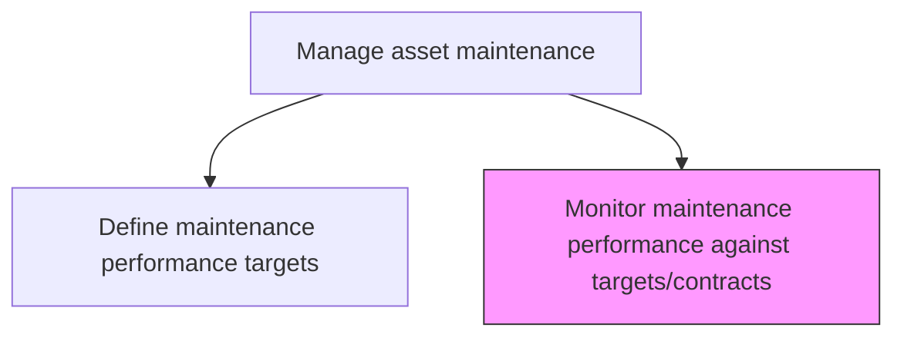
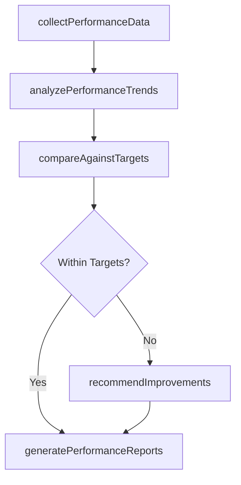

# Monitor maintenance performance against targets/contracts

> Business-as-Code definition for maintenance performance monitoring. Models the complete process of collecting, analyzing, and reporting on maintenance KPIs against established targets and contractual obligations.

## Overview

Following set performance targets, monitor and gage the success of the organization in meeting those targets.

## Process Hierarchy



## GraphDL

```yaml
monitor:
  object: Maintenance Performance Against Targets/contracts
  actor: MaintenanceAnalyst
  result: PerformanceDashboard
```

## Actions

| Action | Description |
|--------|-------------|
| collectPerformanceData | Aggregate maintenance KPI data from work orders, asset records, and financial systems |
| analyzePerformanceTrends | Identify trends, patterns, and deviations in maintenance performance metrics |
| compareAgainstTargets | Evaluate actual performance against established targets and contractual SLAs |
| generatePerformanceReports | Produce periodic dashboards and reports for management review |
| recommendImprovements | Propose corrective actions for areas where performance falls below targets |

## Events

| Event | Description |
|-------|-------------|
| performanceDataCollected | KPI data aggregated from enterprise systems for the reporting period |
| trendsAnalyzed | Performance trend analysis completed |
| targetVarianceDetected | Actual performance deviating from targets or SLAs identified |
| performanceReportGenerated | Periodic performance report published |
| improvementsRecommended | Corrective action recommendations submitted |

## Searches

| Search | Description |
|--------|-------------|
| getPerformanceDashboard | Retrieve the real-time maintenance performance dashboard |
| findTargetVariances | List metrics where actual performance deviates from targets |
| getContractSLAStatus | Retrieve SLA compliance status for contracted maintenance services |
| getPerformanceTrends | Retrieve historical performance trends for specific metrics |

## Process Flow



## RACI Matrix

| Activity | Responsible | Accountable | Consulted | Informed |
|----------|-------------|-------------|-----------|----------|
| collectPerformanceData | MaintenanceAnalyst | MaintenanceManager | IT | DataAnalyst |
| analyzePerformanceTrends | MaintenanceAnalyst | MaintenanceManager | ReliabilityEngineer | Operations |
| compareAgainstTargets | MaintenanceAnalyst | MaintenanceManager | Finance | Procurement |
| generatePerformanceReports | MaintenanceAnalyst | MaintenanceManager | Operations | Executive |
| recommendImprovements | MaintenanceManager | VP Operations | ReliabilityEngineer | Finance |

## Related Processes

| Process | Relationship |
|---------|-------------|
| 10.3.2.6 Define maintenance performance targets | Upstream - targets provide the benchmark for comparison |
| 10.3.2.4 Update work and asset records | Upstream - records provide the data for performance analysis |
| 10.3.1.1 Develop maintenance strategies | Feedback - performance insights inform strategy refinement |

## Related Departments

| Department | Role |
|-----------|------|
| Maintenance | Owns performance monitoring and reporting |
| Finance | Tracks maintenance cost performance |
| Operations | Provides operational context for performance metrics |
| Procurement | Monitors contractor SLA compliance |

## Related Occupations

| Occupation | Involvement |
|-----------|-------------|
| Maintenance Analyst | Collects data and produces reports |
| Maintenance Manager | Reviews performance and approves improvement plans |
| Reliability Engineer | Provides root cause analysis for underperformance |
| Contract Administrator | Monitors vendor SLA compliance |

## KPIs

| KPI | Description | Unit |
|-----|-------------|------|
| Target Achievement Rate | Percentage of KPIs meeting or exceeding defined targets | % |
| SLA Compliance Rate | Percentage of contractual SLAs met by maintenance providers | % |
| Report Timeliness | Percentage of performance reports delivered on schedule | % |
| Improvement Action Closure | Percentage of recommended improvements implemented within target timeframe | % |

## Usage

```typescript
import { monitorMaintenancePerformanceAgainstTargetsContracts } from '@headlessly/monitor-maintenance-performance-against-targets-contracts'

const monitor = monitorMaintenancePerformanceAgainstTargetsContracts()

// Collect performance data for the period
const data = await monitor.collectPerformanceData({
  facilityId: 'plant-north',
  period: 'Q1-2026',
  metrics: ['OEE', 'MTBF', 'MTTR', 'planned-maintenance-percentage']
})

// Compare against targets
const comparison = await monitor.compareAgainstTargets({
  dataId: data.id,
  targetSetId: 'targets-2026',
  includeContractSLAs: true
})
```
