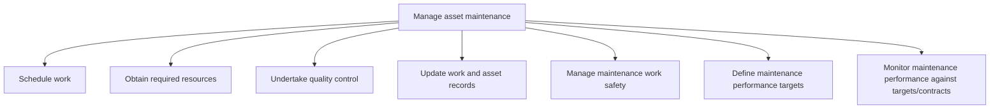
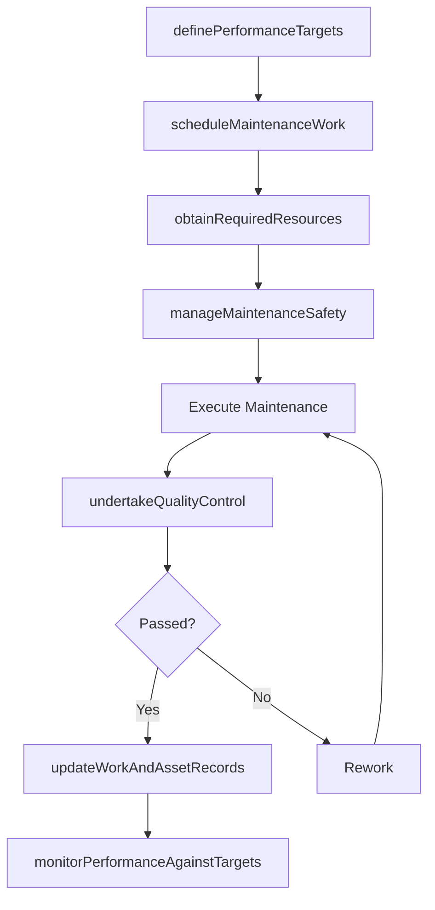

# Manage asset maintenance

> Business-as-Code definition for scheduling maintenance work, obtaining resources, enforcing quality control and safety standards, and monitoring maintenance performance against defined targets and service contracts.

## Overview

Ensuring that asset maintenance is conducted in a timely manner and successfully. Schedule work with the required resources with an eye on quality control and safety. Verify that contracted maintenance meets performance targets.

## Process Hierarchy



## GraphDL

```yaml
manage:
  object: Asset Maintenance
  actor: MaintenanceManager
  result: MaintenancePerformanceReport
```

## Actions

| Action | Description |
|--------|-------------|
| scheduleMaintenanceWork | Assign maintenance work orders to time slots coordinated with production windows |
| obtainRequiredResources | Procure parts, tools, and contracted labor for scheduled maintenance |
| undertakeQualityControl | Inspect completed maintenance against workmanship standards and specifications |
| updateWorkAndAssetRecords | Record maintenance activities, parts used, and asset condition in the CMMS |
| manageMaintenanceSafety | Enforce lockout-tagout, permits, and safety protocols for maintenance work |
| definePerformanceTargets | Establish KPIs and SLA thresholds for maintenance effectiveness |
| monitorPerformanceAgainstTargets | Track actual maintenance outcomes versus defined targets and contracts |

## Events

| Event | Description |
|-------|-------------|
| maintenanceWorkScheduled | Maintenance work orders assigned to schedule and resources allocated |
| requiredResourcesObtained | Parts, tools, and contractor services procured for maintenance |
| qualityControlUndertaken | Post-maintenance quality inspection completed with findings |
| workAndAssetRecordsUpdated | CMMS records updated with completed maintenance activities |
| maintenanceSafetyManaged | Safety audit or permit review for maintenance work completed |
| performanceTargetsDefined | Maintenance KPIs and SLA thresholds approved |
| performanceMonitored | Performance review against targets completed with variance report |

## Searches

| Search | Description |
|--------|-------------|
| getMaintenanceSchedule | Retrieve scheduled work orders by date range, asset, or crew |
| findResourceAvailability | Check spare parts inventory and technician availability |
| getQualityInspectionResults | Query post-maintenance inspection results by asset or severity |
| getPerformanceMetrics | Retrieve maintenance KPI actuals versus targets |
| findContractCompliance | List contractor SLA adherence by vendor or contract |

## Process Flow



## RACI Matrix

| Activity | Responsible | Accountable | Consulted | Informed |
|----------|-------------|-------------|-----------|----------|
| scheduleMaintenanceWork | MaintenanceScheduler | MaintenanceManager | Operations | Production |
| obtainRequiredResources | ProcurementSpecialist | MaintenanceManager | Finance | Warehouse |
| undertakeQualityControl | QualityInspector | MaintenanceManager | Engineering | Operations |
| manageMaintenanceSafety | SafetyOfficer | MaintenanceManager | EHS | HR |
| monitorPerformanceAgainstTargets | MaintenanceAnalyst | MaintenanceManager | Finance | Executive |

## Sub-Processes

| ID | Name | Description |
|----|------|-------------|
| 10.3.2.1 | Schedule work | Defining a timetable for which to execute the maintenance of the asset. |
| 10.3.2.2 | Obtain required resources | Gathering resources needed to complete all maintenance work. Verify that all resources have the prop |
| 10.3.2.3 | Undertake quality control | Implementing a checks and balances system to verify that the maintenance was performed correctly. Re |
| 10.3.2.4 | Update work and asset records | Modifying existing maintenance records to include all new work that has been performed, what assets  |
| 10.3.2.5 | Manage maintenance work safety | Assuring that all safety laws and regulations are being implemented and followed. Align practices wi |
| 10.3.2.6 | Define maintenance performance targets | Outlining what should be achieved through predictive indicators with regard to performing maintenanc |
| 10.3.2.7 | Monitor maintenance performance against targets/contracts | Following set performance targets, monitor and gage the success of the organization in meeting those |

## Related Processes

| Process | Relationship |
|---------|-------------|
| 10.3.1 Plan asset maintenance | Upstream - maintenance plans drive scheduling and resource allocation |
| 10.3.3 Perform asset maintenance | Downstream - managed work orders executed by technicians |
| 10.4 Dispose of assets | Downstream - chronic maintenance issues trigger disposal decisions |

## Related Departments

| Department | Role |
|-----------|------|
| Maintenance Management | Schedules work, tracks performance, and manages maintenance workforce |
| Quality Assurance | Inspects maintenance workmanship and validates repairs |
| EHS (Environment Health Safety) | Enforces safety protocols and manages maintenance permits |
| Procurement | Sources spare parts, consumables, and contracted services |

## Related Occupations

| Occupation | Involvement |
|-----------|-------------|
| Maintenance Manager | Oversees scheduling, resource allocation, and performance monitoring |
| Maintenance Scheduler | Coordinates work orders with production windows and crew availability |
| Quality Inspector | Validates maintenance workmanship and signs off completed work |

## KPIs

| KPI | Description | Unit |
|-----|-------------|------|
| Schedule Compliance | Percentage of scheduled work orders completed on time | % |
| First-Time Fix Rate | Percentage of maintenance tasks completed without rework | % |
| Maintenance Safety Incident Rate | Recordable safety incidents per 200,000 maintenance hours | Rate |
| Contractor SLA Compliance | Percentage of contractor work meeting SLA thresholds | % |
| CMMS Data Accuracy | Percentage of work orders with complete and accurate records | % |

## Usage

```typescript
import { manageAssetMaintenance } from '@headlessly/manage-asset-maintenance'

const mgmt = manageAssetMaintenance()

// Schedule maintenance work for upcoming window
const schedule = await mgmt.scheduleMaintenanceWork({
  workOrderId: 'WO-2025-1847',
  assetId: 'COMP-3200',
  scheduledDate: '2025-07-15',
  estimatedDuration: '6h',
  crew: ['tech-041', 'tech-072']
})

// Monitor performance against SLA targets
const metrics = await mgmt.getPerformanceMetrics({
  period: '2025-Q2',
  kpis: ['schedule-compliance', 'first-time-fix', 'mttr'],
  groupBy: 'asset-class'
})
```
