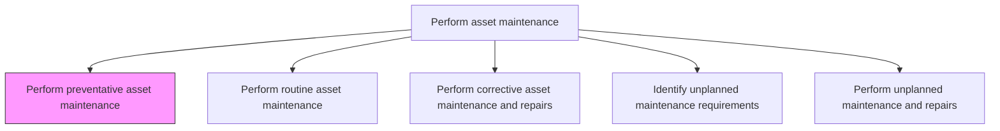
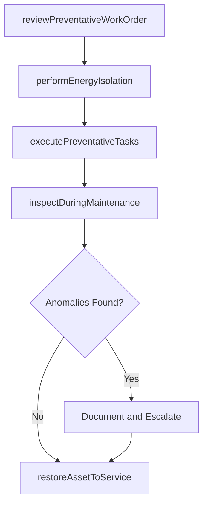

# Perform preventative asset maintenance

> Business-as-Code definition for preventative asset maintenance execution. Models the complete process of performing scheduled, proactive maintenance activities designed to prevent equipment failures and extend asset life.

## Overview

Performing prophylactic maintenance in an effort to avoid corrective or unplanned repairs.

## Process Hierarchy



## GraphDL

```yaml
perform:
  object: Preventative Asset Maintenance
  actor: MaintenanceTechnician
  result: PreventativeMaintenanceRecord
```

## Actions

| Action | Description |
|--------|-------------|
| reviewPreventativeWorkOrder | Examine the work order, work plan, and safety requirements before starting |
| performEnergyIsolation | Execute lockout/tagout procedures to safely isolate the asset |
| executePreventativeTasks | Carry out scheduled maintenance activities such as lubrication, filter changes, and calibration |
| inspectDuringMaintenance | Observe asset condition during maintenance and document any anomalies |
| restoreAssetToService | Reassemble, test, and return the asset to operational status |

## Events

| Event | Description |
|-------|-------------|
| workOrderReviewed | Preventative work order and safety requirements reviewed |
| energyIsolated | Asset safely isolated via lockout/tagout procedures |
| preventativeTasksExecuted | Scheduled maintenance activities completed |
| anomaliesDocumented | Unexpected conditions discovered and recorded during maintenance |
| assetRestoredToService | Asset returned to operational status after maintenance |

## Searches

| Search | Description |
|--------|-------------|
| findScheduledPreventativeTasks | List upcoming preventative maintenance tasks by asset or date |
| getPreventativeWorkOrder | Retrieve the detailed work order for a preventative maintenance task |
| findOverduePreventativeTasks | List preventative tasks that have exceeded their scheduled date |
| getPreventativeMaintenanceHistory | Retrieve the history of preventative maintenance for an asset |

## Process Flow



## RACI Matrix

| Activity | Responsible | Accountable | Consulted | Informed |
|----------|-------------|-------------|-----------|----------|
| reviewPreventativeWorkOrder | MaintenanceTechnician | MaintenanceSupervisor | SafetyOfficer | Scheduler |
| performEnergyIsolation | MaintenanceTechnician | MaintenanceSupervisor | Operations | Safety |
| executePreventativeTasks | MaintenanceTechnician | MaintenanceSupervisor | ReliabilityEngineer | Operations |
| inspectDuringMaintenance | MaintenanceTechnician | MaintenanceSupervisor | QualityInspector | ReliabilityEngineer |
| restoreAssetToService | MaintenanceTechnician | MaintenanceSupervisor | Operations | Scheduler |

## Related Processes

| Process | Relationship |
|---------|-------------|
| 10.3.1.4 Integrate preventive maintenance into operations schedule | Upstream - scheduling determines when preventative work occurs |
| 10.3.2.3 Undertake quality control | Downstream - completed work is quality inspected |
| 10.3.3.4 Identify unplanned maintenance requirements | Parallel - anomalies found during PM may trigger unplanned work |

## Related Departments

| Department | Role |
|-----------|------|
| Maintenance | Executes preventative maintenance tasks |
| Operations | Releases assets for maintenance and receives them back |
| Safety | Oversees lockout/tagout and safety protocols |
| Reliability Engineering | Defines preventative task intervals and procedures |

## Related Occupations

| Occupation | Involvement |
|-----------|-------------|
| Maintenance Technician | Executes preventative maintenance tasks |
| Maintenance Supervisor | Oversees task execution and quality |
| Reliability Engineer | Defines PM intervals and task content |
| Operations Coordinator | Manages asset availability for maintenance |

## KPIs

| KPI | Description | Unit |
|-----|-------------|------|
| PM Compliance Rate | Percentage of preventative tasks completed on schedule | % |
| PM Effectiveness | Reduction in corrective maintenance following PM execution | % |
| Average PM Duration | Mean time to complete a preventative maintenance task | Hours |
| Anomaly Detection Rate | Number of anomalies discovered during preventative maintenance | Count/100 PMs |

## Usage

```typescript
import { performPreventativeAssetMaintenance } from '@headlessly/perform-preventative-asset-maintenance'

const pm = performPreventativeAssetMaintenance()

// Execute preventative tasks on a pump
const execution = await pm.executePreventativeTasks({
  workOrderId: 'pm-2026-0456',
  assetId: 'pump-101',
  tasks: ['replace-mechanical-seal', 'lubricate-bearings', 'check-alignment', 'calibrate-instruments']
})

// Restore asset to service
const restored = await pm.restoreAssetToService({
  workOrderId: 'pm-2026-0456',
  testResults: { vibration: 1.8, temperature: 62, leakTest: 'pass' }
})
```
