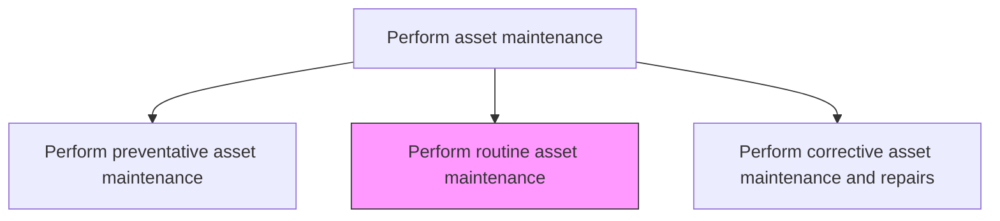
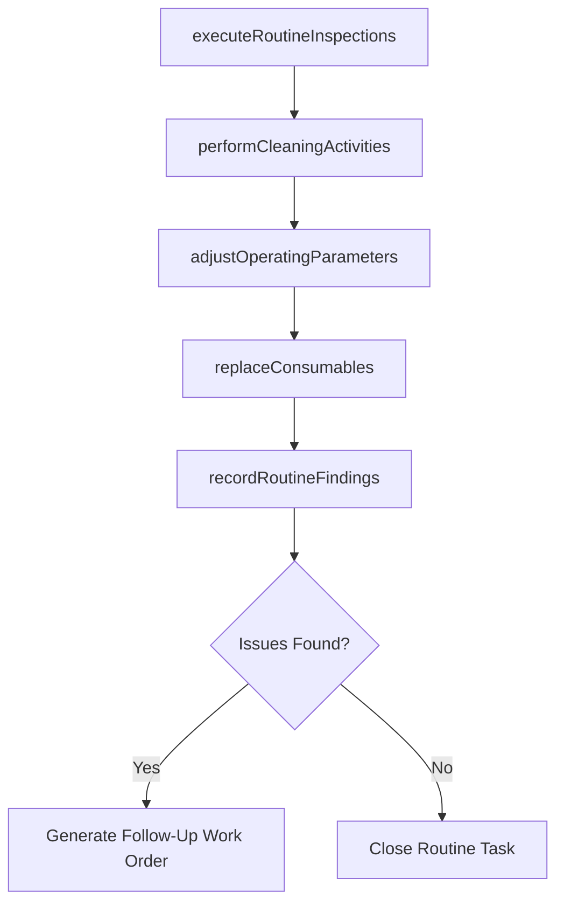

# Perform routine asset maintenance

> Business-as-Code definition for routine asset maintenance execution. Models the complete process of performing regular, recurring maintenance tasks such as inspections, cleaning, adjustments, and minor servicing.

## Overview

Carrying out required maintenance to continue upkeep of equipment or assets.

## Process Hierarchy



## GraphDL

```yaml
perform:
  object: Routine Asset Maintenance
  actor: MaintenanceTechnician
  result: RoutineMaintenanceRecord
```

## Actions

| Action | Description |
|--------|-------------|
| executeRoutineInspections | Perform visual and instrument-based checks on asset condition |
| performCleaningActivities | Clean equipment, filters, and surrounding areas per maintenance schedule |
| adjustOperatingParameters | Make minor adjustments to settings, tension, alignment, or calibration |
| replaceConsumables | Swap out filters, lubricants, belts, and other regularly consumed items |
| recordRoutineFindings | Document inspection results, parameter readings, and any observed issues |

## Events

| Event | Description |
|-------|-------------|
| routineInspectionCompleted | Scheduled inspection conducted with results recorded |
| cleaningCompleted | Equipment cleaning activities finished |
| parametersAdjusted | Operating parameters adjusted to within specification |
| consumablesReplaced | Regularly consumed items replaced per schedule |
| routineFindingsRecorded | All inspection and maintenance observations documented |

## Searches

| Search | Description |
|--------|-------------|
| findRoutineTasksDue | List routine maintenance tasks due within a specified period |
| getRoutineTaskChecklist | Retrieve the standard checklist for a routine maintenance activity |
| getAssetReadings | Retrieve recent parameter readings for an asset |
| findRecurringIssues | List frequently reported issues from routine inspections |

## Process Flow



## RACI Matrix

| Activity | Responsible | Accountable | Consulted | Informed |
|----------|-------------|-------------|-----------|----------|
| executeRoutineInspections | MaintenanceTechnician | MaintenanceSupervisor | Operations | ReliabilityEngineer |
| performCleaningActivities | MaintenanceTechnician | MaintenanceSupervisor | Operations | Safety |
| adjustOperatingParameters | MaintenanceTechnician | MaintenanceSupervisor | Engineering | Operations |
| replaceConsumables | MaintenanceTechnician | MaintenanceSupervisor | MaterialsCoordinator | Warehouse |
| recordRoutineFindings | MaintenanceTechnician | MaintenanceSupervisor | ReliabilityEngineer | MaintenanceManager |

## Related Processes

| Process | Relationship |
|---------|-------------|
| 10.3.3.1 Perform preventative asset maintenance | Related - routine maintenance is a subset of preventative care |
| 10.3.2.1 Schedule work | Upstream - routine tasks are scheduled from the maintenance calendar |
| 10.3.2.4 Update work and asset records | Downstream - routine findings update asset records |

## Related Departments

| Department | Role |
|-----------|------|
| Maintenance | Performs routine maintenance tasks |
| Operations | Coordinates asset access for routine activities |
| Warehouse | Supplies consumable items and routine spare parts |
| Engineering | Provides specifications for parameter adjustments |

## Related Occupations

| Occupation | Involvement |
|-----------|-------------|
| Maintenance Technician | Performs routine inspections and maintenance |
| Maintenance Supervisor | Oversees routine task completion |
| Equipment Operator | Assists with routine checks during shifts |
| Materials Coordinator | Ensures consumables are stocked |

## KPIs

| KPI | Description | Unit |
|-----|-------------|------|
| Routine Task Completion Rate | Percentage of scheduled routine tasks completed on time | % |
| Average Routine Task Duration | Mean time to complete a routine maintenance activity | Minutes |
| Issue Detection Rate | Number of issues found per 100 routine inspections | Rate |
| Consumable Usage Efficiency | Actual versus planned consumable consumption | % |

## Usage

```typescript
import { performRoutineAssetMaintenance } from '@headlessly/perform-routine-asset-maintenance'

const routine = performRoutineAssetMaintenance()

// Execute routine inspections
const inspection = await routine.executeRoutineInspections({
  assetId: 'hvac-unit-3',
  checklist: ['filter-condition', 'belt-tension', 'refrigerant-level', 'coil-cleanliness'],
  readings: true
})

// Replace consumables
const replacement = await routine.replaceConsumables({
  assetId: 'hvac-unit-3',
  items: ['air-filter-20x25', 'belt-a68'],
  workOrderId: 'rt-2026-0789'
})
```
