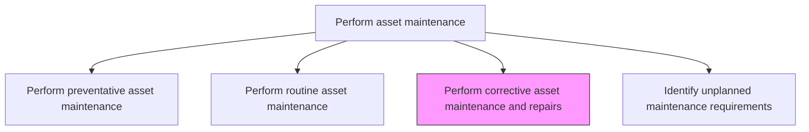
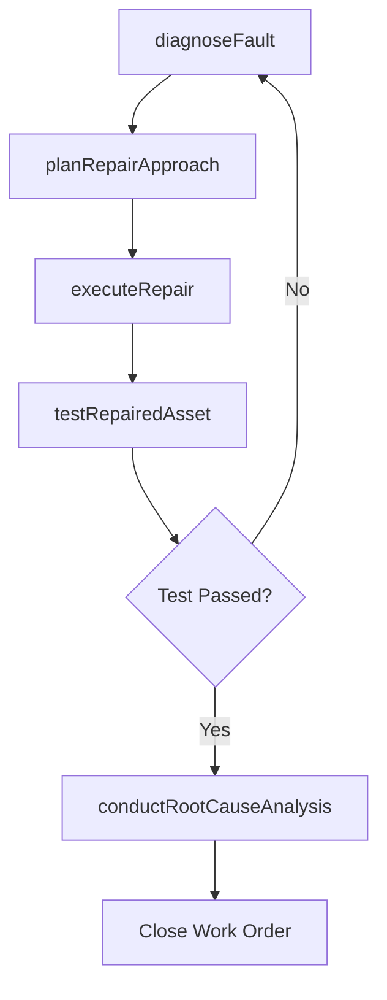

# Perform corrective asset maintenance and repairs

> Business-as-Code definition for corrective maintenance and repair execution. Models the complete process of diagnosing, repairing, and restoring assets that have experienced known faults, breakdowns, or degraded performance.

## Overview

Repairing or correcting faults that occur with an asset. This could be a break or other repairable damage.

## Process Hierarchy



## GraphDL

```yaml
perform:
  object: Corrective Asset Maintenance And Repairs
  actor: MaintenanceTechnician
  result: RepairRecord
```

## Actions

| Action | Description |
|--------|-------------|
| diagnoseFault | Investigate the reported failure to determine the root cause and scope of repair |
| planRepairApproach | Define the repair method, parts needed, and estimated duration |
| executeRepair | Perform the physical repair including component replacement, adjustment, or rebuilding |
| testRepairedAsset | Run functional tests to verify the repair resolved the fault |
| conductRootCauseAnalysis | Analyze the failure to identify underlying causes and prevent recurrence |

## Events

| Event | Description |
|-------|-------------|
| faultDiagnosed | Root cause of the failure identified and repair scope determined |
| repairPlanned | Repair approach, parts, and timeline defined |
| repairExecuted | Physical repair work completed |
| repairedAssetTested | Functional tests confirmed the repair resolved the fault |
| rootCauseAnalysisCompleted | Failure analysis documented with prevention recommendations |

## Searches

| Search | Description |
|--------|-------------|
| findOpenRepairOrders | List active corrective maintenance work orders by priority or asset |
| getRepairHistory | Retrieve the repair history for a specific asset |
| findRecurringFailures | List assets with repeated failures of the same type |
| getRootCauseAnalysis | Retrieve the failure analysis for a specific repair event |

## Process Flow



## RACI Matrix

| Activity | Responsible | Accountable | Consulted | Informed |
|----------|-------------|-------------|-----------|----------|
| diagnoseFault | MaintenanceTechnician | MaintenanceSupervisor | ReliabilityEngineer | Operations |
| planRepairApproach | MaintenancePlanner | MaintenanceSupervisor | MaterialsCoordinator | Scheduler |
| executeRepair | MaintenanceTechnician | MaintenanceSupervisor | Engineering | Operations |
| testRepairedAsset | MaintenanceTechnician | MaintenanceSupervisor | Operations | QualityInspector |
| conductRootCauseAnalysis | ReliabilityEngineer | MaintenanceManager | Engineering | Operations |

## Related Processes

| Process | Relationship |
|---------|-------------|
| 10.3.3.4 Identify unplanned maintenance requirements | Upstream - identified faults trigger corrective maintenance |
| 10.3.2.3 Undertake quality control | Downstream - repair quality is verified |
| 10.3.1.2 Analyze assets and predict maintenance requirements | Feedback - RCA data improves prediction models |

## Related Departments

| Department | Role |
|-----------|------|
| Maintenance | Diagnoses and executes repairs |
| Reliability Engineering | Conducts root cause analysis |
| Operations | Reports faults and receives repaired assets |
| Warehouse | Provides emergency spare parts |

## Related Occupations

| Occupation | Involvement |
|-----------|-------------|
| Maintenance Technician | Diagnoses and performs repairs |
| Reliability Engineer | Conducts root cause analysis |
| Maintenance Planner | Plans repair approach and resources |
| Operations Coordinator | Manages production impact during repairs |

## KPIs

| KPI | Description | Unit |
|-----|-------------|------|
| Mean Time to Repair | Average time from fault report to asset return to service | Hours |
| First-Time Fix Rate | Percentage of repairs that resolve the fault on first attempt | % |
| Corrective Maintenance Cost | Average cost per corrective maintenance event | Currency |
| Root Cause Analysis Completion | Percentage of significant failures with completed RCA | % |

## Usage

```typescript
import { performCorrectiveAssetMaintenanceAndRepairs } from '@headlessly/perform-corrective-asset-maintenance-and-repairs'

const repair = performCorrectiveAssetMaintenanceAndRepairs()

// Diagnose the fault
const diagnosis = await repair.diagnoseFault({
  workOrderId: 'cm-2026-0567',
  assetId: 'compressor-205',
  symptoms: ['excessive-vibration', 'abnormal-noise', 'reduced-output']
})

// Execute the repair
const result = await repair.executeRepair({
  workOrderId: 'cm-2026-0567',
  diagnosis: diagnosis.rootCause,
  repairPlan: 'replace-bearings-and-realign'
})
```
