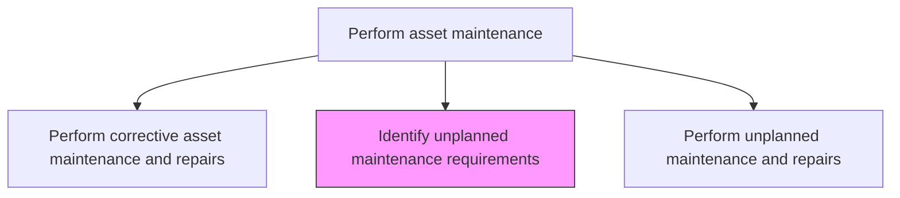
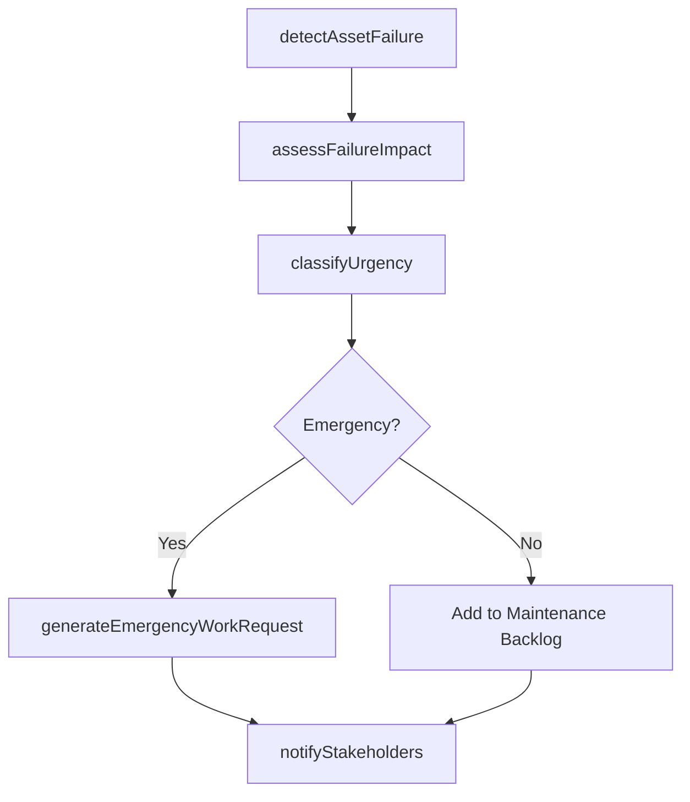

# Identify unplanned maintenance requirements

> Business-as-Code definition for unplanned maintenance identification. Models the complete process of detecting, assessing, and documenting unexpected asset failures or conditions requiring immediate maintenance intervention.

## Overview

Realizing potential or current problems with assets that would require unplanned maintenance. Unplanned maintenance is a repair or change that needs to be made that is not preventative or routine.

## Process Hierarchy



## GraphDL

```yaml
identify:
  object: Unplanned Maintenance Requirements
  actor: OperationsOperator
  result: EmergencyWorkRequest
```

## Actions

| Action | Description |
|--------|-------------|
| detectAssetFailure | Identify equipment breakdowns or abnormal conditions through alarms, observations, or reports |
| assessFailureImpact | Evaluate the operational, safety, and financial impact of the detected failure |
| classifyUrgency | Categorize the maintenance need as emergency, urgent, or deferrable |
| generateEmergencyWorkRequest | Create a formal work request for unplanned maintenance intervention |
| notifyStakeholders | Alert operations, maintenance, and management of the unplanned maintenance need |

## Events

| Event | Description |
|-------|-------------|
| assetFailureDetected | Equipment breakdown or abnormal condition identified |
| failureImpactAssessed | Operational and safety impact of the failure evaluated |
| urgencyClassified | Maintenance need categorized by urgency level |
| emergencyWorkRequestGenerated | Formal work request created for unplanned maintenance |
| stakeholdersNotified | Relevant parties alerted to the maintenance requirement |

## Searches

| Search | Description |
|--------|-------------|
| findActiveAlarms | List current equipment alarms and abnormal conditions |
| getFailureImpactAssessment | Retrieve the impact analysis for a specific failure event |
| findEmergencyWorkRequests | List open emergency maintenance requests by priority |
| getAssetAlarmHistory | Retrieve historical alarm data for a specific asset |

## Process Flow



## RACI Matrix

| Activity | Responsible | Accountable | Consulted | Informed |
|----------|-------------|-------------|-----------|----------|
| detectAssetFailure | OperationsOperator | ShiftSupervisor | MaintenanceTechnician | MaintenanceManager |
| assessFailureImpact | MaintenanceSupervisor | MaintenanceManager | Operations | SafetyOfficer |
| classifyUrgency | MaintenanceSupervisor | MaintenanceManager | Operations | Finance |
| generateEmergencyWorkRequest | MaintenanceSupervisor | MaintenanceManager | Scheduler | Procurement |
| notifyStakeholders | MaintenanceSupervisor | MaintenanceManager | Operations | Executive |

## Related Processes

| Process | Relationship |
|---------|-------------|
| 10.3.3.5 Perform unplanned maintenance and repairs | Downstream - identified requirements trigger unplanned repairs |
| 10.3.3.3 Perform corrective asset maintenance and repairs | Related - corrective work addresses known planned faults |
| 10.3.1.2 Analyze assets and predict maintenance requirements | Feedback - unplanned events improve predictive models |

## Related Departments

| Department | Role |
|-----------|------|
| Operations | First responders who detect and report failures |
| Maintenance | Assesses impact and generates work requests |
| Safety | Evaluates safety implications of failures |
| Management | Receives notifications on critical unplanned events |

## Related Occupations

| Occupation | Involvement |
|-----------|-------------|
| Equipment Operator | Detects and reports equipment failures |
| Maintenance Supervisor | Assesses impact and classifies urgency |
| Shift Supervisor | Coordinates immediate operational response |
| Maintenance Manager | Authorizes emergency work requests |

## KPIs

| KPI | Description | Unit |
|-----|-------------|------|
| Unplanned Failure Rate | Number of unplanned failures per operating period | Count/Month |
| Detection to Report Time | Average time from failure occurrence to formal work request | Minutes |
| Emergency Classification Accuracy | Percentage of urgency classifications validated as correct | % |
| Unplanned Maintenance Ratio | Ratio of unplanned to total maintenance work orders | % |

## Usage

```typescript
import { identifyUnplannedMaintenanceRequirements } from '@headlessly/identify-unplanned-maintenance-requirements'

const unplanned = identifyUnplannedMaintenanceRequirements()

// Detect and report an asset failure
const detection = await unplanned.detectAssetFailure({
  assetId: 'conveyor-belt-7',
  reportedBy: 'operator-shift-b',
  symptoms: ['belt-stopped', 'motor-overheating', 'burning-smell'],
  timestamp: new Date()
})

// Assess failure impact
const impact = await unplanned.assessFailureImpact({
  detectionId: detection.id,
  productionLineAffected: 'assembly-line-2',
  safetyRisk: 'medium'
})
```
