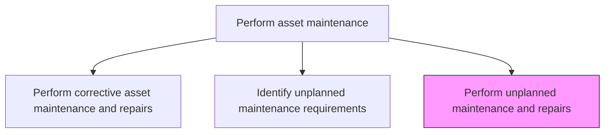
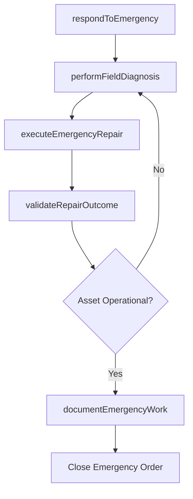

# Perform unplanned maintenance and repairs

> Business-as-Code definition for unplanned maintenance and repair execution. Models the complete process of rapidly responding to, repairing, and restoring assets that have experienced unexpected failures or breakdowns.

## Overview

Performing repairs that occur outside of normal routine or preventative maintenance.

## Process Hierarchy



## GraphDL

```yaml
perform:
  object: Unplanned Maintenance And Repairs
  actor: EmergencyRepairTechnician
  result: EmergencyRepairRecord
```

## Actions

| Action | Description |
|--------|-------------|
| respondToEmergency | Mobilize maintenance crew and equipment to the failed asset location |
| performFieldDiagnosis | Conduct rapid on-site diagnosis to determine repair requirements |
| executeEmergencyRepair | Perform the urgent repair to restore asset functionality |
| validateRepairOutcome | Test the repaired asset to confirm operational readiness |
| documentEmergencyWork | Record all emergency repair details including parts, labor, and root cause findings |

## Events

| Event | Description |
|-------|-------------|
| emergencyResponseInitiated | Maintenance crew mobilized to the failure site |
| fieldDiagnosisCompleted | On-site diagnosis determined repair approach |
| emergencyRepairExecuted | Urgent repair work completed |
| repairOutcomeValidated | Repaired asset tested and confirmed operational |
| emergencyWorkDocumented | All emergency repair details recorded |

## Searches

| Search | Description |
|--------|-------------|
| findActiveEmergencyRepairs | List currently active emergency repair efforts |
| getEmergencyRepairHistory | Retrieve the history of unplanned repairs for a specific asset |
| findAvailableEmergencyCrew | List maintenance technicians available for emergency response |
| getEmergencyPartsList | Retrieve commonly needed emergency spare parts and their availability |

## Process Flow



## RACI Matrix

| Activity | Responsible | Accountable | Consulted | Informed |
|----------|-------------|-------------|-----------|----------|
| respondToEmergency | EmergencyRepairTechnician | MaintenanceSupervisor | Operations | SafetyOfficer |
| performFieldDiagnosis | EmergencyRepairTechnician | MaintenanceSupervisor | ReliabilityEngineer | MaintenanceManager |
| executeEmergencyRepair | EmergencyRepairTechnician | MaintenanceSupervisor | Engineering | Operations |
| validateRepairOutcome | EmergencyRepairTechnician | MaintenanceSupervisor | Operations | QualityInspector |
| documentEmergencyWork | EmergencyRepairTechnician | MaintenanceSupervisor | ReliabilityEngineer | Finance |

## Related Processes

| Process | Relationship |
|---------|-------------|
| 10.3.3.4 Identify unplanned maintenance requirements | Upstream - identified failures trigger emergency repairs |
| 10.3.2.4 Update work and asset records | Downstream - emergency work updates asset records |
| 10.3.3.3 Perform corrective asset maintenance and repairs | Related - corrective work for known planned faults |

## Related Departments

| Department | Role |
|-----------|------|
| Maintenance | Executes emergency repairs |
| Operations | Manages production impact during emergency repairs |
| Safety | Ensures safe execution of emergency work |
| Warehouse | Provides emergency spare parts on demand |

## Related Occupations

| Occupation | Involvement |
|-----------|-------------|
| Emergency Repair Technician | Responds and executes urgent repairs |
| Maintenance Supervisor | Coordinates emergency response |
| Operations Coordinator | Manages production rerouting during repairs |
| Warehouse Clerk | Issues emergency spare parts |

## KPIs

| KPI | Description | Unit |
|-----|-------------|------|
| Emergency Response Time | Time from failure report to maintenance crew on site | Minutes |
| Mean Time to Restore | Average time from failure to asset return to service | Hours |
| Emergency Repair Success Rate | Percentage of emergency repairs that restore full functionality | % |
| Unplanned Downtime | Total production hours lost due to unplanned maintenance | Hours/Month |

## Usage

```typescript
import { performUnplannedMaintenanceAndRepairs } from '@headlessly/perform-unplanned-maintenance-and-repairs'

const emergency = performUnplannedMaintenanceAndRepairs()

// Respond to an emergency failure
const response = await emergency.respondToEmergency({
  workRequestId: 'er-2026-0089',
  assetId: 'conveyor-belt-7',
  priority: 'emergency',
  crewIds: ['tech-003', 'tech-007']
})

// Execute the emergency repair
const repair = await emergency.executeEmergencyRepair({
  responseId: response.id,
  repairAction: 'replace-drive-motor',
  partsUsed: ['motor-5hp-3phase', 'coupling-flexible']
})
```
