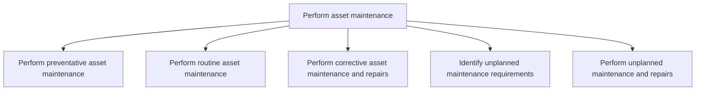
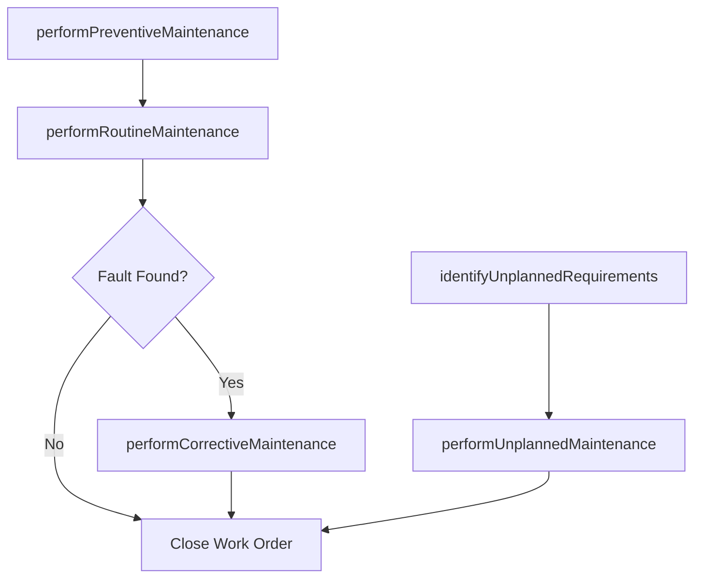

# Perform asset maintenance

> Business-as-Code definition for executing preventive, routine, corrective, and unplanned maintenance activities on productive assets to restore or sustain operational capability and reliability.

## Overview

Engaging in all aspects of asset maintenance. Ensure that all assets are functioning properly and to all specified codes and regulations where applicable. Maintenance includes all preventative, routine, and corrective activates.

## Process Hierarchy



## GraphDL

```yaml
perform:
  object: Asset Maintenance
  actor: MaintenanceTechnician
  result: MaintenanceCompletionRecord
```

## Actions

| Action | Description |
|--------|-------------|
| performPreventiveMaintenance | Execute scheduled preventive tasks such as lubrication, filter replacement, and calibration |
| performRoutineMaintenance | Carry out recurring inspections, cleaning, and minor adjustments |
| performCorrectiveMaintenance | Repair identified faults to restore asset to operational condition |
| identifyUnplannedRequirements | Detect emerging failures or abnormal conditions requiring immediate attention |
| performUnplannedMaintenance | Execute emergency repairs to address unexpected asset breakdowns |

## Events

| Event | Description |
|-------|-------------|
| preventiveMaintenancePerformed | Scheduled preventive maintenance task completed and documented |
| routineMaintenancePerformed | Routine inspection or servicing completed |
| correctiveMaintenancePerformed | Fault repaired and asset restored to operational status |
| unplannedRequirementsIdentified | Emerging failure or abnormal condition flagged for emergency response |
| unplannedMaintenancePerformed | Emergency repair completed and asset returned to service |

## Searches

| Search | Description |
|--------|-------------|
| getWorkOrdersByAsset | Retrieve open and completed work orders for a specific asset |
| findMaintenanceHistory | Query maintenance records by asset, date range, or maintenance type |
| getActiveBreakdowns | List assets currently in breakdown status awaiting repair |
| findPartsUsed | Query spare parts consumption by work order or asset |

## Process Flow



## RACI Matrix

| Activity | Responsible | Accountable | Consulted | Informed |
|----------|-------------|-------------|-----------|----------|
| performPreventiveMaintenance | MaintenanceTechnician | MaintenanceSupervisor | ReliabilityEngineer | Operations |
| performCorrectiveMaintenance | MaintenanceTechnician | MaintenanceSupervisor | Engineering | Production |
| identifyUnplannedRequirements | Operator | MaintenanceSupervisor | ReliabilityEngineer | MaintenanceManager |
| performUnplannedMaintenance | MaintenanceTechnician | MaintenanceSupervisor | Safety | Operations |

## Sub-Processes

| ID | Name | Description |
|----|------|-------------|
| 10.3.3.1 | Perform preventative asset maintenance | Performing prophylactic maintenance in an effort to avoid corrective or unplanned repairs. |
| 10.3.3.2 | Perform routine asset maintenance | Carrying out required maintenance to continue upkeep of equipment or assets. |
| 10.3.3.3 | Perform corrective asset maintenance and repairs | Repairing or correcting faults that occur with an asset. This could be a break or other repairable d |
| 10.3.3.4 | Identify unplanned maintenance requirements | Realizing potential or current problems with assets that would require unplanned maintenance. Unplan |
| 10.3.3.5 | Perform unplanned maintenance and repairs | Performing repairs that occur outside of normal routine or preventative maintenance. |

## Related Processes

| Process | Relationship |
|---------|-------------|
| 10.3.2 Manage asset maintenance | Upstream - work orders and schedules direct execution |
| 10.3.1 Plan asset maintenance | Upstream - work plans provide instructions and procedures |
| 10.4 Dispose of assets | Downstream - irreparable assets trigger disposal process |

## Related Departments

| Department | Role |
|-----------|------|
| Maintenance | Executes all preventive, corrective, and emergency repair activities |
| Operations | Reports equipment issues and coordinates production downtime |
| Safety | Ensures maintenance activities comply with safety regulations |
| Warehouse | Issues spare parts and consumables for maintenance work |

## Related Occupations

| Occupation | Involvement |
|-----------|-------------|
| Maintenance Technician | Performs hands-on repair, inspection, and servicing tasks |
| Maintenance Supervisor | Directs technician crews and prioritizes emergency work |
| Equipment Operator | Detects abnormal conditions and initiates maintenance requests |

## KPIs

| KPI | Description | Unit |
|-----|-------------|------|
| Mean Time to Repair (MTTR) | Average elapsed time from failure to asset restoration | Hours |
| Mean Time Between Failures (MTBF) | Average operating time between consecutive failures | Hours |
| Preventive Maintenance Compliance | Percentage of preventive tasks completed on schedule | % |
| Unplanned Maintenance Ratio | Percentage of total maintenance hours spent on unplanned work | % |
| Wrench Time | Percentage of technician time spent on actual hands-on work | % |

## Usage

```typescript
import { performAssetMaintenance } from '@headlessly/perform-asset-maintenance'

const maintenance = performAssetMaintenance()

// Execute preventive maintenance on a compressor
const result = await maintenance.performPreventiveMaintenance({
  workOrderId: 'WO-2025-2103',
  assetId: 'COMP-3200',
  tasks: ['oil-change', 'filter-replacement', 'vibration-check'],
  partsUsed: [{ partId: 'FLT-220', quantity: 2 }]
})

// Report and perform emergency repair
const emergency = await maintenance.performUnplannedMaintenance({
  assetId: 'CONV-1150',
  failureMode: 'bearing-seizure',
  priority: 'critical',
  downtime: { started: '2025-07-15T08:30:00Z' }
})
```
